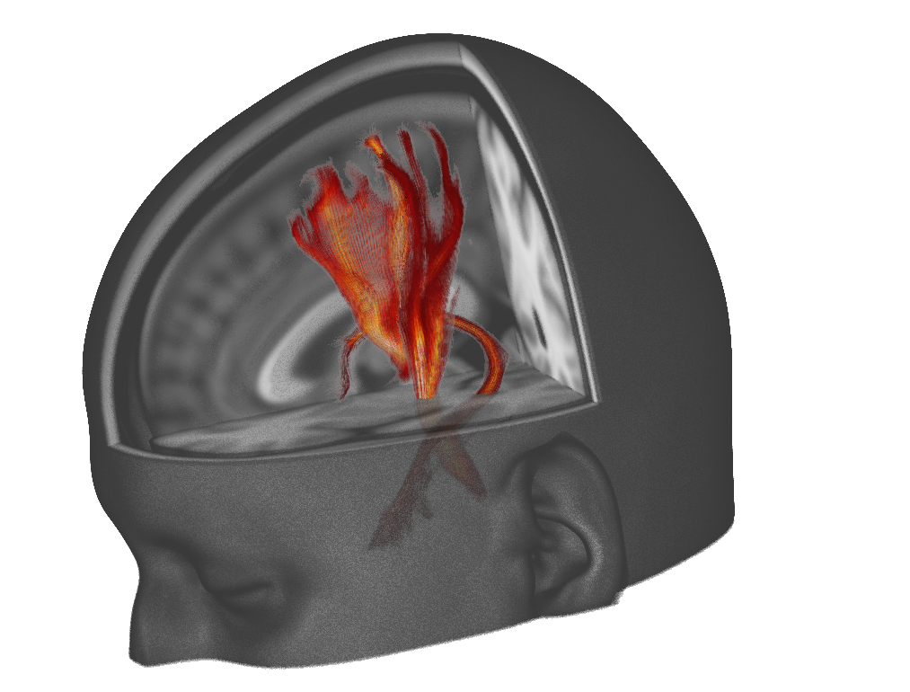
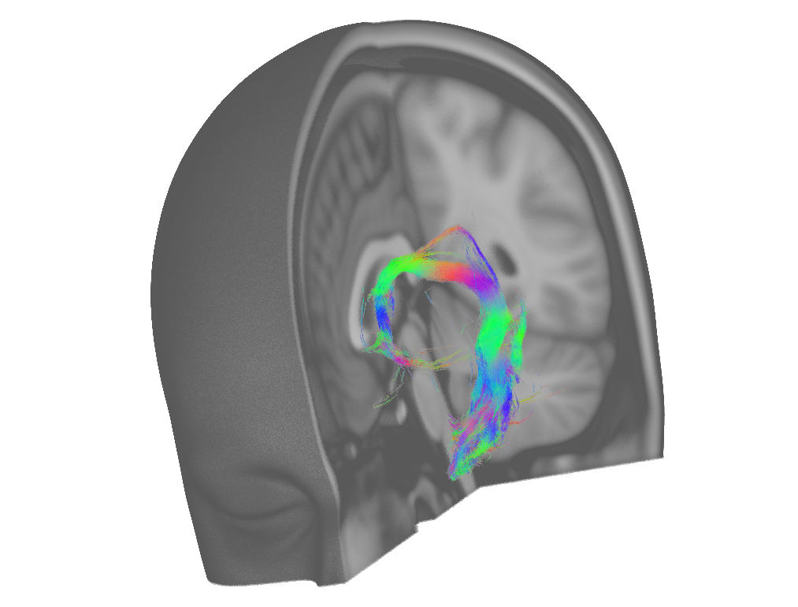
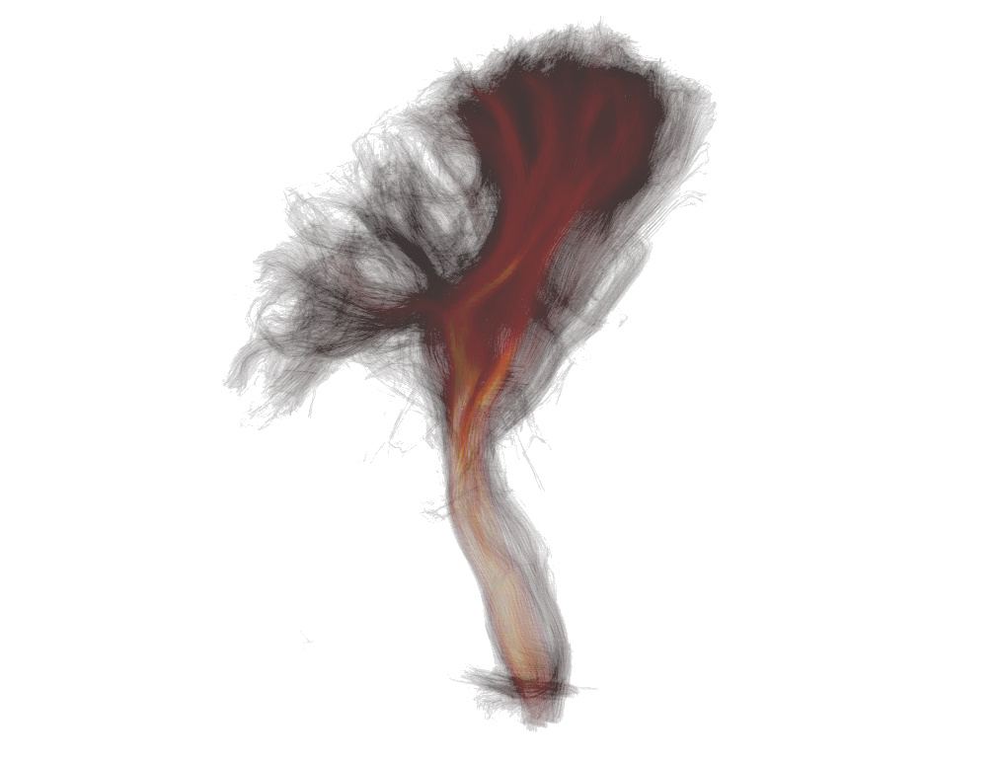

.. |right_arrow| unicode:: U+21D2
.. |alt_key|     unicode:: U+2325
.. |command_key| unicode:: U+2318
.. |control_key| unicode:: U+2303
.. |shift_key|   unicode:: U+21E7

.. |reset_zoom_icon|  image:: images/reset_zoom_icon.png
.. |gear_icon|        image:: images/gear_icon.png
.. |spanner_icon|     image:: images/spanner_icon.png

.. _3d_view:

3D view
=======

You can use FSLeyes to view your images, meshes, and tractograms in 3D using
the *Views* |right_arrow| *3D view* menu item.

.. image:: images/3d_view_volume_example.png
   :width: 50%
   :align: center

.. note:: 3D visualisation functionality and quality will vary, depending on
          how you are running FSLeyes, For example, if you are running
          FSLeyes over a remote SSH/X11 session, quality will be lower, and
          some features will not be available.

3D view interaction
-------------------

You can interact with the 3D view in the following ways:

 - Click and drag to rotate the view

 - Middle-click, or hold down the |alt_key| key and click, to pan the view

 - Hold down the |command_key| or |control_key| and scroll or spin the mouse
   wheel to zoom in and out.

 - Hold down the |shift_key| and click to change the display location,
   relative to the currently selected image or surface.

To reset the view, click on the |reset_zoom_icon| button on the toolbar.

.. _3d_view_overlay_display_settings:

3D overlay display settings
---------------------------

The FSLeyes 3D view can display volumetric images, surface meshes, and
streamline tractograms.  As with the :ref:`ortho and lightbox views
<ortho_lightbox_views>`, you can open the overlay display settings by clicking
on the |gear_icon| button.

Volume overlays
^^^^^^^^^^^^^^^

FSLeyes uses a `volumetric ray-casting
<https://en.wikipedia.org/wiki/Volume_ray_casting>`_ algorithm to display 3D
images. The *3D display settings* pane in the :ref:`overlay display panel
<overlays_overlay_display_panel>` (accessed via the |gear_icon| button)
contains settings which allow you achieve higher quality rendering by
controlling the ray casting algorithm.

.. image:: images/3d_view_volume_display_settings.png
   :width: 60%
   :align: center

It is generally advisable to change the **Interpolation** setting to *Linear*
or *Spline*, unless you wish to achieve a Minecraft-style voxel effect.

The following settings can be used to control the ray-casting:

- **Blending** This setting controls the extent to which adjacent samples
  along each ray are blended together.

- **Blend by intensity** By default, areas of the image with lower voxel
  intensities will be made more transparent. This setting allows that
  behaviour to be disabled.

- **Number of samples** This setting controls how many samples are taken
  through the volume. A higher number of samples will result in a better
  quality rendering.

- **Quality** This setting controls the resolution of the final rendering.
  Setting it to 100% will render the result at the display
  resolution. Reducing this setting will improve the rendering speed - a
  useful strategy is to reduce the quality, experiment with the other display
  settings until you are happy, and then increase the quality for the final
  rendering.

Volume clipping
^^^^^^^^^^^^^^^

The *3D display settings* pane also contains options to control volume clipping.

.. image:: images/3d_view_volume_clipping.png
   :width: 30%
   :align: right

Volume overlays can be clipped by up to five clipping planes. A clipping plane
is a flat plane which can be used to divide a volume into two parts - the part
of the volume on one side of the plane will be shown, and the part on the
opposite side will be hidden.

When more than one clipping plane is active, their effect is combined
according to the **Clipping mode** setting - the default behaviour is to hide
the parts of the volume which fall within the *intersection* of the active
planes. You can also choose to hide areas of the volume according to the
*union*, or the *complement* of the active planes.

When you change the **Number of clipping planes** setting, a set of additional
controls will appear for each clipping plane that you add. The following
settings allow you to control each clipping plane:

- **Clip position** This setting controls the position of the plane, as a
  proportion of the image.

- **Clip rotation** This setting (also known as the *azimuth*) controls the
  rotation of the plane about the vertical axis.

- **Clip Z angle** This setting (also known as the *incline*) controls the
  rotation of the plane with respect to a horizontal plane.

Mesh overlays
^^^^^^^^^^^^^

.. image:: images/3d_view_mesh_example.png
   :width: 30%
   :align: center

The 3D display settings for mesh overlays are much the same as the :ref:`2D
display settings <overlays_mesh>`. You can choose different variants of the
same mesh via the **Surface definition** setting, and you can display data on
the surface via the **Vertex data** setting.

The default behaviour, when you are colouring a mesh with some vertex data, is
for the colours to be interpolated (smoothed) across the mesh
surface. However, if you are viewing discrete data (e.g. anatomical labels),
and/or wish to display the mesh with flat, unsmoothed colours, you change the
**Interpolation** option to **Nearest**.

.. _3d_view_tractogram:

Tractogram overlays
^^^^^^^^^^^^^^^^^^^

FSLeyes can display `TrackVis <http://trackvis.org/>`_ ``.trk`` and `MRtrix3
<https://www.mrtrix.org/>`_ ``.tck`` streamline tractography (*tractogram*)
data sets.

The overlay display settings dialog (the |gear_icon| button) has several
options allowing you to control how tractograms are displayed.

The **Streamline width** option controls the thickness of each streamline.
The **Streamline resolution** option allows you to control whether streamlines
are drawn as lines (lower resolution), or as tubes (higher resolution) - when
you increase the streamline resolution, a lighting effect will be applied to
the streamlines. Lighting can be disabled in the view settings dialog (the
|spanner_icon| button).

The **Colour streamlines by** option allows you to control how a tractogram
is coloured.  Streamlines can be coloured in one of three ways - the default
setting is to colour them according to their XYZ orientation.  The colours
that correspond to each of the XYZ directions can be changed, in the same
manner as for :ref:`vector images <overlays_vector>`.

Streamlines can also be coloured by per-vertex/per-streamline data sets,
either stored in the tractogram file itself, or loaded from a separate data
file (click on the **Load vertex data** button can to load data from a
separate file). Finally, streamlines can be coloured by the values in a
separate NIfTI image.

When colouring streamlines according to a data set or image, the :ref:`usual
options <overlays_volume>` are available to control colouring, including
choosing a **Colour map**, controlling the **Display range**, and modulating
transparency by the data.

The **Clip streamlines by** option can be set independently of the **Colour
streamlines by** option, and can be used to clip/hide streamlines according to
the data set, and **Clipping range** that you specify.

Finally, it is worth playing with the **Opacity** setting, as some nice
visualisation effects can be achieved.
