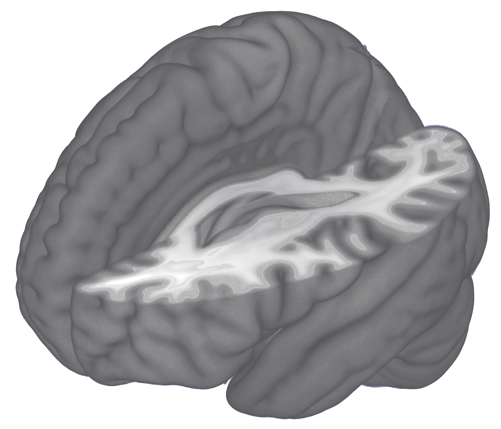
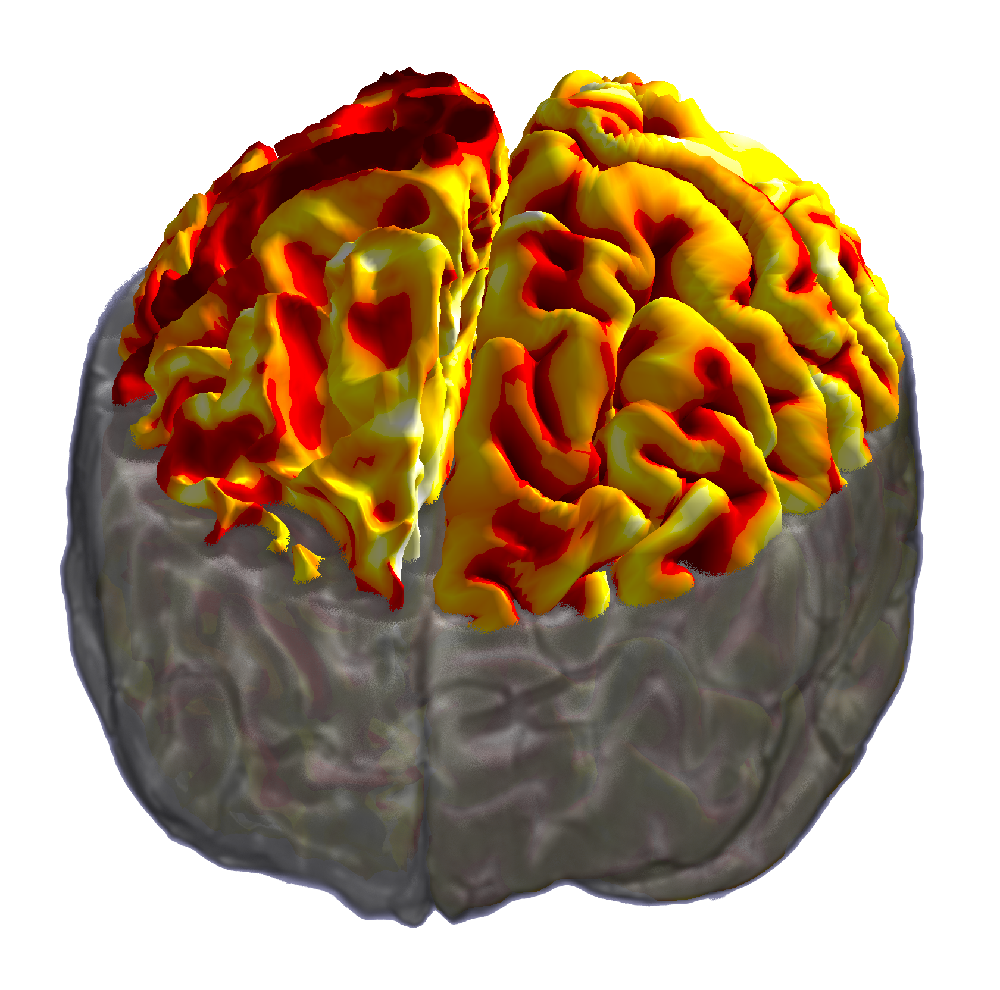
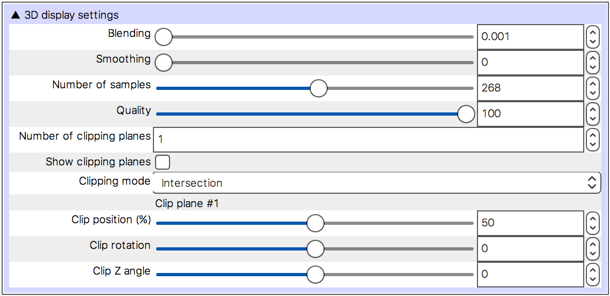
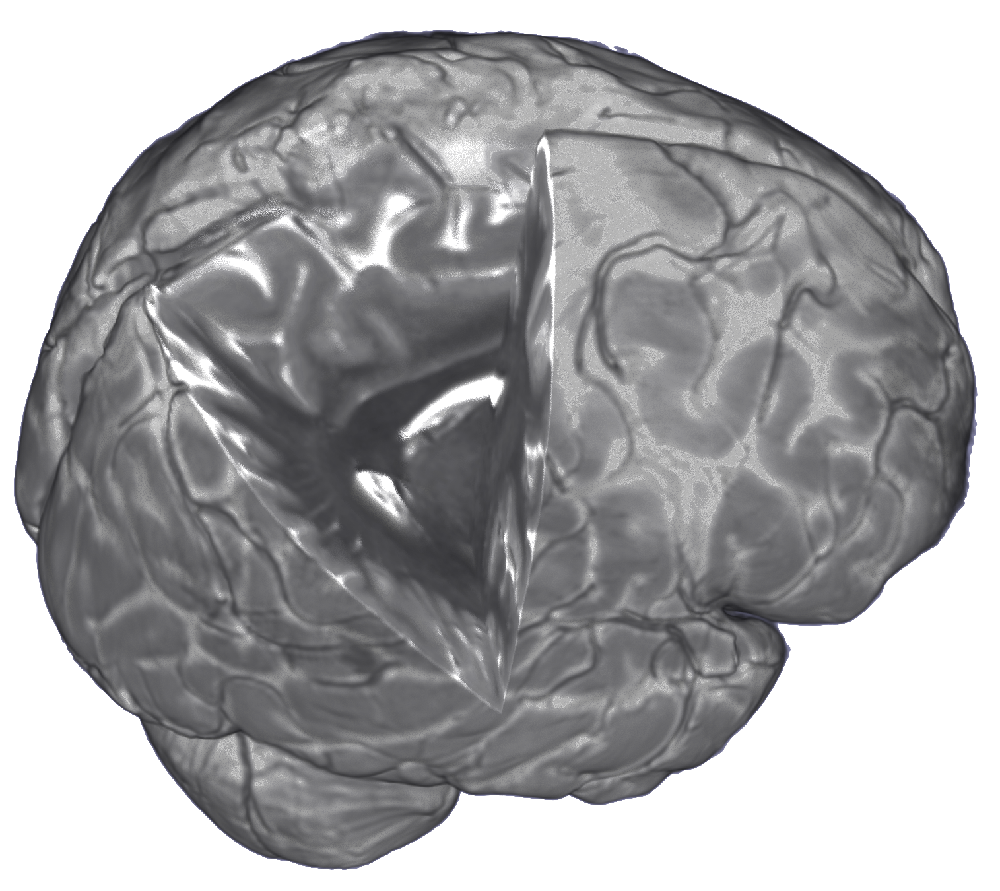

.. |right_arrow| unicode:: U+21D2
.. |alt_key|     unicode:: U+2325
.. |command_key| unicode:: U+2318
.. |control_key| unicode:: U+2303

.. |reset_zoom_icon|  image:: images/reset_zoom_icon.png
.. |gear_icon|        image:: images/gear_icon.png

.. _3d_view:

3D view
=======

You can use FSLeyes to view your images and meshes in 3D using the *Views*
|right_arrow| *3D view* menu item.

3D view interaction
-------------------

You can interact with the 3D view in the following ways:

 - Click and drag to rotate the view

 - Middle-click, or hold down the |alt_key| key and click, to pan the view

 - Hold down the |command_key| or |control_key| and spin the mouse wheel to
   zoom in and out.

To reset the view, click on the |reset_zoom_icon| button on the toolbar.

.. _3d_view_overlay_display_settings:

3D overlay display settings
---------------------------

The FSLeyes 3D view can display volumetric images, and surface meshes.  As
with the :ref:`ortho and lightbox views <ortho_lightbox_views>`, you can open
the overlay display settings by clicking on the |gear_icon| button.

Mesh overlays
^^^^^^^^^^^^^

The 3D display settings for mesh overlays are much the same as the :ref:`2D
display settings <overlays_mesh>`. You can choose different variants of the
same mesh via the **Surface definition** setting, and you can display data on
the surface via the **Vertex data** setting.

Volume overlays
^^^^^^^^^^^^^^^

FSLeyes uses a `volumetric ray-casting
<https://en.wikipedia.org/wiki/Volume_ray_casting>`_ algorithm to display 3D
images. The *3D display settings* pane in the :ref:`overlay display panel
<overlays_overlay_display_panel>` (accessed via the |gear_icon| button)
contains settings which allow you achieve higher quality rendering by
controlling the ray casting algorithm.

It is generally advisable to change the **Interpolation** setting to *Linear*
or *Spline*, unless you wish to achieve a Minecraft-style voxel effect.

The following settings can be used to control the ray-casting:

- **Blending** This setting controls the extent to which adjacent samples
  along each ray are blended together.

- **Number of samples** This setting controls how many samples are taken
  through the volume. A higher number of samples will result in a better
  quality rendering.

- **Quality** This setting controls the resolution of the final rendering.
  Setting it to 100% will render the result at the display
  resolution. Reducing this setting will improve the rendering speed - a
  useful strategy is to reduce the quality, experiment with the other display
  settings until you are happy, and then increase the quality for the final
  rendering.

Volume clipping
^^^^^^^^^^^^^^^

The *3D display settings* pane also contains options to control volume clipping.

Volume overlays can be clipped by up to five clipping planes. A clipping plane
is a flat plane which can be used to divide a volume into two parts - the part
of the volume on one side of the plane will be shown, and the part on the
opposite side will be hidden.

When more than one clipping plane is active, their effect is combined
according to the **Clipping mode** setting - the default behaviour is to hide
the parts of the volume which fall within the *intersection* of the active
planes. You can also choose to hide areas of the volume according to the
*union*, or the *complement* of the active planes.

When you change the **Number of clipping planes** setting, a set of additional
controls will appear for each clipping plane that you add. The following
settings allow you to control each clipping plane:

- **Clip position** This setting controls the position of the plane, as a
  proportion of the image.

- **Clip rotation** This setting (also known as the *azimuth*) controls the
  rotation of the plane about the vertical axis.

- **Clip Z angle** This setting (also known as the *incline*) controls the
  rotation of the plane with respect to a horizontal plane.
