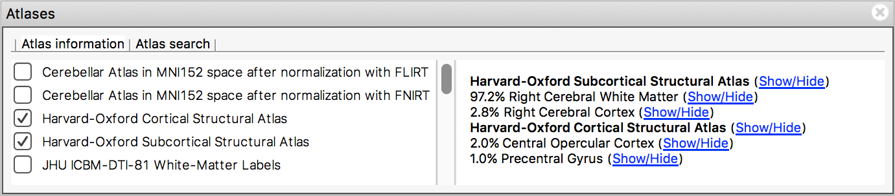
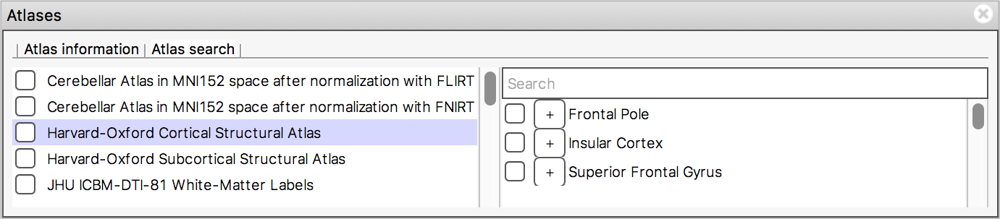
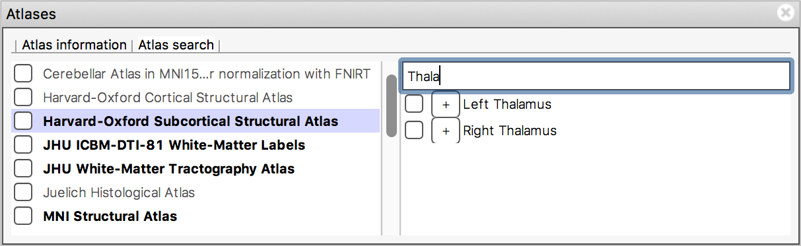
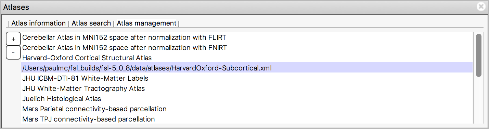

.. |right_arrow| unicode:: U+21D2

.. _atlases:

Atlases
=======

FSL comes bundled with a collection of `NIFTI templates and atlases
<http://fsl.fmrib.ox.ac.uk/fsl/fslwiki/Atlases>`_. A variety of probabilistic
and discrete atlases are included, comprising cortical, sub-cortical, and
regional parcellations. It is also possible to :ref:`add your own atlases to
FSL <customising_atlases>`.

.. sidebar:: Atlas registration space

             All of the atlases included with FSL |fsl_version| have been
             aligned to the MNI152 standard template. This means that any
             images which you wish to query using these atlases must be also
             registered to MNI152 space.

The atlas panel, available in :ref:`Orthographic and lightbox views
<ortho_lightbox_views>`, allows you to browse and search through these
atlases. An atlas panel can be added to a view via its settings menu,
e.g. *Settings* |right_arrow| *Ortho view 1* |right_arrow| *Atlas panel*.

The atlas panel is organised into three main sections - :ref:`Atlas
information <atlases_atlas_information>`, :ref:`Atlas search
<atlases_atlas_search>`, and :ref:`Atlas management
<atlases_atlas_management>`. These sections are accessed by clicking on the
tabs at the top of the panel.

.. _atlases_atlas_information:

Atlas information
-----------------

The atlas information tab displays information about the current display
location, relative to one or more atlases:

The list on the left allows you to select the atlases that you wish to query -
click the check boxes to the left of an atlas to toggle information on and off
for that atlas. The Harvard-Oxford cortical and sub-cortical structural
atlases are both selected by default.

The panel on the right displays information about the current display location
from each selected atlas. For probabilistic atlases, the region(s)
corresponding to the display location are listed, along with their
probabilities. For discrete atlases, the region at the current location is
listed.

You may click on the *Show/Hide* links alongside each atlas and region name to
toggle corresponding image overlays on and off. 

- For atlases, the *Show/Hide* link toggles a discrete :ref:`label
  <overlays_label>` overlay.

- For regions from a discrete label atlas, the *Show/Hide* link toggles a
  discrete :ref:`mask <overlays_mask>` overlay which just contains the voxels
  in that region.

- For regions from a probabilistic atlas, the *Show/Hide* link toggles a
  probabilistic :ref:`volume <overlays_volume>` overlay, containing the
  probabilistic map for that region.

.. _atlases_atlas_search: 

Atlas search
------------

The atlas search tab allows you to browse through the atlases, and search for
specific regions.

.. sidebar:: Region list generation

             Some of the atlases included in FSL (e.g. the Talairach) contain
             a large number of regions. Generating and displaying the region
             list can therefore take some time, so please be patient the first
             time that you select an atlas!

The list on the left displays all available atlases - the checkbox to the left
of each atlas toggles a :ref:`label <overlays_label>` overlay for that atlas
on and off.

When you select an atlas in this list, all of the regions in that atlas are
listed in the area to the right. Again, the checkbox to the left of each
region name toggles an overlay for that region on and off (either a
:ref:`volume <overlays_volume>` or :ref:`mask <overlays_mask>` overlay,
depending on whether the atlas is probabilstic or discrete). The + button next
to each region moves the display location to the (approximate) centre of that
region.

.. _atlases_searching_for_regions:

Searching for regions
^^^^^^^^^^^^^^^^^^^^^

The search field at the top of the region list allows you to filter the
regions that are displayed.

When you type some characters into the search field, the region list will be
filtered, so that only those regions with a name that contains the characters
you entered are displayed. The atlas list on the left will also be updated so
that any atlases which contain regions matching the search term are
highlighted in **bold**.

.. _atlases_atlas_management:

Atlas management
----------------

The atlas management tab displays a list of all loaded atlases, and allows you
to add and remove atlases from FSLeyes. The name of each atlas is shown in the
list, but you can click and hold on an atlas to display the path to the atlas
specification file.

You can load a new atlas into FSLeyes by clicking the + button, and selecting
the FSL atlas specification file which describes the atlas - see the page on
:ref:`customising FSLeyes <customising>` for details.  You can remove an atlas
from FSLeyes by selecting it in the list and clicking the - button [*]_.

.. [*] If you remove an atlas that is located in ``$FSLDIR/data/atlases/`` it
       will be re-loaded the next time you start FSLeyes.
