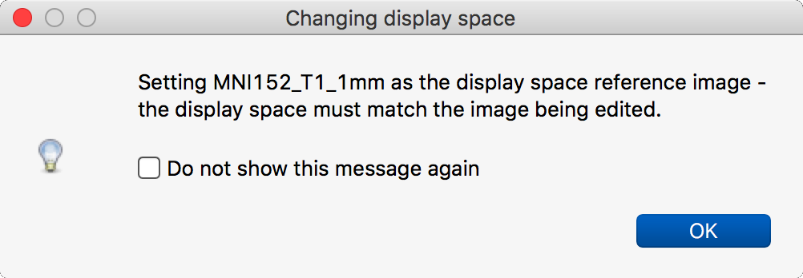
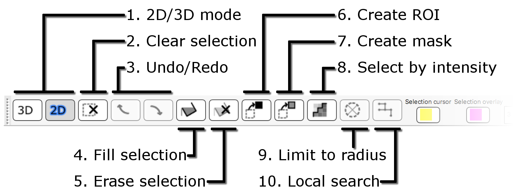
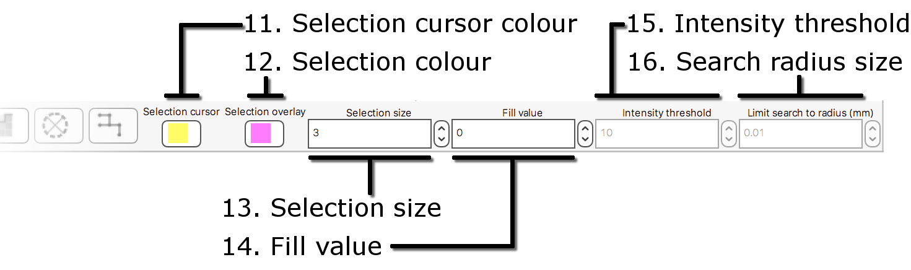

.. |command_key| unicode:: U+2318
.. |shift_key|   unicode:: U+21E7
.. |control_key| unicode:: U+2303
.. |alt_key|     unicode:: U+2325 
.. |right_arrow| unicode:: U+21D2

.. |2D_3D_buttons|              image:: images/editing_images_2D_3D_buttons.png
.. |select_by_intensity_button| image:: images/editing_images_select_by_intensity_button.png 
.. |select_radius_button|       image:: images/editing_images_select_radius_button.png
.. |local_search_button|        image:: images/editing_images_local_search_button.png
.. |fill_selection_button|      image:: images/editing_images_fill_selection_button.png
.. |erase_selection_button|     image:: images/editing_images_erase_selection_button.png
.. |create_roi_button|          image:: images/editing_images_create_roi_button.png
.. |create_mask_button|         image:: images/editing_images_create_mask_button.png 

.. _editing_images:

Editing NIFTI images
====================

The :ref:`orthographic view <ortho_lightbox_views_ortho>` has an *edit mode*
which allows you to edit the values contained in NIFTI images.  You can enter
edit mode in any orthographic view via its settings menu, e.g. *Settings*
|right_arrow| *Ortho View 1* |right_arrow| *Edit mode*.

Overview
--------

   
When you enter edit mode, an :ref:`edit toolbar <editing_images_edit_toolbar>`
is added to the ortho view you are working in.  Editing the data in an image
is a two-stage process:

1. Select the voxels you wish to change. You can do this in one of two ways:
 
   - By :ref:`manually <editing_images_manual_selection>` drawing your
     selection.

   - By using :ref:`Select by intensity <editing_images_select_by_intensity>`
     mode to automatically select voxels.
 
2. :ref:`Change <editing_images_changing_voxel_values>` the value of the
   selected voxels.

Create a copy!
^^^^^^^^^^^^^^

If you are worried about destroying your data, you may wish to create a copy
of your image, and edit that copy - you can do this via the *Overlay*
|right_arrow| *Copy* menu option.

Saving your changes
^^^^^^^^^^^^^^^^^^^

When you have made changes to an image, or created a mask/ROI image, don't
forget to save them via the *Overlay* |right_arrow| *Save* menu item, or the
floppy disk button on the :ref:`overlay list
<ortho_lightbox_views_overlay_list>`.

The display space
^^^^^^^^^^^^^^^^^

When you enable edit mode or, whilst in edit mode you change the selected
overlay, you may be presented with a warning:

This message is just informing you that the display space is being changed to
the image that is being edited (the selected overlay). This is necessary
because, when editing an image, the image must be shown in an orientation
which is orthogonal to the display coordinate system. For more details, refer
to the page on the :ref:`display space <display_space>`.

.. _editing_images_edit_toolbar:

The edit toolbar
----------------

In FSLeyes |version|, all editing-related settings and actions are accessed
through the edit toolbar.

1.  **2D/3D mode** You can toggle between selecting voxels in the current
    slice (2D), or selecting voxels throughout the image (3D).
    
2.  **Clear selection** This button clears the current selection.
    
3.  **Undo/Redo** These buttons allow you to undo or redo any changes that you
    have made to the selection or to the image.
    
4.  **Fill selection** This button causes all voxel intensities in the
    selection to be set to the current *Fill value*.
    
5.  **Erase selection** This button causes all voxel intensities in the
    selection to be set to zero.
    
6.  **Create ROI** This button creates a new image, which contains the
    intensities of all voxels in the selection, and zeros outside of the
    selection.
    
7.  **Create mask** This button creates a new image, which contains ones at
    the voxels within the selection, and zeros outside of the selection.
    
8.  **Select by intensity** This button allows you to switch between
    :ref:`manual selection <editing_images_manual_selection>`, and
    :ref:`select by intensity <editing_images_select_by_intensity>` modes.
    
9.  **Limit to radius** This button allows you to limit the *Select by
    intensity* search to a specific radius (specified via the *Search radius
    size*).

10. **Local search** This button allows you to limit the *Select by
    intensity* search to adjacent voxels only.

11. **Selection cursor colour** This button allows you to change the
    selection cursor colour.
    
12. **Selection colour** This button allows you to change the
    selection overlay colour.
    
13. **Selection size** This setting controls the selection cursor size, when
    in :ref:`manual selection mode <editing_images_manual_selection>`.
    
14. **Fill value** This setting controls the fill value used when
    :ref:`changing voxel values <editing_images_changing_voxel_values>`.
         
15. **Intensity threshold** This setting controls the threshold used when in
    :ref:`select by intensity mode <editing_images_select_by_intensity>`.
         
16. **Search radius size** This setting controls the size of the search
    radius, when the *Limit to radius* setting is enabled.

.. _editing_images_manual_selection: 

Manual selection
----------------

This is the default selection mode - it is active when you first enter edit
mode.

Voxels can be selected by right-clicking and dragging, or by holding down the
|command_key|/|control_key| and |shift_key| keys and left-clicking and
dragging.  Voxels can be de-selected by holding down the
|command_key|/|control_key| and |shift_key| keys, and right-clicking and
dragging.

The selection size can be adjusted via the *Selection size* control in the
:ref:`edit toolbar <editing_images_edit_toolbar>`, or by holding down the
|command_key|/|control_key| and |shift_key| keys and spinning the mouse wheel.

By default, the selection block is a 2-dimensional rectangle in the current
slice, but it can be made into a 3-dimensional cuboid by changing to a 3D
selection, via the |2D_3D_buttons| buttons on the :ref:`edit toolbar
<editing_images_edit_toolbar>`.

.. _editing_images_select_by_intensity:

Select by intensity
-------------------

As an alternate to manually drawing the selection, voxels can be selected by
intensity. Select by intensity mode is enabled via the *Select by intensity*
button (|select_by_intensity_button|) on the :ref:`edit toolbar
<editing_images_edit_toolbar>`.

In select by intensity mode, clicking on a voxel (the *seed*) will result in
all voxels that have a value similar to that voxel being selected.  The
threshold by which voxels are considered to be similar can be changed via the
*Intensity threshold* on the :ref:`edit toolbar
<editing_images_edit_toolbar>`, or simply by spinning the mouse wheel.

Various sub-modes are available when select by intensity mode is in use,
allowing you to further limit the voxels which will be included in the
intensity search. These sub-modes are accessed through buttons on the
:ref:`edit toolbar <editing_images_edit_toolbar>`.

- |2D_3D_buttons| The region can be limited to the current slice, or the
  entire image, via the 2D/3D buttons.

- |select_radius_button| The region be limited to a radius by pushing the
  *Limit to radius* button.  The radius can be changed on the edit toolbar, or
  by holding down the |alt_key| and |shift_key| keys, and spinning the mouse
  wheel.

- |local_search_button| The search can be restricted to adjacent voxels by
  pushing the *Local search* button.  When local search is enabled, voxels
  which are not adjacent to an already-selected voxel (using a 6-neighbour
  connectivity regime) are excluded from the search.

.. _editing_images_changing_voxel_values: 

Changing voxel values
---------------------

Once you are happy with your selection you can change the value of the
selected voxels in one of the following ways:

- |fill_selection_button| The values of all selected voxels can be replaced
  with the current fill value, by clicking the *Fill selection* button.               
  The current fill value can be modified via the *Fill value* control.

- |erase_selection_button| The values of all selected voxels can be erased
  (replaced with 0) by clicking the *Erase selection* button.

.. _editing_images_creating_masks_rois:

Creating masks/ROIs
-------------------

Once you have made a selection, you can copy that selection into a new overlay,
with the *Create mask* and *Create ROI* buttons. Both buttons will create a new
image which has the same dimensions as the image being edited.

- |create_roi_button| The *Create ROI* button will create a new image, and
  will copy the values of all selected voxels over from the image being
  edited. All other voxels in the new image will be set to 0.
  
- |create_mask_button| The *Create Mask* button will create a new image, and
  will set the value of all selected voxels to 1, and the value of all other
  voxels to 0.
