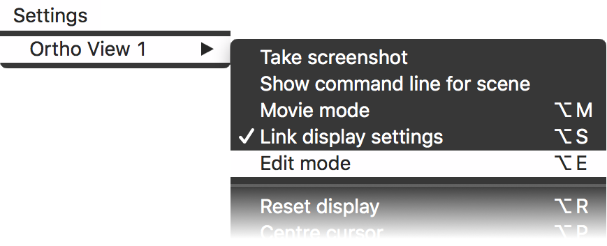
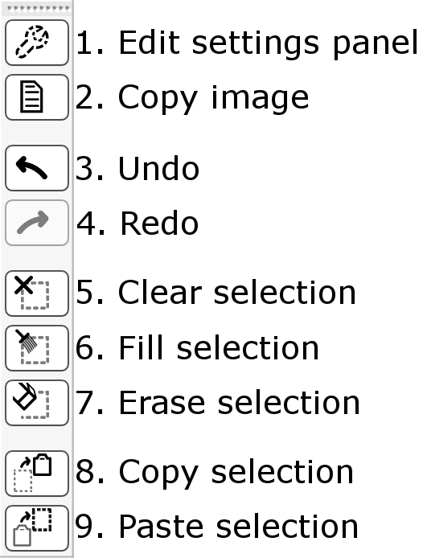
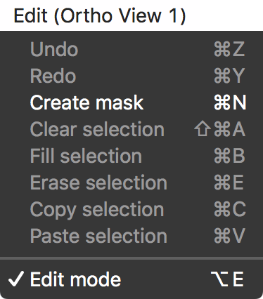
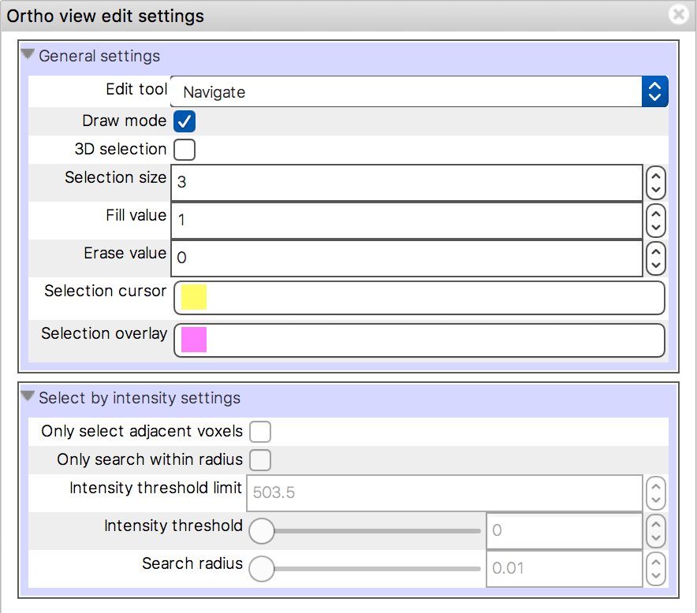

.. |command_key| unicode:: U+2318
.. |shift_key|   unicode:: U+21E7
.. |control_key| unicode:: U+2303
.. |alt_key|     unicode:: U+2325
.. |right_arrow| unicode:: U+21D2

.. |draw_mode_button|                image:: images/editing_images_draw_mode_button.png

.. |bucket_button|                   image:: images/editing_images_bucket_button.png
.. |copy_button|                     image:: images/editing_images_copy_button.png

.. |edit_spanner_button|             image:: images/editing_images_edit_spanner_button.png

.. |select_radius_button|            image:: images/editing_images_select_radius_button.png
.. |local_search_button|             image:: images/editing_images_local_search_button.png

.. |erase_selection_button|          image:: images/editing_images_erase_selection_button.png

.. |copy_selection_highlight_button| image:: images/editing_images_copy_selection_highlight_button.png
.. |copy_data_button|                image:: images/editing_images_copy_data_button.png
.. |copy_data_highlight_button|      image:: images/editing_images_copy_data_highlight_button.png
.. |floppy_disk_button|              image:: images/floppy_icon.png

.. _editing_images:

====================
Editing NIFTI images
====================

The :ref:`orthographic view <ortho_lightbox_views_ortho>` has an *edit mode*
which allows you to edit the values contained in NIFTI images.  You can enter
edit mode in any orthographic view via the *Tools* |right_arrow| *Edit mode*
menu option.

Overview
========

.. important:: When you are in edit mode, the :ref:`currently selected overlay
               <overview_overlays>` (assuming that it is a NIFTI image) is the
               default target for all editing operations. Whenever you draw,
               erase, fill, select, copy, or paste voxels, you will be doing
               so with respect to the *currently selected image*.

               There is one exception to this rule - in :ref:`select mode
               <editing_images_select_mode>`, you may use the *Target image*
               setting to specify an alternate target for fill and paste
               operations.

Create a mask/copy!
-------------------

If you are worried about destroying your data, you may wish to create a copy
of your image, and edit that copy:

 - |copy_button| Create an empty 3D copy of the currently selected image
   (useful for creating mask images) through the :ref:`action toolbar
   <editing_images_action_toolbar>`.

 - Create a full copy of the currently selected image via the *Overlay*
   |right_arrow| *Copy* menu option.

Save your changes
-----------------

When you have made changes to an image, or created a mask/ROI image, don't
forget to save them via the *Overlay* |right_arrow| *Save* menu item, or the
floppy disk button |floppy_disk_button| on the :ref:`overlay list
<ortho_lightbox_views_overlay_list>`.

Editing modes
-------------

You can choose to work in one of two primary editing modes:

 - |draw_mode_button| **Draw mode** In :ref:`this mode <editing_images_draw_mode>`,
   clicking, or clicking and dragging on an image, will immediately change the
   voxel values in the image. This mode will be familiar to you if you are
   used to editing images in `FSLView
   <http://fsl.fmrib.ox.ac.uk/fsl/fslview/>`_.

 - |select_mode_button| **Select mode** In :ref:`this mode
   <editing_images_select_mode>`, editing images is a two-step process:

   1. Select the voxels you wish to change.

   2. Change the value of the selected voxels.

Editing tools
-------------

When you are editing an image, you can choose from one of four main
interaction tools which control what the mouse does when you click, or click
and drag on the image:

 - |navigate_button| **Navigate** This tool is identical to using the
   :ref:`ortho view <ortho_lightbox_views_ortho>` outside of edit mode - it
   simply allows you to view the image, and change the displayed location.

 - |pencil_button| **Pencil** In :ref:`draw mode <editing_images_draw_mode>`,
   this tool allows you to change voxel values to the current fill value. In
   :ref:`select mode <editing_images_select_mode>`, this tool allows you to
   add voxels to the current selection.

 - |eraser_button| **Eraser** In :ref:`draw mode <editing_images_draw_mode>`,
   this tool allows you to erase voxels (set their value to zero). In
   :ref:`select mode <editing_images_select_mode>` this tool allows you to
   remove voxels from the current selection.

 - |bucket_button| **Bucket** This tool allows you to fill closed regions - in
   draw mode, regions in the image can be filled, and in select mode, regions
   in the selection can be filled.

 - |selint_button| **Select by intensity** This tool (only available in
   :ref:`select mode <editing_images_select_mode>`) allows you to
   automatically select voxels based on their intensity.

.. _editing_images_draw_mode:

Draw mode
=========

|draw_mode_button| When you first enter edit mode, you will be in *Draw
mode*. In draw mode, you can:

 - |navigate_button| Use the *navigate* tool to change the display location.

 - |pencil_button| Use the *pencil* tool to change voxel values.

 - |eraser_button| Use the *eraser* tool to erase voxels.

 - |bucket_button| Use the *bucket* tool to fill in regions.

 - |undo_button| |redo_button| Use the *undo* and *redo* buttons to undo/redo
   changes that you have made to the currently selected image.

Draw mode will be familiar to you if you are used to editing images in
FSLView. Select the *pencil* tool, then click, or click and drag, on the
image. When you release the mouse, the values of all of the highlighted voxels
will be replaced with the current fill value (which can be changed on the
:ref:`edit toolbar <editing_images_edit_toolbar>`).

You can use the *eraser* tool in a similar manner - click, or click and drag
on the image. When you release the mouse, the values of the highlighted voxels
will be replaced with zero (or with the current erase value - see the
:ref:`edit settings panel <editing_images_edit_settings_panel>`).

The pencil/eraser size can be adjusted with the *Selection size* control on
the :ref:`edit toolbar <editing_images_edit_toolbar>`. You can also hold down
the |command_key| and |shift_key| keys and scroll/spin the mouse wheel to
increase/decrease the pencil size.

The *bucket* tool can be used to fill in holes. Use the pencil tool to draw a
loop around the region you wish to fill, making sure that the loop is closed.
Then select the bucket tool, and click inside the region - all of the voxels
within the loop will be filled.

The |2D_3D_buttons| buttons allow you to switch between using a 2D selection
region in slice, and using a 3D selection which extends across multiple
slices. The bucket tool only works in 2D mode.

.. _editing_images_select_mode:

Select mode
===========

|select_mode_button| Select mode offers more flexibility than :ref:`draw mode
<editing_images_draw_mode>`, but is slightly more involved. In select mode,
editing an image is a two-step process:

   1. Select the voxels you wish to change. You can do this in one of two ways:

      - By :ref:`manually drawing <editing_images_manual_selection>` your
        selection with the pencil |pencil_button|, eraser |eraser_button|,
        and |bucket_button| tools.

      - By using the :ref:`select by intensity
        <editing_images_select_by_intensity>` tool |selint_button| to
        automatically select voxels based on their intensity.

   2. :ref:`Change <editing_images_changing_voxel_values>` the value of the
      selected voxels by filling or erasing.

In select mode, you can select voxels in one image, and then apply that
selection to another image [*]_ - you can do this simply by selecting, in the
:ref:`overlay list <ortho_lightbox_views_overlay_list>`, the image you wish to
apply the selection to, or by using the *Target image* setting, on the
:ref:`edit toolbar <editing_images_edit_toolbar>`.

This means that you can, for example, select a lesion in a T\ :sub:`1` image,
and then fill in the voxels for that lesion in a corresponding mask image.
You can also copy the values of all voxels in a selection, and paste them into
another image - see the section on :ref:`copying and pasting
<editing_images_copying_and_pasting>` for details.

.. [*] **As long as** the newly selected image has the same dimensions,
       resolution and orientation as the previous one.

.. _editing_images_manual_selection:

Manual selection
----------------

In select mode, the pencil |pencil_button|, eraser |eraser_button|, and bucket
|bucket_button| tools are respectively used to select and deselect voxels.

Using the pencil tool, left-clicking will select voxels under the selection
cursor. Selected voxels are highlighted in pink (you can change the selection
colour in the :ref:`edit settings panel
<editing_images_edit_settings_panel>`).  Left clicking with the eraser tool
will remove voxels from the selection [*]_.

In the same manner as with draw mode, you can fill regions in the selection
using the bucket tool. Draw a loop with the pencil tool, then switch to the
bucket tool and click inside the loop - all voxels within the loop will be
added to the selection.

You can adjust the selection cursor size via the *Selection size* control in
the :ref:`edit toolbar <editing_images_edit_toolbar>`, or by holding down the
|command_key|/|control_key| and |shift_key| keys and scrolling/spinning the
mouse wheel.

By default, the selection cursor is a 2-dimensional rectangle in the current
slice, but it can be made into a 3-dimensional cuboid by changing to a 3D
selection, via the |2D_3D_buttons| buttons on the :ref:`edit toolbar
<editing_images_edit_toolbar>`.

At any point, you can discard your current selection with the *Clear
selection* button |clear_selection_button| on the :ref:`action toolbar
<editing_images_action_toolbar>` - clicking this will deselect all voxels.

Once you are happy with your selection, you can fill, erase, or copy it with
the buttons on the :ref:`action toolbar <editing_images_action_toolbar>`.  See
the sections on :ref:`changing voxel values
<editing_images_changing_voxel_values>`, and :ref:`copying and pasting
<editing_images_copying_and_pasting>` for details.

.. [*] In fact, when you are using the pencil tool, right-clicking will
       deselect voxels. Similarly, with the eraser tool, right-clicking will
       select voxels. So you do not need to continually switch between the
       pencil and eraser tools - simply use both mouse buttons.

.. _editing_images_select_by_intensity:

Select by intensity
-------------------

As an alternate to manually drawing the selection, voxels can be selected
automatically based on their intensity/value. You can do this with the *select
by intensity* tool |selint_button|, accessed through the :ref:`edit toolbar
<editing_images_edit_toolbar>`.

With the select by intensity tool, left-clicking on a voxel (the *seed*) will
result in all voxels that have a value similar to that voxel being selected
[*]_.  The threshold by which voxels are considered to be similar can be
changed via the *Intensity threshold* on the :ref:`edit toolbar
<editing_images_edit_toolbar>` [*]_.

Various settings, accessed via the :ref:`edit toolbar
<editing_images_edit_toolbar>`, are available to constrain the voxels which
will be selected when you use the select by intensity tool:

- |2D_3D_buttons| The region can be limited to the current slice, or the
  entire image, via the 2D/3D buttons.

- |select_radius_button| The region be limited to a radius by clicking the
  *Limit to radius* button.  You can adjust the search radius via the
  *Search radius* control on the
  :ref:`edit toolbar <editing_images_edit_toolbar>` [*]_.

- |local_search_button| The search can be restricted to adjacent voxels by
  pushing the *Local search* button.  When local search is enabled, voxels
  which are not adjacent to an already-selected voxel (using a 6-neighbour
  connectivity scheme) are excluded from the search.

.. [*] In a similar manner to :ref:`manual selection
       <editing_images_manual_selection>`, you can remove voxels from the
       selection with the right mouse button.

.. [*] You can also change the intensity threshold by holding down the
       |command_key|/|control_key| and |shift_key| keys and scrolling/spinning
       the mouse wheel.

.. [*] The search radius can be also be changed by holding down the |alt_key|
       and |shift_key| keys, and scrolling/spinning the mouse wheel.

.. _editing_images_changing_voxel_values:

Changing voxel values
---------------------

Once you are happy with your selection you can change the value of the
selected voxels in one of the following ways:

- |fill_selection_button| The values of all selected voxels can be replaced
  with the current fill value, by clicking the *Fill selection* button.
  The current fill value can be modified via the *Fill value* control on the
  :ref:`edit toolbar <editing_images_edit_toolbar>`.

- |erase_selection_button| The values of all selected voxels can be erased
  (set to zero) by clicking the *Erase selection* button.

Remember that, once you have made a selection on the currently selected image,
you can apply that selection to a different image (with the same
dimensions/resolution/orientation), either via the **Target image** setting on
the :ref:`edit toolbar <editing_images_edit_toolbar>`, or simply by selecting
the other image in the :ref:`overlay list
<ortho_lightbox_views_overlay_list>`. This feature is most useful with the
:ref:`select by intensity <editing_images_select_by_intensity>` tool - you can
make a selection based on the intensities in one image, but then change the
values of voxels within that selection in another image.

.. _editing_images_copying_and_pasting:

Copying and pasting
-------------------

The |copy_data_button| button on the :ref:`action toolbar
<editing_images_action_toolbar>` allow you to copy voxel values from one
image, and paste them into another image. Similarly, the
|copy_selection_button| button allows you to copy a 2D selection from one
slice, and paste/duplicate that selection in another slice. These features are
only enabled in select mode |select_mode_button|, and the copy selection
button is only enabled when using 2D selection |2D_3D_buttons|.

Use the |copy_data_button| button to copy voxel values from one image, and
paste them into another:

1. Select some voxels in an image, either :ref:`manually
   <editing_images_manual_selection>` or with the :ref:`select by intensity
   tool <editing_images_select_by_intensity>`,

2. Click the copy data button |copy_data_button|. The values of all voxels in
   the selection are copied to an internal clipboard. The button will become
   highlighted |copy_data_highlight_button|, indicating that the clipboard
   contains some data.

3. Select a different image, which has the same dimensions, resolution, and
   orientation as the previously selected image.

4. Click the copy data button again |copy_data_highlight_button|. The voxel
   values from the first image will be pasted into the newly selected image.

5. You can paste the data as many times as you wish. To clear the clipboard,
   hold down the |shift_key| key and click the button again
   |copy_data_highlight_button|.

Use the |copy_selection_button| button to copy a 2D selection from one slice
in an image, and paste that selection into another slice:

1. Select some voxels on of the sagittal, coronal, or axial slices.

2. Click the copy selection button |copy_selection_button|. The 2D selection
   in **the most recently focused slice** will be copied to an internal
   clipboard. The button will become highlighted
   |copy_selection_highlight_button|, indicating that the clipboard contains
   a selection.

3. Navigate to a different slice (e.g. while in edit mode, you can hold down
   the |shift_key| key and click on the image to change the displayed
   location).

4. Click the copy selection button again
   |copy_selection_highlight_button|. The 2D selection will be pasted into the
   currently displayed slice.

5. You can paste the selection as many times as you wish. To clear the
   clipboard, hold down the |shift_key| key and click the button again
   |copy_selection_highlight_button|.

Edit mode toolbars and panels
=============================

When you enter edit mode, two toolbars are added the ortho view you are
working in:

 - The :ref:`edit toolbar <editing_images_edit_toolbar>`, along the top,
   allows you to control how editing/selections are performed.

 - The :ref:`action toolbar <editing_images_action_toolbar>`, down the left
   hand side, allows you to perform various actions related to editing.

.. _editing_images_edit_toolbar:

The edit toolbar
----------------

The edit toolbar allows you to change the editing mode, to choose the editing
tool, and to configure some options and settings:

.. image:: images/editing_images_edit_toolbar.png
   :width: 95%
   :align: center

1. **Editing mode** These buttons allow you to switch between :ref:`draw mode
   <editing_images_draw_mode>` and :ref:`select mode
   <editing_images_select_mode>`.

2. **Edit tool** These buttons allow you to choose the current tool -
   *navigate*, *pencil*, *eraser*, *bucket*, or *select by intensity*.

3. **2D/3D mode** You can toggle between selecting voxels in the current
   slice (2D), or selecting voxels across multiple slices (3D).

4. **Limit to radius** (only available in :ref:`select mode
   <editing_images_select_mode>`) This button allows you to limit the *select
   by intensity* search to a specific radius (specified via the *Search
   radius*).

5. **Local search** (only available in :ref:`select mode
   <editing_images_select_mode>`) This button allows you to limit the *select
   by intensity* search to adjacent voxels only.

6. **Selection size** This setting controls the selection cursor size, when
   :ref:`drawing <editing_images_draw_mode>`, or :ref:`manually selecting
   voxels <editing_images_manual_selection>`.

7. **Fill value** This setting controls the fill value used when editing
   voxel values.

8. **Intensity threshold** (only available in :ref:`select mode
   <editing_images_select_mode>`) This setting controls the threshold used
   when using the :ref:`select by intensity
   <editing_images_select_by_intensity>` tool.

9. **Search radius size** (only available in :ref:`select mode
   <editing_images_select_mode>`) This setting controls the size of the search
   radius, when the *Limit to radius* setting is enabled.

10. **Target image** (only available in :ref:`select mode
    <editing_images_select_mode>`) This setting allows you to choose a
    *target*, or *destination* image for fill/paste operations. Voxels will be
    selected according to the :ref:`currently selected overlay
    <overview_overlays>`, but the selection will be applied to the current
    target image.

.. _editing_images_action_toolbar:

The action toolbar
------------------

The action toolbar contains buttons allowing you to perform various editing
actions.

1. **Edit settings panel** This button opens the :ref:`edit settings panel
   <editing_images_edit_settings_panel>`, which contains all options related
   to editing.

2. **Copy image** This button creates an empty 3D copy of the currently
   selected image, and adds it to the overlay list.

3. **Cursor follows mouse** By default, when you draw/select or erase/deselect
   voxels using the pencil or eraser tools, the currently displayed location
   will update as you move the mouse. This button allows you to disable this
   behaviour.

4. **Undo** This button undoes the most recent change to the currently selected
   image.

5. **Redo** This button re-does the most recently undone change to the
   currently selected image.

6. **Show/hide selection** (only available in :ref:`select mode
   <editing_images_select_mode>`) This button allows you to turn on and off
   the selection overlay.

7. **Clear selection** (only available in :ref:`select mode
   <editing_images_select_mode>`) This button clears the current selection,
   i.e. all voxels are deselected.

8. **Fill selection** (only available in :ref:`select mode
   <editing_images_select_mode>`) This button fills the current selection -
   the value of all selected voxels is set to the current fill value.

9. **Erase selection** (only available in :ref:`select mode
   <editing_images_select_mode>`) This button erases the current selection -
   the value of all selected voxels is set to zero.

10. **Copy selection** (only available in :ref:`select mode
    <editing_images_select_mode>`) This button :ref:`copies
    <editing_images_copying_and_pasting>` the current selection - the values
    of all selected voxels are copied to an internal clipboard.

11. **Paste selection** (only available in :ref:`select mode
    <editing_images_select_mode>`) This button :ref:`pastes
    <editing_images_copying_and_pasting>` the selection on the clipboard into
    the currently selected image (if it has compatible dimensionality).

.. _editing_images_edit_menu:

The edit menu
-------------

Several of the options in the :ref:`action toolbar
<editing_images_action_toolbar>` are also available in the edit menu, which
appears when you enter edit mode:

.. _editing_images_edit_settings_panel:

The edit settings panel
-----------------------

The edit settings panel can be opened via the spanner button
|edit_spanner_button| on the :ref:`action toolbar
<editing_images_action_toolbar>`.

In FSLeyes |version|, the edit settings panel only contains a few settings in
addition to those that can be accessed via the :ref:`edit toolbar
<editing_images_edit_toolbar>`:

 - **Erase value** This setting allows you to change the value to use when
   erasing voxels.

 - **Selection cursor colour** This setting allows you to change the colour
   of the selection cursor.

 - **Selection overlay colour** This setting allows you to change the colour
   of the selection overlay (only visible in :ref:`select mode
   <editing_images_select_mode>`).

 - **Intensity threshold limit** By default, the maximum value that the
   intensity threshold can be set to is determined from the image data range.
   If your image has an unusual data range or distribution, you may wish to
   use this setting to manually set the maximum intensity threshold.
