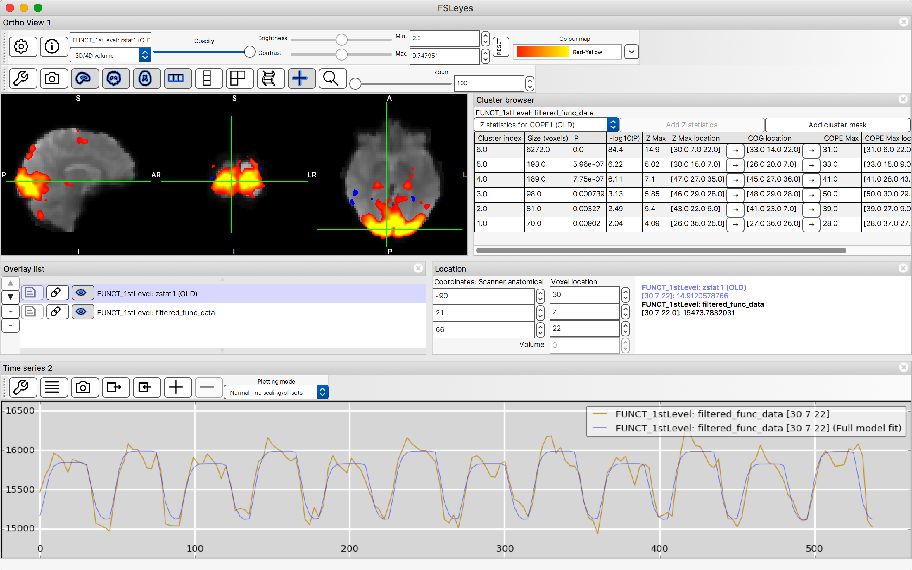
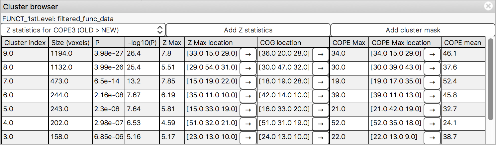
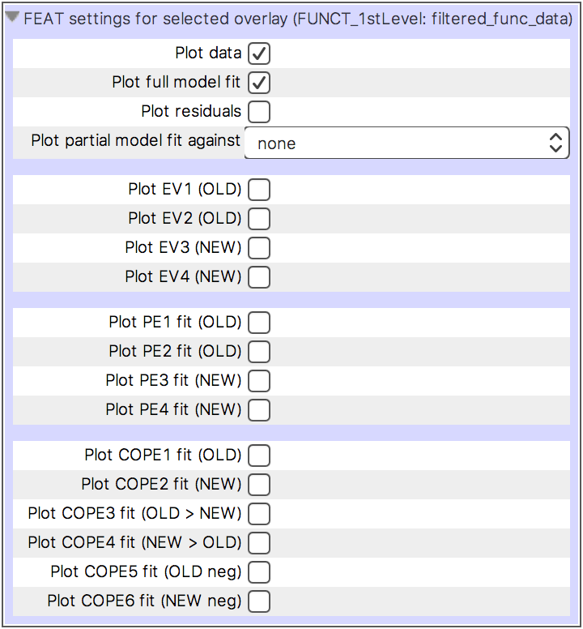

.. |right_arrow|   unicode:: U+21D2
.. |right_arrow_2| unicode:: U+2192

.. _feat_mode:

Viewing FEAT analyses
=====================

FSLeyes has some features which can help you to view and explore the results
of your `FEAT <http://fsl.fmrib.ox.ac.uk/fsl/fslwiki/FEAT>`_ analyses.

.. _feat_mode_loading_a_feat_analysis:

Loading a FEAT analysis
-----------------------

.. sidebar:: What does a FEAT analysis directory look like?

             FSLeyes detects FEAT directories based on the following rules.
             If any of these rules are not met, FSLeyes will not recognise
             your data as a FEAT analysis:

             - The directory name must end in ``.feat``
             - The directory must contain the following files:

              - ``filtered_func_data``: a NIFTI image containing the
                pre-processed input data (the file extension does not
                matter)
              - ``design.fsf``: FEAT configuration file
              - ``design.mat``: FEAT design matrix file
              - ``design.con``: FEAT contrast vector file

You can load a FEAT analysis in a few different ways [*]_:

- From the :ref:`command line <command_line>` - you can specify either a
  ``.feat`` directory::

      fsleyes path/to/my_analysis.feat

  Or the ``filtered_func_data`` image::

      fsleyes path/to/my_analysis.feat/filtered_func_data

- Via *File* |right_arrow| *Add from directory* - select your
  ``.feat`` analysis directory.

- Via *File* |right_arrow| *Add from file* - select the
  ``filtered_func_data`` image located in your ``.feat`` analysis directory.

In fact, you can load any NIFTI image contained within a ``.feat`` analysis
directory - FSLeyes will automatically detect that the image is part of a FEAT
analysis. However, the ``filtered_func_data`` image must be loaded in order to
view :ref:`time series and model fits
<feat_mode_viewing_model_fits_in_the_time_series_panel>`.

.. [*] FSLeyes |version| does not contain any special functionality for
       higher-level FEAT analyses (``.gfeat`` directories). But you can load
       and view the individual ``cope*.feat`` directories contained within a
       ``.gfeat`` directory. Future versions of FSLeyes will add
       functionality for working with group analyses.

.. _feat_mode_the_feat_layout:

The FEAT layout
---------------

The FEAT layout arranges the FSLeyes interface for viewing FEAT analyses.

The FEAT layout simply adds a :ref:`cluster panel
<feat_mode_viewing_clusters_the_cluster_panel>`, and a :ref:`time series panel
<feat_mode_viewing_model_fits_in_the_time_series_panel>` to the :ref:`default
layout <overview_default_layout>`.

You can activate the FEAT layout via the *View* |right_arrow|
*Layouts* |right_arrow| *FEAT mode* menu item. Or you can tell FSLeyes to
start up with the FEAT layout via the :ref:`command line <command_line>`
(the ``-s`` flag is short for ``--scene``)::

    fsleyes -s feat path/to/my_analysis.feat

.. _feat_mode_viewing_clusters_the_cluster_panel:

Viewing clusters (the cluster panel)
------------------------------------

If you have used `cluster thresholding
<http://fsl.fmrib.ox.ac.uk/fsl/fslwiki/FEAT/UserGuide>`_ in your FEAT
analysis, the cluster panel allows you to browse the clusters that were found
in each contrast of your analysis.

The controls at the top of the cluster panel allow you to:

- Change the contrast that you are viewing cluster results for.

- Load the Z statistic image for the current contrast. The image is displayed
  as a :ref:`volume overlay <overlays_volume>`.

- Load a cluster mask image for the current contrast. The image is displayed
  as a :ref:`label overlay <overlays_label>`, highlighting the clusters that
  were deemed significant for this contrast.

.. |cluster_link| replace:: FSL ``cluster`` tool
.. _cluster_link: http://fsl.fmrib.ox.ac.uk/fsl/fslwiki/Cluster

The table in the cluster panel lists all of the clusters that were found to be
significant for the current contrast. The information shown in this table is
similar to that which can be generated with the |cluster_link|_.  The
|right_arrow_2| buttons embedded in the table allow you to move the display to
the following locations for a given cluster:

 - The location of the maximum Z value in the cluster
 - The location of the clutser's centre of gravity
 - The location of the maximum COPE value in the cluster

.. _feat_mode_viewing_model_fits_in_the_time_series_panel:

Viewing model fits in the time series panel
-------------------------------------------

The :ref:`time series view <plot_views_time_series_view>` contains
functionality specific to FEAT analyses. When the selected overlay is from a
FEAT analysis (and the ``filtered_func_data`` image from that analysis is
loaded), the time series view will plot the time series for the current voxel,
and will also plot the full GLM model fit for that voxel. You can also plot
several other types of data from a FEAT analysis, including explanatory
variables (EVs), parameter estimates (PEs) and contrasts of parameter
estimates (COPEs).

When an image from a FEAT analysis is selected, the :ref:`plot control panel
<plot_views_customising_the_plot_the_plot_control_panel>` adds a group of
settings allowing you to control what is plotted. See the :ref:`GLM refresher
<feat_mode_glm_refresher>` below for more details on what the options mean:

- **Plot data** This setting is selected by default. When selected, the input
  data for the current voxel is plotted.

- **Plot full model fit** This setting is selected by default. When selected,
  the full model fit at the current voxel is plotted.

- **Plot residuals** When selected, the residuals of the full model fit (the
  noise) at the current voxel is plotted.

- **Plot reduced data against** This setting allows you to plot a "reduced"
  version of the data at the current voxel, against any of the PEs or COPEs in
  the analysis.

- **Plot EV** A checkbox is added for each EV in your design, allowing you to
  plot them alongside the data.

- **Plot PE fit** A checkbox is added for each PE in the analysis, allowing
  you to plot the model fit for any of them at the current voxel.

- **Plot COPE fit** A checkbox is added for each COPE in the analysis,
  allowing you to plot the model fit for any of them at the current voxel.

.. _feat_mode_glm_refresher:

GLM refresher
-------------

`The following overview pertains to fitting a model to the time course for a
single voxel.`

Let's say that we have an experimental model comprising a single *explanatory
variable* (EV).  For a voxel with an observed time course
:math:`\boldsymbol{Y}`, over :math:`n` time points:

.. math::
   \boldsymbol{Y} = {Y_1, Y_2, \dots, Y_n}

And an expected time course :math:`\boldsymbol{X}` (the time course of our
EV):

.. math::
   \boldsymbol{X} = {X_1, X_2, \dots, X_n}

The aim of the General Linear Model (GLM) is to obtain the best fit of
:math:`\boldsymbol{X}` to :math:`\boldsymbol{Y}`, by finding the best values
for the *parameter estimates* (PEs) :math:`\boldsymbol{\beta}` in the
following equation:

.. math::
   \boldsymbol{Y} = \boldsymbol{X}\boldsymbol{\beta} + \boldsymbol{\epsilon}

This is equivalent to finding the minimum value for the residual error
:math:`\boldsymbol{\epsilon}`.

With a single EV (i.e. :math:`\boldsymbol{X}` is a column vector), we end up
with a single PE :math:`\boldsymbol{\beta}`. With :math:`p` EVs
(i.e. :math:`\boldsymbol{X}` is a :math:`p\times n` matrix),
:math:`\boldsymbol{\beta}` will be a vector of PEs, one for each EV:

.. math::
   \boldsymbol{\beta} = {\beta_1, \beta_2, \dots, \beta_p}

A *contrast of parameter estimates* (COPE) is simply a linear combination of
PEs, and is defined with a contrast vector. Let's say our experimental design
comprises three EVs (i.e. :math:`p = 3` in the above equations), and we are
interested in the first. The contrast vector (or simply the contrast) would
be:

.. math::

   \boldsymbol{C_1} = {1, 0, 0}

The COPE for this contrast is then the elementwise product of the contrast
vector :math:`\boldsymbol{C}` and the parameter estimates
:math:`\boldsymbol{\beta}`:

.. math::

   COPE_1 &= 1 \times \beta_1 + 0 \times \beta_2 + 0 \times \beta_3 \\
          &= \beta_1

.. _feat_mode_understanding_feat_time_series_plots:

Understanding FEAT time series plots
------------------------------------

With the above :ref:`refresher <feat_mode_glm_refresher>`, we can now describe
what FSLeyes plots, when you view the results of a FEAT analysis. A few of the
options are straightforward to interpret:

- **Plot data** This option plots the voxel time course
  :math:`\boldsymbol{Y}`.

- **Plot residutals** This option plots the residual error
  :math:`\boldsymbol{\epsilon}`.

- **Plot EV** These options plot the EVs, i.e. the columns of
  :math:`\boldsymbol{X}`.

.. sidebar:: The FSLeyes plots don't match the FEAT report plots!

             The plots included in FEAT reports are generated by the
             ``tsplot`` command line utility. While FSLeyes |version| and
             ``tsplot`` essentially plot the same data, ``tsplot`` may apply
             some further processing to the full and partial model fits,
             including weighting them by Z values, and
             pre-whitening. Furthermore, in FSL |fsl_version|, ``tsplot``
             handles contrast vectors with negative values in a strange
             manner, resulting in partial model fits being plotted upside-down
             with respect to the fitted data.  Therefore plots shown in
             FSLeyes |version| may not exactly match the corresponding plots
             in the FEAT report.

.. _feat_mode_full_and_partial_model_fits:

Full and partial model fits
^^^^^^^^^^^^^^^^^^^^^^^^^^^

The *Plot full model fit*, *Plot PE fit* and *Plot COPE fit* options all work
in a similar manner, so are described together. Each of these options plot the
GLM model fit for a specific contrast vector.

For a contrast :math:`\boldsymbol{C}`, the model fit :math:`\boldsymbol{F_C}`
at time :math:`t` is calculated as:

.. math::

   F_C^t = \sum_{e=1}^{p}{X_e^t\ \beta_e\ |C_e|}

where:

- :math:`p` is the number of EVs in the design matrix,

- :math:`X_e^t` is the value in the design matrix for EV :math:`e` at time
  :math:`t`,

- :math:`\beta_e` is the parameter estimate for EV :math:`e`, and

- :math:`|C_e|` is the absolute value in the contrast vector for EV :math:`e`.
  The absolute value is used because the parameter estimate :math:`\beta_e`
  should already have an appropriate sign.

The contrast vector :math:`\boldsymbol{C}` is defined as follows:

- For the *Plot full model fit* option, the contrast :math:`\boldsymbol{C}`
  is simply a vector of ones.

- For the *Plot PE fit* options, :math:`\boldsymbol{C}` is a vector
  containing a one for the EV corresponding to the PE, and zeros everywhere
  else.

- For the *Plot COPE fit* options, the contrast is the contrast vector that
  was used in the FEAT analysis.

A few further steps are applied to the above process:

- The contrast vectors are normalised before the model fit is calculated:

  .. math::

     \boldsymbol{C} = \frac{\sqrt{n_\boldsymbol{C}}\boldsymbol{C}}{\sqrt{\sum_{e=1}^{p}{C_e^2}}}

  where :math:`n_\boldsymbol{C}` is the number of non-zero elements in the
  contrast vector.  This normalisation is applied purely for display purposes,
  so that partial model fits are scaled in a sensible manner.

- If the analysis is a first-level analysis (i.e. fitting a model to time
  series data), the data mean is added to the model fit. This is because FEAT
  de-means time series data before calculating the model fit.

.. _feat_mode_reduced_data_plots:

Reduced data plots
^^^^^^^^^^^^^^^^^^

The *Plot reduced data against* option allows you to plot a "reduced" version
of the voxel time course against any of the PEs or COPEs in your analysis. The
reduced data :math:`\boldsymbol{D}` for a contrast :math:`\boldsymbol{C}` is
easily calculated:

.. math::

   \boldsymbol{D_C} = \boldsymbol{F_C} + \boldsymbol{\epsilon}

i.e. the reduced data for a contrast is the sum of the partial model fit for
that contrast, and the residual error from the GLM estimation.
