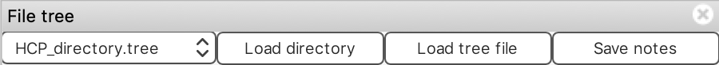
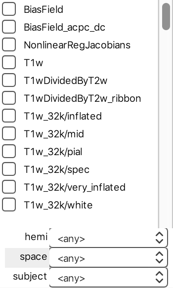
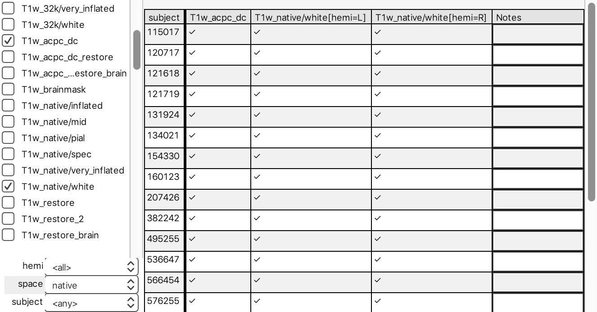
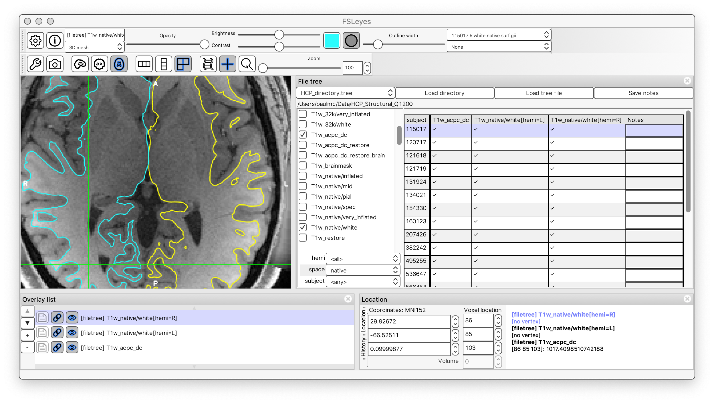
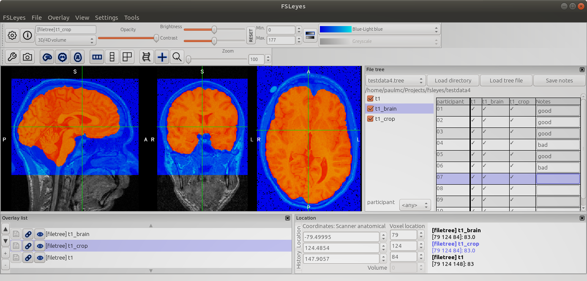

.. |right_arrow| unicode:: U+21D2
.. |up_arrow|    unicode:: U+2191
.. |down_arrow|  unicode:: U+2193
.. |tick|        unicode:: U+2713

.. _file_tree:

File tree
=========

The *File tree* control panel allows you to use FSLeyes to browse image data
in *structured directories*. You can add a file tree panel to the ortho,
lightbox, or 3D views via the *Settings* |right_arrow| *view* |right_arrow|
*File tree* menu option.

FSLeyes has built-in support for a selection of structured data directories,
including:

 - `Human Connectome Project <https://www.humanconnectome.org/>`_ data
 - Raw `BIDS <https://bids.neuroimaging.io/>`_ data
 - `Freesurfer <http://www.freesurfer.net/>`_ data
 - `FEAT <https://fsl.fmrib.ox.ac.uk/fsl/fslwiki/FEAT>`_ data
 - `VBM <https://fsl.fmrib.ox.ac.uk/fsl/fslwiki/FSLVBM>`_ data
 - `TBSS <https://fsl.fmrib.ox.ac.uk/fsl/fslwiki/TBSS>`_ data

It is also possible to :ref:`define your own file tree
<file_tree_define_your_own>`, for working with your own directory structures.

Loading data
------------

The file tree panel has a row along its top containing a drop-down list and
some buttons.  When you want to browse some data, you first need to select the
data directory type from the dropdown list - for example, if you want to view
some VBM data, you would select *vbm.tree* from the list.  If you have a
custom tree file, you can select it via the *Load tree file* button.

Once you have selected a tree, click on the *Load directory* button to select
your data directory. The left side of the file tree panel will be then be
populated with lists of all the file types and variables present in the
directory.

Here we have selected the *HCP_directory.tree*, and have loaded a directory
containing data for a handful of individuals from the Human Connectome
Project.

Configuring the file list
-------------------------

The next step is to choose which file types you want to display - you can do
this by selecting them from the file type list on the left.  As soon as you
select some file types, a list of files will appear on the right side of the
file tree panel. The list will update whenever you change the selected file
types or variable settings.

Let's imagine that we want to look at the white-matter surfaces overlaid on
the native-space T1 image for all of our subjects. For HCP data, we would
select the *T1w_acpc_dc* and *T1w_native/white* file types. We're viewing data
in native subject space, so we'll set the *space* variable to *native*.

We would also like to view white matter surfaces for both the left and right
hemispheres together - we can accomplish this by setting the *hemi* variable
to *<all>*, which will cause files for every value of *hemi* to be listed on
the same row.

You will end up with a grid which contains a row for every combination of
variable values, and a column for every file type, and every combination of
values for variables set to *<all>*. A |tick| indicates that the file is
present - cells for missing/absent files will be empty. The right-most column
allows you to enter notes for each row - see the section below on :ref:`saving
notes <file_tree_saving_notes>`.

Viewing data
------------

Simply click on a row in the file list - when you do so, all of the files in
that row will be loaded into FSLeyes. You can now configure their display
settings just like with any other FSLeyes overlay. When you select another row
in the file list (either with the mouse, or with the |up_arrow| / |down_arrow|
keys, the overlays from the previous row will be replaced with the overlays
from the new row.

The main strength of the file tree panel is that, once you have configured the
display settings for the overlays from one row, when you select another row in
the file list, those display settings will be preserved for the new overlays.

So, if you are viewing data from many subjects, you only need to configure the
overlay display settings once; you can then view the data from all of your
subjects without having to configure the display for each of them.

.. note:: In FSLeyes |version|, some display settings are not preserved when
          changing rows, most notably vertex data on mesh overlays
          (e.g. cortical thickness).  Furthermore, if you have missing data,
          some display settings may not be correctly preserved as you change
          rows.

.. _file_tree_saving_notes:

Saving notes
------------

The right-most column in the file list allows you to add notes about the
overlays in each row. For example, you may be performing quality-control
checks on imaging data from a number of subjects.

The *Save notes* button allows you to save your notes to a plain text,
tab-separated file. This file will contain the entire contents of the
file list, including your notes, e.g.::

    participant  t1  t1_brain  t1_crop  Notes
    01           x   x         x        good
    02           x   x         x        good
    03           x   x         x        good
    04           x   x         x        bad
    05           x   x         x        good
    06           x   x         x        bad
    ...

.. warning:: The contents of the *Notes* column is cleared whenever the file
             types or variables are changed.

.. _file_tree_define_your_own:

Defining your own file tree
---------------------------

Say you have some imaging data for a group of subjects, which you have
organised nicely like so::

  subj-01/
    ses-1/
      T1w.nii.gz
      T2w.nii.gz
      L.white.gii
      R.white.gii
      L.mid.gii
      R.mid.gii
      L.pial.gii
      R.pial.gii
    ses-2/
      T1w.nii.gz
      T2w.nii.gz
      L.white.gii
      R.white.gii
      L.mid.gii
      R.mid.gii
      L.pial.gii
      R.pial.gii
  subj-02/
    ses-1/
      T1w.nii.gz
      T2w.nii.gz
      L.white.gii
      R.white.gii
      L.mid.gii
      R.mid.gii
      L.pial.gii
      R.pial.gii
    ses-2/
      T1w.nii.gz
      T2w.nii.gz
      L.white.gii
      R.white.gii
      L.mid.gii
      R.mid.gii
      L.pial.gii
      R.pial.gii
  ...

To load this directory into the file tree panel, you need to create a
``.tree`` file which describes the structure of the directory. It defines all
of the *variables* which are implicitly present in the structure (e.g. subject
ID), and all of the *file types* which are present (e.g. ``T1w``, ``T2w``,
etc)::

  subj-{subject}
    ses-{session}
      T1w.nii.gz (T1w)
      T2w.nii.gz (T2w)
      {hemi}.{surf}.gii (surface)

In this example, we have three file types - the ``T1w`` image, the ``T2w``
image, and the cortical ``surface`` files. We also have four variables - the
``subject``, the ``session``, the surface type (``surf``), and the hemisphere
(``hemi``).

See the ``fsl.utils.filetree`` module in the |fslpy_doc| documentation for
more details on defining your own file trees.
