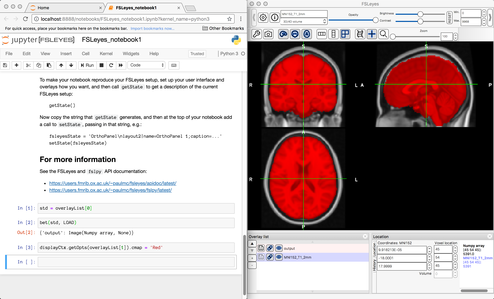
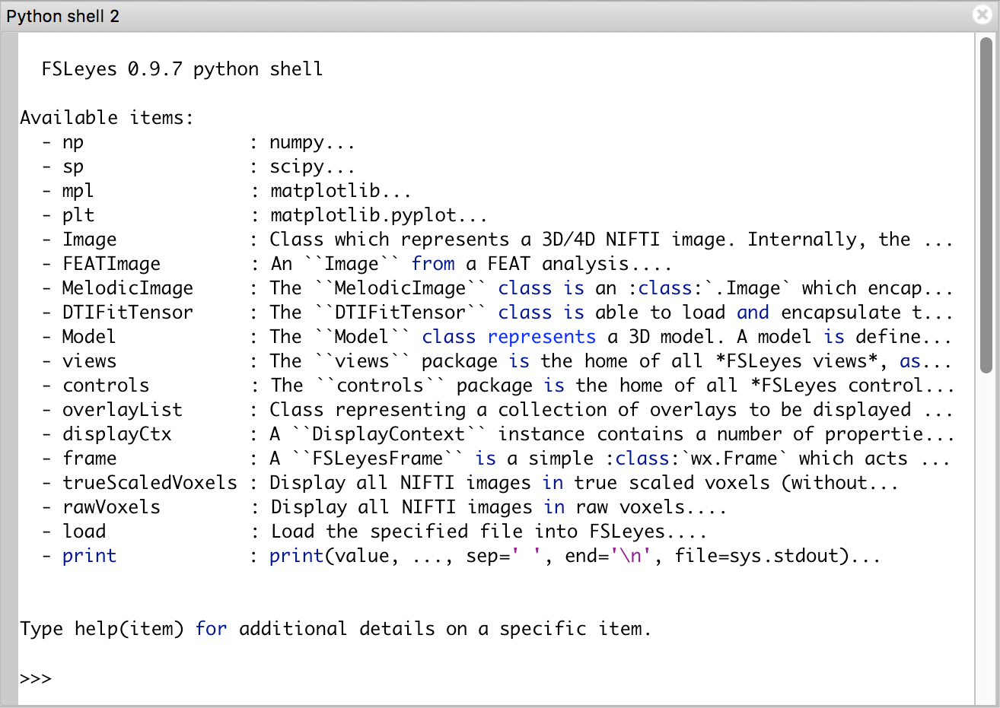

.. |right_arrow| unicode:: U+21D2

.. _fsleyes_notebook:

FSLeyes and Jupyter Notebook
============================

FSLeyes is written primarily in the `Python <https://www.python.org>`_
programming language.  Much of the internal state of FSLeyes can be queried
and modified through a programming interface, which may be accessed from
`IPython <https://ipython.readthedocs.io/>`_ or through a `Jupyter Notebook
<https://jupyter.readthedocs.io/>`_.

It is possible to start FSLeyes from an IPython/Jupyter Notebook session, or
to start a Jupyter notebook which is attached to a running instance of
FSLeyes.

Starting FSLeyes from IPython/Jupyter
-------------------------------------

To start FSLeyes from a running IPython/Jupyter Notebook session, you first
need to enable GUI integration::

    %gui wx

Then you can call the :func:`fsleyes.embed` function to start FSLeyes::

    import fsleyes
    overlayList, displayCtx, frame = fsleyes.embed()
    frame.Show()

Or, if you already have your own ``wx.App`` and ``wx.Frame``, you can prevent
a frame from being created::

    overlayList, displayCtx, _ = fsleyes.embed(mkFrame=False)

You now have references to an :class:`.OverlayList`, the master
:class:`.DisplayContext`, and the :class:`.FSLeyesFrame` (unless you set
``mkFrame=False``), and can use their programming interfaces to interact with
FSLeyes. For example, to open an ortho view, and add an image::

    import os.path as op
    from fsleyes.views.orthopanel import OrthoPanel
    from fsl.data.image import Image

    ortho = frame.addViewPanel(OrthoPanel)

    overlayList.append(Image(op.expandvars('$FSLDIR/data/standard/MNI152_T1_2mm')))

If you are managing your own ``wx.App`` and ``wx.Frame``, you need to do a
little more work - for each view panel, you need to create a child
``DisplayContext`` object, which is linked to the main ``DisplayContext``
(this would normally be done for you by the ``FSLeyesFrame``)::

    from fsleyes.displaycontext import DisplayContext
    orthoDC = DisplayContext(overlayList, parent=displayCtx)
    ortho = OrthoPanel(wxparent, overlayList, orthoDC, None)
    wxparent.GetSizer().Add(ortho)

When you are finished, you should call the :func:`fsleyes.shutdown` function
to free up resources::

    frame.Close()
    fsleyes.shutdown()

Starting Jupyter Notebook from FSLeyes
--------------------------------------

You can start a Jupyter Notebook server which may be used to interact with a
running instance of FSLeyes via the *File* |right_arrow| *Open notebooks* menu
item.

FSLeyes also has an integrated Python shell which offers the same programming
interface. This can be accessed via the *Views* |right_arrow| *Python shell*
menu item

The remainder of this page contains a very brief overview of the FSLeyes
programming interface. Refer to the :ref:`links below
<fsleyes_api_further_reading>` for more comprehensive documentation.

.. [*] See also the ``--runscript`` :ref:`command line option
       <command_line_run_script>`.

.. warning:: The FSLeyes programming API is subject to change. The developers
             strive to adhere to `semantic versioning <https://semver.org>`_
             conventions, so take note of the FSLeyes version number.

Help
----

Use the built-in ``help`` function to get help on anything in the
notebook/shell environment, whether it is a module, function, class, or
object::

  >>> help(load)
  Help on function load in module fsleyes.actions.runscript:

  load(filename)
      Load the specified file into FSLeyes.

Overlays
--------

The ``overlayList`` is a list which contains all of the overlays that have
been loaded into FSLeyes::

  >>> overlayList
  >>> [Image(MNI152_T1_1mm, /.../MNI152_T1_1mm.nii.gz),
       Image(MNI152_T1_2mm, /.../MNI152_T1_2mm.nii.gz)]

You can load overlays into FSLeyes simply by inserting them into this
list. Or, you can use the built-in ``load`` function::

  >>> load('path/to/my_image.nii.gz')

You can remove an overlay in the same way that you would remove an item from a
python ``list``::

  >>> del overlayList[0]
  >>> overlayList
  >>> [Image(MNI152_T1_2mm, /.../MNI152_T1_2mm.nii.gz)]

.. note:: As an alternative to the ``load`` function, ytou can also manually
          create overlays, and then add them to the ``overlayList``. For
          example::

              image = Image('path/to/my_image.nii.gz')
              overlayList.append(image)

FSL tools
---------

If you have FSL installed, you can call some FSL tools [*]_ through Python
functions, e.g.::

  >>> struc = load('/path/to/my/T1.nii.gz')
  >>> bet(struc, LOAD)

The special ``LOAD`` symbol will cause the result to be loaded into FSLeyes.

.. [*] The FSL wrapper functions are provided by the |fslpy_doc|_ library -
       check out the ``fsl.wrappers`` package documentation to see what is
       available.

Display settings
----------------

You can use the ``displayCtx`` to access the display settings for an
overlay. Display settings for an overlay are divided between two objects:

 - A ``Display`` object, which contains general display settings
 - A ``DisplayOpts`` object, which contains display settings specific to the
   overlay type

You can access these objects like so::

  >>> overlay = overlayList[0]
  >>> display = displayCtx.getDisplay(overlay)
  >>> opts    = displayCtx.getOpts(   overlay)

Adjusting the overlay display settings is easy::

  >>> display.brightness = 75
  >>> opts.cmap          = 'hot'

You can get help on the ``Display`` and ``DisplayOpts`` instances via the
``help`` function::

  >>> help(display)
  Help on Display in module fsleyes.displaycontext.display object:

  class Display(props.syncable.SyncableHasProperties)
   |  The ``Display`` class contains display settings which are common to
   |  all overlay types.
   |
   |  A ``Display`` instance is also responsible for managing a single
   |  :class:`DisplayOpts` instance, which contains overlay type specific
   |  display options. Whenever the :attr:`overlayType` property of a
   |  ``Display`` instance changes, the old ``DisplayOpts`` instance (if any)
   |  is destroyed, and a new one, of the correct type, created.
  .
  .
  .

FSLeyes interface
-----------------

You can programmatically modify the FSLeyes interface and layout through the
notebook/shell. The FSLeyes interface is contained within a single object, the
``FSLeyesFrame``. This is available in the environment as the ``frame``.

You can add and remove :ref:`views <overview_views_and_controls>` to and from
the ``frame``::

  >>> frame.addViewPanel(views.OrthoPanel)
  >>> frame.viewPanels
  [<fsleyes.views.shellpanel.ShellPanel; proxy of <Swig Object of type 'wxPyPanel *' at 0x11b4b4c90> >,
   <fsleyes.views.orthopanel.OrthoPanel; proxy of <Swig Object of type 'wxPyPanel *' at 0x11593dba0> >]

  >>> ortho = frame.viewPanels[1]
  >>> frame.removeViewPanel(ortho)

You can also access the view settings for a specific view::

  >>> frame.addViewPanel(views.OrthoPanel)
  >>> frame.viewPanels
  [<fsleyes.views.shellpanel.ShellPanel; proxy of <Swig Object of type 'wxPyPanel *' at 0x11b4b4c90> >,
   <fsleyes.views.orthopanel.OrthoPanel; proxy of <Swig Object of type 'wxPyPanel *' at 0x11593dba0> >]

  >>> ortho                = frame.viewPanels[1]
  >>> orthoOpts            = ortho.getSceneOptions()
  >>> orthoOpts.layout     = 'grid'
  >>> orthoOpts.showLabels = False

.. _fsleyes_api_further_reading:

Further reading
---------------

For more information on the FSLeyes programming interface, refer to:

- |fsleyes_apidoc|_ developer documentation
- |fslpy_doc|_ developer documentation
- |props_doc|_ developer documentation
- |widgets_doc|_ developer documentation
