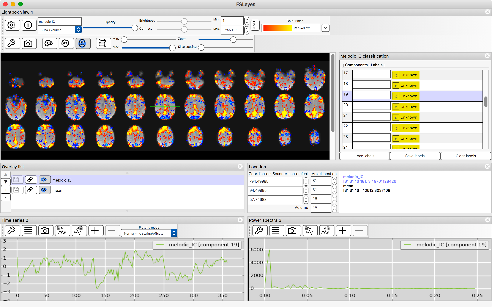
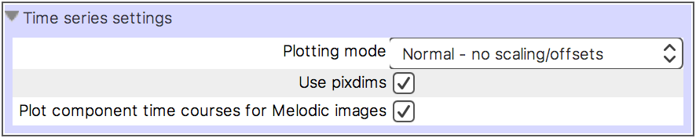
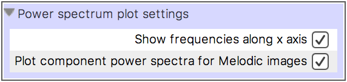
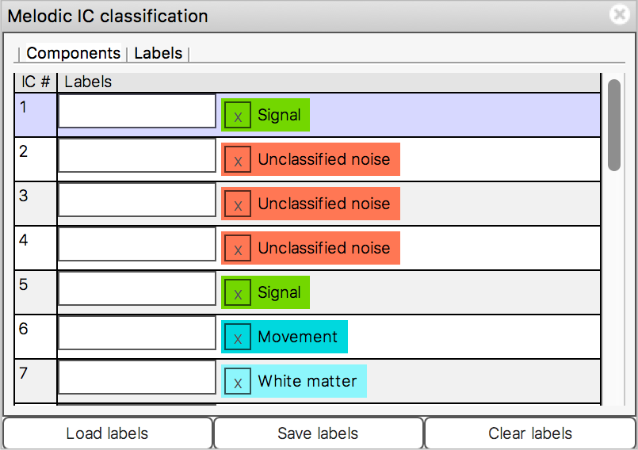
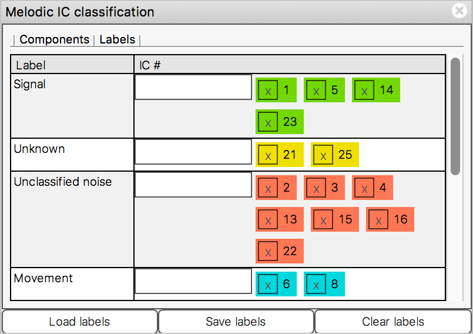

.. |right_arrow|   unicode:: U+21D2

.. |left_arrow_2|  unicode:: U+2190
.. |up_arrow_2|    unicode:: U+2191
.. |right_arrow_2| unicode:: U+2192
.. |down_arrow_2|  unicode:: U+2193

.. _ic_classification:

IC classification
=================

FSLeyes has some features to assist you in viewing and classifying the results
of a `MELODIC <http://fsl.fmrib.ox.ac.uk/fsl/fslwiki/MELODIC>`_ analysis.  In
particular, FSLeyes offers similar capability to the `Melview
<http://fsl.fmrib.ox.ac.uk/fsl/fslwiki/Melview>`_ tool, for manual component
classification. Manual classification of MELODIC components is a necessary
step in training the `FIX <http://fsl.fmrib.ox.ac.uk/fsl/fslwiki/FIX>`_
classifier.

.. _ic_classification_loading_a_melodic_analysis:

Loading a MELODIC analysis
--------------------------

.. sidebar:: What does a MELODIC analysis directory look like?

             FSLeyes requires a MELODIC directory to meet the following
             rules. If any of these rules are not met, FSLeyes will not
             recognise your directory as a MELODIC analysis:

             - The directory name must end in ``.ica``.

             - The directory must contain the following files:

               - ``melodic_IC``: A 4D NIFTI image containing one spatial
                 component map in each 3D volume.
               - ``melodic_mix``: The component time courses
               - ``melodic_FTmix``: The component power spectra

You can load a MELODIC analysis in a few different ways:

- From the :ref:`command line <command_line>` - you can specify either an
  ``.ica`` directory [*]_::

      fsleyes path/to/my_analysis.ica

  Or the ``melodic_IC`` image::

      fsleyes path/to/my_analysis.ica/melodic_IC

- Via *File* |right_arrow| *Add from directory* - select your
  ``.ica`` analysis directory.

- Via *File* |right_arrow| *Add from file* - select the
  ``melodic_IC`` image located in your ``.ica`` analysis directory.

.. [*] If you are working with a single-subject analysis generated via the
       MELODIC GUI, there will be two levels of directories ending in
       ``.ica``. You need to pass the path to the inner directory to FSLeyes -
       this is typically called ``filtered_func_data.ica``.

.. _ic_classification_the_melodic_layout:

The MELODIC layout
------------------

The MELODIC layout arranges the FSLeyes interface in a layout inspired by
Melview, to assist in manual component classification.

The MELODIC layout comprises a :ref:`lightbox view
<ortho_lightbox_views_lightbox>`, a :ref:`time series
<plot_views_time_series_view>` and :ref:`power spectrum
<plot_views_power_spectrum_view>` view, and an IC classification panel
(described :ref:`below
<ic_classification_classifying_components_with_the_classification_panel>`).

You can activate the MELODIC layout via the *View* |right_arrow|
*Layouts* |right_arrow| *MELODIC mode* menu item. Or you can tell FSLeyes
to start up with the MELODIC layout via the :ref:`command line
<command_line>`::

    fsleyes -s melodic path/to/my_analysis.ica

.. _component_time_series_and_power_spectra:

Component time series and power spectra
---------------------------------------

The :ref:`time series <plot_views_time_series_view>` and :ref:`power
spectrum <plot_views_power_spectrum_view>` views both recognise when you are
viewing a ``melodic_IC`` image from a MELODIC analysis. Instead of plotting
the intensities at the current *voxel*, the time series and power spectrum for
the current *component* is plotted - the current component is determined by
the 3D volume that you are currently viewing.

If, instead of viewing the time series and power spectrum for the current
component, you actually want to view the voxel intensities or voxel power
spectrum from a ``melodic_IC`` file, both plotting views have an option,
accessed through the :ref:`plot control panel
<plot_views_customising_the_plot_the_plot_control_panel>`:

The *Plot component time series for Melodic images* and *Plot component power
spectra for Melodic images*, both enabled by default, allow you to choose
between plotting data for the current component, or plotting data for the
current voxel.

.. _ic_classification_classifying_components_with_the_classification_panel:

Classifying components with the classification panel
----------------------------------------------------

The IC classification panel allows you to view and modify classification
labels for each component in a ``melodic_IC`` file [*]_. The IC classification
panel displays a list of components, and one or more classification labels for
each component:

The *Components* and *Labels* tabs along the top allow you to switch between
organising the list by component, or organising the list by label. The
*Labels* tab displays the same information, but organised by label, instead
of by component:

The buttons along the bottom of the panel allow you to:

- **Load labels** Load a set of classifications from a file (see the section
  on the :ref:`label file format <ic_classification_file_format>` below).

- **Save labels** Save your labels to a file. These files can be used as
  inputs to `FIX <http://fsl.fmrib.ox.ac.uk/fsl/fslwiki/FIX>`_.

- **Clear labels** Clear all of the existing labels - each component will be
  given a label of *Unknown*.

When working in the *Components* list, each row contains the labels for one
component, corresponding to one volume in the ``melodic_IC`` file [*]_. If you
are using the :ref:`MELODIC layout
<ic_classification_the_melodic_layout>`, when you select a row in the
component list, the lightbox, time series, and power spectrum views will
update to display the volume, time course, and power spectrum corresponding to
the selected component.

.. [*] The classification panel can actually be used to label the volumes of
       any 4D NIFTI image, not just ``melodic_IC`` images.

.. [*] **Important**: In FSLeyes |version|, component indices start at 1, but
       volume indices start at 0! This means that, for example, `IC #1` in the
       classification panel corresponds to volume 0 in the ``melodic_IC`` file
       (as reported in the :ref:`location panel
       <ortho_lightbox_views_location_panel>`).

.. sidebar:: Available labels

             The following classification labels are built into FSLeyes, but
             you are free to type in your own. You may also customise this
             list by modifying the ``melodic-classes`` lookup table - see the
             page on :ref:`customising FSLeyes <customising>` for more
             details:

             - Signal
             - Unknown
             - Unclassified noise
             - Movement
             - Cardiac
             - White matter
             - Non-brain
             - MRI
             - Susceptibility-motion
             - Sagittal sinus
             - Respiratory

The classification panel is designed to be used entirely with the keyboard
[*]_:

1. Move up and down the list with the |up_arrow_2| and |down_arrow_2| keys.

2. When you select a row, simply start typing the label you wish to apply to
   the component. A drop-down box will appear containing a list of known
   labels. You can use the |up_arrow_2| and |down_arrow_2| keys to select an
   entry from this list, or continue typing the label manually. Press
   **Enter** when you have finished typing, and the label will be added to the
   component.

3. When you select a row, you can also press *Enter* to display the drop down
   box immediately, instead of typing a label.

4. You can use the |left_arrow_2| and |right_arrow_2| keys to move between
   labels for the current component. When a label is selected (the label box
   will be outlined with a faint pink border) you can push the **Delete** key
   to remove that label from the component.

While the above description pertains to the *Components* list, the *Labels*
list can be used in the same manner.

.. [*] Keyboard navigation may not work correctly on some platforms - refer to
       the :ref:`troubleshooting page
       <troubleshooting_keyboard_navigation_doesnt_work_in_the_ic_classification_panel>`
       for more details.

.. _ic_classification_file_format:

IC Classification file format
-----------------------------

The file format used by FSLeyes for storing IC classification labels is
compatible [*]_ to that used by `Melview
<http://fsl.fmrib.ox.ac.uk/fsl/fslwiki/Melview>`_ and `FIX
<http://fsl.fmrib.ox.ac.uk/fsl/fslwiki/FIX>`_. FSLeyes is also able to load
label files generated by `ICA-AROMA
<https://github.com/rhr-pruim/ICA-AROMA>`_, a classifier for detecting
motion-related ICs.

An IC classificaiton file is a plain text file which looks like this::

  filtered_func_data.ica
  1, Signal, False
  2, Unclassified Noise, True
  3, Unknown, False
  4, Signal, False
  5, Unclassified Noise, True
  6, Unclassified Noise, True
  7, Non-brain, Movement, True
  8, Signal, False
  [2, 5, 6, 7]

The file format comprises three sections:

- The first line of the file contains the name of the MELODIC directory which
  the label file corresponds to (specified as a path relative to the location
  of the label file).

- Then, one line is present for each component. Each component line contains
  the following, separated by commas:

  - The component index (starting from 1).

  - One or more labels for the component (multiple labels are separated with a
    comma).

  - ``True`` if the component has been classified as a *bad* component [*]_,
    ``False`` otherwise.

- The last line of the file contains the indices (starting from 1) of all
  *bad* components. These indices are separated with commas, and contained
  within square brackets.

FSLeyes is also capable of loading classification files which only contain the
bad component list. Such files contain a single line of comma-separated
component indices, which may or may not be contained within square
brackets. For example::

  [2, 5, 6, 7]

This is also valid::

  2, 5, 6, 7

.. [*] The one exception to this is that files saved with FSLeyes, which
       contain more than one label per component, cannot be loaded into
       Melview.  These files *can* be used with FIX, however.

.. [*] A *bad* component is defined as any component which does not have a a
       label of ``Signal`` or ``Unknown``.
