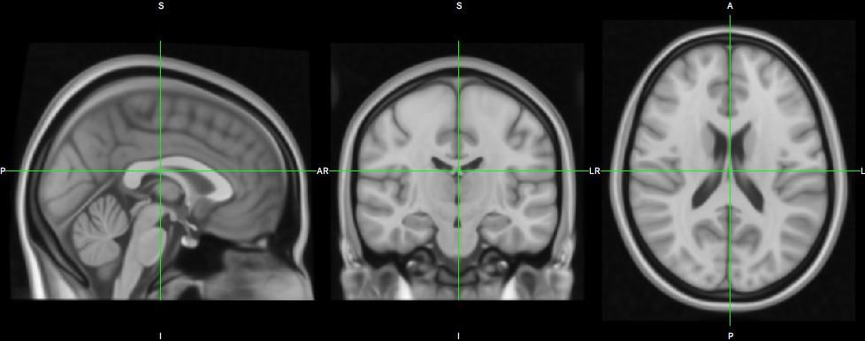
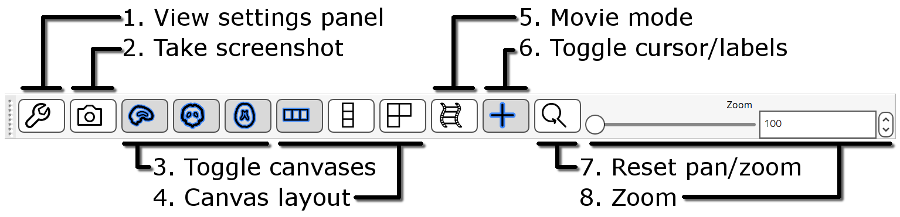
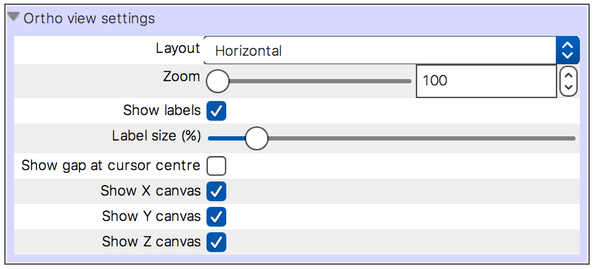
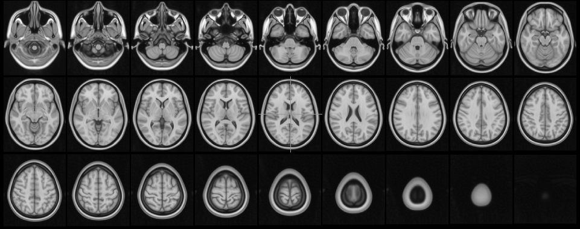
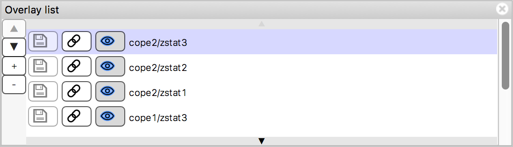
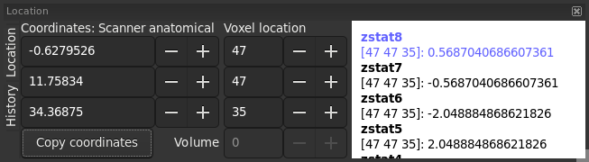
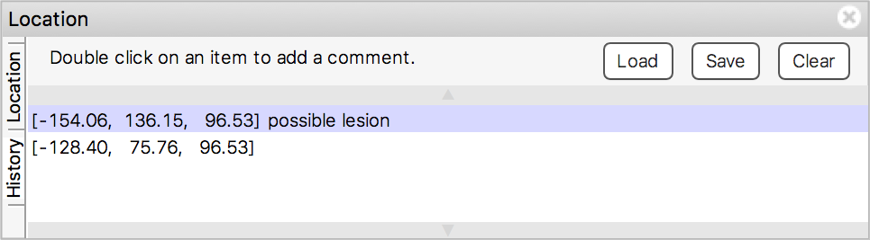
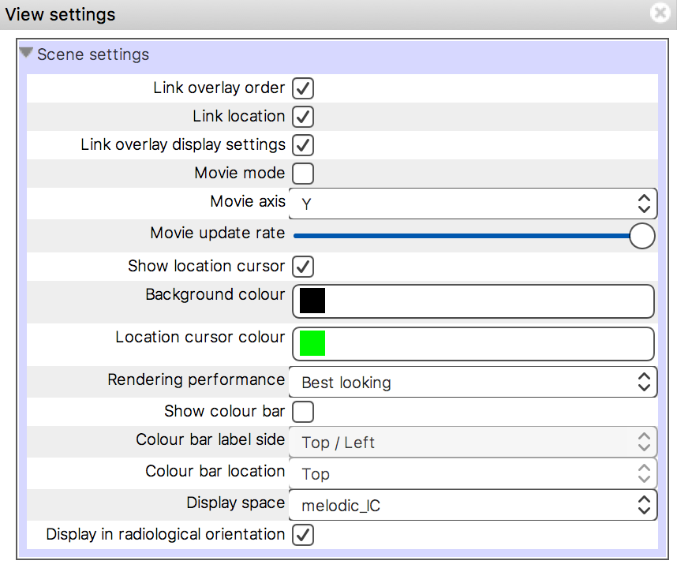
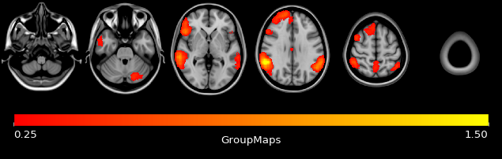

.. |command_key| unicode:: U+2318
.. |shift_key|   unicode:: U+21E7
.. |control_key| unicode:: U+2303
.. |alt_key|     unicode:: U+2325

.. |up_arrow|    unicode:: U+25B2
.. |down_arrow|  unicode:: U+25BC

.. |right_arrow| unicode:: U+21D2

.. |chainlink_icon|   image:: images/chainlink_icon.png
.. |eye_icon|         image:: images/eye_icon.png
.. |reset_zoom_icon|  image:: images/reset_zoom_icon.png
.. |spanner_icon|     image:: images/spanner_icon.png
.. |floppy_icon|      image:: images/floppy_icon.png
.. |camera_icon|      image:: images/camera_icon.png

.. _ortho_lightbox_views:

Orthographic/lightbox views
===========================

FSLeyes |version| has two primary 2D views - the orthographic (*ortho*) view,
and the *lightbox* view.

.. _ortho_lightbox_views_ortho:

Ortho view
----------

The ortho view comprises three canvases, which display your overlays along
three orthogonal planes. For a NIFTI image which is oriented acording to the
MNI152 template, these canvases correspond to the sagittal, coronal, and axial
planes.

.. _ortho_lightbox_views_ortho_interaction:

Ortho view interaction
^^^^^^^^^^^^^^^^^^^^^^

You can interact with an ortho view in a number of ways:

 - Click, or click and drag, to change the current location.
 - Right click and drag to draw a zoom rectangle. When you release the mouse,
   the view will zoom in to that rectangle.

 - Hold down the |command_key| key (OSX) or |control_key| key (Linux), and
   use your mouse wheel to zoom in and out of a canvas.

 - Hold down the |shift_key| key, and use your mouse wheel to change the
   current location along the depth axis for that canvas (i.e. to scroll
   through slices).

 - If a mesh overlay is selected, hold down the |shift_key| and click the
   mouse to select the mesh vertex that is nearest to the mouse click.

 - Middle-click and drag, or hold down the |alt_key| key and drag with the
   left mouse button, to pan around.

 - Hold down the |shift_key| key and the |command_key|/|control_key| key, then
   click and drag the mouse to adjust the brightness and contrast of the
   currently selected overlay. Moving the mouse vertically will adjust the
   contrast, and horizontally will adjust the brightness.

 - You can reset the view to its default zoom/pan settings by pressing the
   |reset_zoom_icon| button on the :ref:`ortho toolbar
   <ortho_lightbox_views_ortho_toolbar>`, or selecting the *Settings*
   |right_arrow| *Ortho view 1* |right_arrow| *Reset display* menu item.

.. _ortho_lightbox_views_ortho_toolbar:

Ortho toolbar
^^^^^^^^^^^^^

The ortho toolbar contains some controls allowing you to configure an ortho
view. More settings are available in the :ref:`view settings panel
<ortho_lightbox_views_ortho_view_settings>`.

1. **View settings panel** Clicking the |spanner_icon| button will open the
   :ref:`view settings panel <ortho_lightbox_views_view_settings>`,
   which contains more options for configuring the ortho view.

2. **Take screenshot**: Clicking the |camera_icon| button allows you to save
   the current ortho scene as a screenshot.

3. **Toggle canvases** These buttons allow you to individually toggle each of
   the canvases on and off.

4. **Canvas layout** These buttons allow you to switch the canvas layout
   between horizontal, vertical, and a grid layout.

5. **Movie mode** Clicking this button will enable :ref:`movie mode
   <ortho_lightbox_views_view_settings_movie_mode>`.

6. **Toggle cursor/labels** This button allows you to turn the location cursor
   and anatomical labels on and off.

7. **Reset pan/zoom** This button will reset the pan and zoom settings on the
   three canvases.

8. **Zoom** This control allows you to set the zoom level on all three
   canvases at once.

.. _ortho_lightbox_views_ortho_view_settings:

Ortho view settings
^^^^^^^^^^^^^^^^^^^

All of the settings which are available on the :ref:`ortho toolbar
<ortho_lightbox_views_ortho_toolbar>`, along with some more options, are
available in the view settings panel (accessed via the |spanner_icon| button)
[*]_:

Here you can turn on/off anatomical labels and adjust their size, and toggle a
gap at the location cursor centre.

.. [*] The view settings panel also contains settings which are common to
       both ortho and lightbox views - these settings are described
       :ref:`below <ortho_lightbox_views_view_settings>`.

.. _ortho_lightbox_views_lightbox:

Lightbox view
-------------

The lightbox view displays a series of adjacent slices along a single plane
through your overlays. You can adjust the start/end points, and adjust the
slice spacing.

.. _ortho_lightbox_views_lightbox_interaction:

Lightbox view interaction
^^^^^^^^^^^^^^^^^^^^^^^^^

 - Click, or click and drag, to change the current location.

 - Use your mouse wheel to scroll up and down through the slices.

 - Hold down the |command_key| key (OSX) or |control_key| key (Linux), and use
   your mouse wheel to zoom in and out of the canvas. Zooming on a lightbox
   view simply changes the number of slices which are displayed.

.. _ortho_lightbox_views_lightbox_toolbar:

Lightbox toolbar
^^^^^^^^^^^^^^^^

Similar to the :ref:`ortho toolbar <ortho_lightbox_views_ortho_toolbar>`, the
lightbox toolbar allows you to control how the lightbox view displays your
overlay.

.. image:: images/ortho_lightbox_views_lightbox_toolbar.png
   :width: 75%
   :align: center

1. **View settings panel** Clicking the |spanner_icon| button will open the
   :ref:`view settings panel <ortho_lightbox_views_view_settings>`, allowing you
   to further configure the lightbox view.

2. **Take screenshot** Clicking the |camera_icon| button allows you to save
   the current lightbox scene as a screenshot.

3. **Z axis** These three buttons allow you to switch between displaying slices
   along the three orthogonal planes.

4. **Movie mode** This button enables :ref:`movie mode
   <ortho_lightbox_views_view_settings_movie_mode>`.

5. **Slice range** These sliders allow you to adjust the position, along the Z
   axis, of the first and last slices which are displayed on the lightbox view.

6. **Zoom** This slider allows you to zoom in and out of the lightbox view.

7. **Slice spacing** This slider allows you to adjust the distance, along the
   Z axis, between adjacent slices.

.. _ortho_lightbox_views_lightbox_view_settings:

Lightbox view settings
^^^^^^^^^^^^^^^^^^^^^^

The :ref:`view settings panel <ortho_lightbox_views_view_settings>` for a
lightbox view contains some additional settings, allowing you to turn on a
grid, and to highlight the current slice.

.. image:: images/ortho_lightbox_views_lightbox_view_settings.png
   :width: 50%
   :align: center

.. _ortho_lightbox_views_overlay_list:

The overlay list
----------------

The overlay list displays a list of all overlays that you have loaded.

The overlay list allows you to do the following:

 - Change the currently selected overlay, by clicking on the overlay name.

 - Identify the currently selected overlay (highlighted in blue).

 - Add/remove overlays with the + and - buttons.

 - Change the overlay display order with the |up_arrow| and |down_arrow|
   buttons.

 - Show/hide each overlay with the |eye_icon| button, or by double clicking
   on the overlay name.

 - :ref:`Link overlay display properties
   <overlays_linking_overlay_properties>` with the |chainlink_icon| button.

 - Save an overlay if it has been :ref:`edited <editing_images>`, with the
   |floppy_icon| button.

 - Left-click and hold the mouse button down on the overlay name to view the
   overlay source (e.g. its location in the file system).

.. _ortho_lightbox_views_location_panel:

The location panel
------------------

The location panel shows the currently displayed location, relative to the
currently selected overlay.

For NIFTI images, the location is displayed in both voxel coordinates and
world coordinates [*]_, along with a label which defines the world coordinates
for the currently selected overlay - in the example above, the world
coordinates for the selected overlay are defined by the MNI152 standard
space.

You can use the coordinate controls to change the currently displayed location
and, for 4D NIFTI images, use the volume control to change the currently
displayed volume.

.. warning:: Note that FSLeyes starts counting volumes from **0**, not **1**.

The area on the right of the location panel displays the intensity values at
the current location for every visible overlay. For NIFTI images, the
corresponding voxel location (and volume index, for 4D images) is also shown.

.. [*] See the page on :ref:`the display space <display_space>` for more
       details on the different coordinate systems used in FSLeyes.

Location history
^^^^^^^^^^^^^^^^

Clicking the *History* tab on the left of the location panel will bring up a
list of all of the locations that you have visited, recorded in world
coordinates.

Clicking on a location will take you back to that location. You can also
double-click on an entry to add a comment about that location. You can save
the location history out to a text file, and load in a previously saved
history using the buttons along the top.

.. _ortho_lightbox_views_view_settings:

Ortho/lightbox view settings
----------------------------

Ortho and lightbox views (and the :ref:`3D view <3d_view>`) have a view
settings panel, which contain various settings. Many of the settings in this
panel are common to both ortho and lightbox views, and are described here.

A number of basic and advanced options can be configured through the view
settings panel:

 - **Show location cursor** The location cursor can be toggled on/off.

 - The canvas **Background colour** can be changed.

 - The canvas **Foreground colour** can be changed. This controls the font
   colour. Note that the foreground colour will be automatically adjusted
   whenever you change the background colour.

 - The **Location cursor colour** can be changed.

 - The **Rendering performance** setting allows you to adjust how FSLeyes
   draws overlays; if you are using an old or low-performance computer, you
   may wish to choose a lower (faster) performance setting here.

 - If you are using a mac with a retina display, you can turn on the **Enable
   high-DPI rendering** option to take full advantage of your display's
   resolution.

 - You can change the **Display space** reference overlay - the display space
   is further described :ref:`here <display_space>`.

 - **Display in radiological orientation** The view orientation can be toggled
   between radiological and neurological [*]_.

 .. [*] When radiological orientation is enabled, the subject's left will be
        displayed on the right, and vice-versa. When radiological orientation
        is disabled, FSLeyes displays images in neurological orientation,
        where subject left is displayed on the left.

The remaining options in the view settings panel are described below.

.. _ortho_lightbox_views_view_settings_linking_views:

Linking views
^^^^^^^^^^^^^

When you have more than one view open in FSLeyes (e.g. multiple ortho views),
you can choose to have various properties between them linked or unlinked.

 - **Link overlay order** When this setting is selected, the overlay order (as
   controlled through the :ref:`overlay list panel
   <ortho_lightbox_views_overlay_list>`) will be the same across linked
   views. This setting is selected by default.

 - **Link location** When this setting is selected, the display location will
   be the same across linked views. This setting is selected by default.

 - **Link overlay display settings** When this setting is selected, all
   :ref:`overlay display settings <overlays_overlay_display_settings>`
   (e.g. display range, colour map) will be the same across linked views
   [*]_. This setting is unselected by default.

 .. [*] The *Link overlay display settings* option is independent of the
        :ref:`overlay linking <overlays_linking_overlay_properties>` option
        available through the :ref:`overlay list
        <ortho_lightbox_views_overlay_list>`.

- **Link overlay volume settings** When this setting is selected, the volume
  for 4D overlays will be linked across views.

.. _ortho_lightbox_views_view_settings_movie_mode:

Movie mode
^^^^^^^^^^

If the currently selected overlay is a 4D NIFTI image or a mesh with 4D vertex
data loaded, turning on movie mode will causes FSLeyes to automatically loop
through all of the 3D volumes in the image (or time points in the mesh vertex
data). This allows you to quickly scan through 4D images to, for example,
visually check for motion artefacts in fMRI time series, or check registration
alignment in a collection of T1 MRI images. The **Movie update rate** setting
will adjust the speed at which the movie frames change. You can also change
the image axis (X, Y, Z, or time/volume), to loop through via the **Movie
axis** setting.

.. note:: If movie mode is not working for you, try changing the **Synchronise
          movie updates** setting.

.. _ortho_lightbox_views_view_settings_colour_bar:

Colour bar
^^^^^^^^^^

You can add a colour bar to ortho and lightbox views, which will display the
mapping between voxel intensity values and the colour map for the currently
selected overlay [*]_. You can choose to display the colour bar on the top,
bottom, left, or right of the canvas, and on which side the colour bar labels
are shown.

.. [*] The colour bar feature currently only works for :ref:`volume
       <overlays_volume>` overlays and :ref:`mesh <overlays_mesh>` overlays
       with vertex data selected. Future versions of FSLeyes will offer more
       colour bar options.
