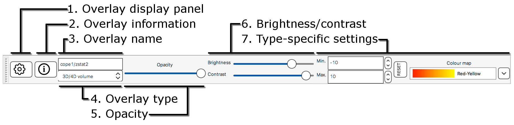
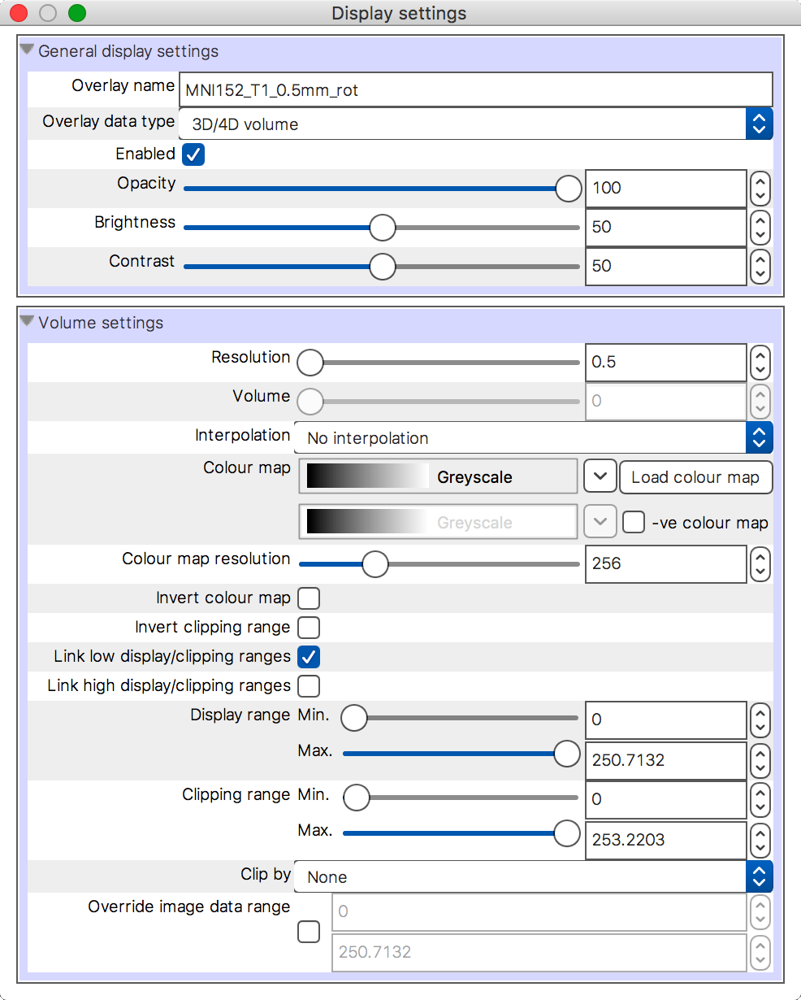
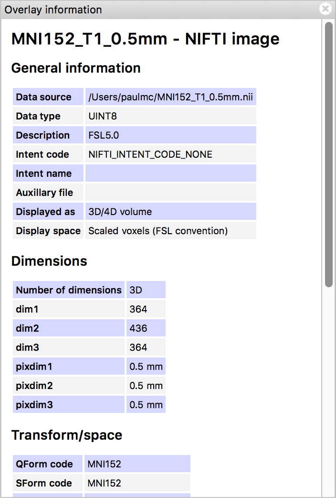

.. |right_arrow| unicode:: U+21D2

.. |information_icon| image:: images/information_icon.png
.. |gear_icon|        image:: images/gear_icon.png
.. |chainlink_icon|   image:: images/chainlink_icon.png

.. _overlays:

Overlays
========

FSLeyes refers to the files that you load as *overlays*. FSLeyes |version| is
capable of loading the following types of data:

 - `NIFTI <https://nifti.nimh.nih.gov/>`_ image files (``.nii``, ``.nii.gz``).

 - `MGH <http://surfer.nmr.mgh.harvard.edu/fswiki/FsTutorial/MghFormat>`_
   image files (``.mgh``, ``.mgz``).

 - `GIFTI <http://www.nitrc.org/projects/gifti/>`_ surface files
   (``.surf.gii``, ``.gii``).

 - `Freesurfer
   <http://www.grahamwideman.com/gw/brain/fs/surfacefileformats.htm>`_ surface
   files (``lh.orig``, ``lh.pial``, ``lh.white``, etc).

 - `FEAT <http://fsl.fmrib.ox.ac.uk/fsl/fslwiki/FEAT>`_ analysis directories
   (``.feat``).

 - `MELODIC <http://fsl.fmrib.ox.ac.uk/fsl/fslwiki/MELODIC>`_ analysis
   directories (``.melodic``).

 - `dtifit <http://fsl.fmrib.ox.ac.uk/fsl/fslwiki/FDT/UserGuide#DTIFIT>`_
   output directories.

 - `VTK legacy files
   <http://www.vtk.org/wp-content/uploads/2015/04/file-formats.pdf>`_
   (``.vtk``) which are in a format similar to that produced by the `FIRST
   <http://fsl.fmrib.ox.ac.uk/fsl/fslwiki/FIRST>`_ sub-cortical segmentation
   tool.

Volumetric images can be displayed in a variety of different ways, depending
on the nature of the image data, and on how you want to display it. The way in
which an overlay is displayed is called the *overlay type* or the *display
type*.  The most conventional overlay/display type for a volumetric image is
the :ref:`volume <overlays_volume>`; the other types are described :ref:`below
<overlays_overlay_type>`.

.. _overlays_loading_an_overlay:

Loading an overlay
------------------

You can load an overlay by doing one of the following:

1. The *File* |right_arrow| *Add from file* menu option allows you to choose a
   file to load (e.g. a ``.nii``, ``.nii.gz``, or ``.gii`` file).

2. The *File* |right_arrow| *Add from directory* menu option allows you to
   choose a directory to load (e.g. a ``.feat``, ``.ica``, or ``dtifit``
   directory).

3. The *File* |right_arrow| *Add standard* menu option allows you to choose a
   file from the ``$FSLDIR/data/standard/`` directory to load [*]_.

4. The *File* |right_arrow| *Add from XNAT* menu option allows you to
   connect to, and download files from, XNAT server.

5. The *File* |right_arrow| *Add from DICOM* menu option allows you to load
   volumetric data from a DICOM directory [*]_.

5. The + button on the :ref:`overlay list <ortho_lightbox_views_overlay_list>`
   allows you to choose a file to load.

.. [*] The *File* |right_arrow| *Add standard* menu option will be disabled
       if your FSL environment is not configured correctly.

.. [*] The *Add from DICOM* option will only be available if Chris Rorden's
       ``dcm2niix`` is present on your system - it is available `here
       <https://github.com/rordenlab/dcm2niix>`_.

.. _overlays_overlay_display_settings:

Overlay display settings
------------------------

When you select an overlay, or change the type of an overlay, the contents of
the :ref:`overlay display toolbar <overlays_overlay_display_toolbar>` will
change to show commonly used display settings for that overlay. All display
settings for the currently selected overlay are available in the :ref:`overlay
display panel <overlays_overlay_display_panel>`.

.. _overlays_overlay_display_toolbar:

The overlay display toolbar
---------------------------

The overlay display toolbar allows you to adjust basic display settings for
the currently selected overlay. Some settings are available for all overlay
types, whereas other settings will change depending on the type of the
selected overlay.

The following settings are available for all overlay types:

1. **Overlay display panel** Clicking on the |gear_icon| button will open the
   :ref:`overlay display panel <overlays_overlay_display_panel>`.

2. **Overlay information** Clicking on the |information_icon| button will open
   the :ref:`overlay information panel <overlays_overlay_information_panel>`.

3. **Overlay name** You can change the overlay name, as shown in the
   :ref:`overlay list panel <ortho_lightbox_views_overlay_list>`, here.

4. **Overlay type** You can change the overlay type here.

5. **Opacity** This slider allows you to adjust the overlay
   opacity/transparency.

6. **Brightness/contrast** These sliders allow you to adjust the overlay
   brightness and contrast.

The remaining settings will differ depending on the overlay type. For
:ref:`volume <overlays_volume>` overlays, the following settings are
available:

7. **Reset display range** This button will reset the **display range** to
   the range of the image data.

8. **Display range** These fields control the way that the image data is
   coloured.

9. **Colour map** You can select a range of different colour maps for
   colouring the image data.

10. **-ve colour map** If the negative colour map is enabled, this control
    allows you to choose the colour map for negative valued voxels.

11. **Enable -ve colour map** This button toggles the use of the negative
    colour map - for images which have both positive and negative values,
    positive voxels will be coloured with the standard colour map,
    and negative voxels will be coloured with the negative colour map.

.. _overlays_overlay_display_panel:

The overlay display panel
-------------------------

The :ref:`overlay toolbar <overlays_overlay_display_toolbar>` allows you to
adjust basic display settings for the currently selected overlay. Many more
settings are available in the overlay display panel (accessed via the
|gear_icon| button on the overlay toolbar):

.. _overlays_linking_overlay_properties:

.. sidebar:: Linking overlay properties

             The :ref:`overlay list panel <ortho_lightbox_views_overlay_list>`
             allows you to link some display properties across a group of
             overlays, via the |chainlink_icon| button.  This is useful if,
             for example, you have two or more 4D NIFTI images, and you want
             to display the same volume from each of them.

The *General display settings* section at the top contains settings common to
all overlay types. The bottom section (*Volume settings* in this example)
contain settings which are specific to the type of the currently selected
overlay. The settings available for each overlay type are covered :ref:`below
<overlays_overlay_type>` [*]_.

 .. [*] In the :ref:`3D view <3d_view>`, the overlay display panel contains a
        third section containing 3d-specific settings. These settings are
        described separately in the :ref:`3D view
        <3d_view_overlay_display_settings>` section.

.. _overlays_overlay_information_panel:

The overlay information panel
-----------------------------

Clicking the |information_icon| button on the overlay toolbar brings up the
overlay information panel:

This panel contains basic information about the currently selected overlay,
such as its dimensions, file name, and transformation/orientation information.

.. _overlays_overlay_type:

Overlay types
-------------

.. _overlays_volume:

Volume
^^^^^^

This is the default (and most conventional) display type for NIFTI
images. Voxel intensities are coloured according to a colour map. The display
range used to colour voxels can be adjusted, and voxels can be *clipped*
(hidden) with an independent clipping range.

.. container:: image-strip

  .. image:: images/overlays_volume1.png
     :width: 25%

  .. image:: images/overlays_volume2.png
     :width: 25%

  .. image:: images/overlays_volume3.png
     :width: 25%

|

The following settings are available for volume overlays:

- **Volume** If your image is 4D, you can select the displayed volume with
  this slider [*]_.

  .. [*] The **Volume** setting is also available on :ref:`label
         <overlays_label>` and :ref:`mask <overlays_mask>` overlays.

- **Dimension** If your image has more than four dimensinos, you can select
  the dimension (fourth or higher) that the **Volume** setting controls.

- **Interpolation** You can interpolate the image data (resampled to the
  resolution of your display). This is useful for generating figures, and to
  smooth over voxel or slice boundaries for oblique images (images which are
  not orthogonal to the display coordinate system). You can choose between no
  interpolation (equivalent to nearest-neighbour), tri-linear, or spline [*]_
  interpolation.

  .. [*] Spline interpolation may not be available if you are using
         FSLeyes over a SSH/X11 connection, in a VNC session, on an
         older computer, or at a reduced performance setting.

- **Colour map** The colour map defines how voxels are coloured on the
  display. Voxels with an intensity equal to the low display range value will
  be coloured according to the lowest (left-most) colour in the selected
  colour map., and voxels with an intensity equal to the high display range
  will be coloured according to the highest (right-most) colour. You can
  choose from a pre-defined colour map selection, or load your own via the the
  **Load colour map** button. See the page on :ref:`customising FSLeyes
  <customising_colour_maps>` for more details..

- **-ve (negative) colour map** You can apply a second colour map for images
  which contain positive and negative values, such as Z-statistic images, or
  ICA component maps. The first colour map will be applied to positive values,
  and the second to negative values. When a negative colour map is enabled,
  the display and clipping range will be applied inversely to both positive
  and negative values.

- **Colour map resolution** This setting allows you to reduce the number of
  colours that are used in the colour map. For example, if the underlying
  colour map file (see the section on :ref:`colour maps
  <customising_colour_maps>`) contains 256 colours, and you set the resolution
  to 128, only half of the colours from the colour map will be used.

- **Gamma correction** This setting allows you to apply a weighting to the
  display range, so that either lower or higher values will take up more
  of the colour range.

- **Interpolate colour maps** This setting allows you to enable linear
  interpolation between colours in the selected colour map. The default
  behaviour (when this setting is disabled) is to use nearest neighbour
  interpolation.

- **Invert colour map** This setting inverts the colour map, so that low voxel
  intensities are coloured with the high colour from the colour map, and
  vice-versa.

- **Invert clipping range** This setting inverts the behaviour of the clipping
  range, so that voxels with an intensity inside the range are clipped, and
  those with an intensity outside of the range are shown.

- **Link low display/clipping ranges** This setting (enabled by default) links
  the low display and clipping ranges, so that voxels with an intensity below
  the low display range value are also clipped.

- **Link high display/clipping ranges** This setting (disabled by default)
  links the high display and clipping ranges, so that voxels with an intensity
  above the high display range value are also clipped.

- **Display range** This setting controls how the colour map relates to voxel
  intensities.

- **Clipping range** This setting allows you to hide voxels which lie outside
  of the range.

- **Clip by** This setting allows you to clip the selected overlay by the
  voxel intensities that are in another image. When a *clip by* image is
  selected, the *clipping range* will be in terms of that image, not of the
  image being clipped.

- **Override image data range** This setting allows you to effectively
  override the image data range with a custom range. By default, FSLeyes sets
  the default display and clipping range according to the minimum and maximum
  values in the image. While this is suitable for most images, it is
  inconvenient for images which have a very large data range that is driven by
  outlier voxels. By overriding the image data range with this setting, you
  can adjust the display and clipping range limits to a range which is more
  sensible with respect to the data that you are viewing [*]_.

  .. [*] If you are using FSLeyes over a SSH/X11 connection, in a VNC session,
         or on an older computer, it may be necessary to override the data
         range of such an image before you are able to view it.

.. _overlays_the_lookup_table_panel:

.. sidebar:: The lookup table panel

             FSLeyes treats lookup tables independently from the colour maps
             used to colour :ref:`volume <overlays_volume>` overlays. FSLeyes
             provides a handful of pre-defined lookup tables, and allows you
             to create your own through the *lookup table panel*, available as
             a :ref:`control panel <overview_views_and_controls>` on
             :ref:`ortho and lightbox views <overview_views_and_controls>`:

             .. image:: images/overlays_lookup_table_panel.png
                :width: 90%
                :align: center

             |

             You can also install your own lookup tables - see the page on
             :ref:`customising FSLeyes <customising_lookup_tables>` for more
             details.

.. _overlays_label:

Label
^^^^^

This type is useful for viewing NIFTI images which contain discrete integer
values (*labels*), such as :ref:`atlases <atlases>` and (sub-)cortical
segmentation summary images.  Label overlays are coloured according to a
*lookup table*.

.. container:: image-strip

   .. image:: images/overlays_label1.png
      :width: 25%

   .. image:: images/overlays_label2.png
      :width: 25%

|

The following settings are available on label overlays:

- **Lookup table** Choose the lookup table which defines the mapping between
  voxel intensity and colour.

- **Show outline only** You can choose to display label overlays with filled
  regions, or display region outlines.

- **Outline width** This setting controls the region outline width.

.. _overlays_mask:

Mask
^^^^

This type is useful if you want to display an image as a binary mask. You can
display any NIFTI image as a mask - not just binary images.

.. container:: image-strip

   .. image:: images/overlays_mask1.png
      :width: 25%

   .. image:: images/overlays_mask2.png
      :width: 25%

   .. image:: images/overlays_mask3.png
      :width: 25%

|

Mask overlays have the following settings:

- **Colour** This setting controls the colour used to display the mask.

- **Invert** This setting inverts the behaviour of the *threshold* setting -
  when enabled, voxels within the range are excluded from the mask, and
  vice-versa.

- **Threshold** This range defines which voxels are included in the
  mask. Voxels which are within the range are included, and those outside of
  the range are excluded.

- **Interpolation** This setting allows to interpolate the mask overaly on the
  display.

- **Show outline only** This setting will cause only the mask outline to be
  displayed (according to the current threshold), rather than showing it
  "filled".

- **Outline width** If the *Show outline only* option is enabled, this
  setting allows you to control the outline width.

.. _overlays_mip:

Maximum intensity projection (MIP)
^^^^^^^^^^^^^^^^^^^^^^^^^^^^^^^^^^

   .. image:: images/overlays_mip1.png
      :width: 25%
      :align: right

Selecting this overlay type enables an X-ray-like effect, where the maximum
values present in the image, along a ray perpendicular to the viewing
plane, is displayed. The :ref:`Nudge <tools_adjust_image_transform>` tool can
be applied to MIP overlays to give you a 3D effect.

In addition to many options shared with the :ref:`volume <overlays_volume>`
overlay type, the following settings are available for MIP overlays:

- **MIP window length** This setting allows you to control the window over
  which the MIP is calculated. It is calculated over a window centered at the
  current display location, and of a length specified as a proportion of the
  image - setting the window length to **1** will cause the MIP to be
  calculated over the entire image.

- **Minimum intensity** This setting allows you to display the minimum
  intensity, rather than the maximum intensity.

- **Absolute intensity** This setting allows you to display the absolute
  maximum intensity, rather than the maximum intensity. This setting will
  override the *Minimum intensity* setting.

.. _overlays_vector:

Vector
^^^^^^

4D NIFTI images which contain exactly three 3D volumes may be interpreted as a
*vector* image where, at each voxel, the three volumes respectively contain X,
Y and Z coordinates specifying the magnitude and direction of a vector at that
voxel.  For example, the `dtifit
<http://fsl.fmrib.ox.ac.uk/fsl/fslwiki/FDT/UserGuide#DTIFIT>`_ tool outputs
diffusion tensor eigenvectors, and the `bedpostx
<http://fsl.fmrib.ox.ac.uk/fsl/fslwiki/FDT/UserGuide#BEDPOSTX>`_ tool outputs
mean principal diffusion directions, as vector images.

A vector image can be displayed in one of two ways - as a *RGB* vector, or as
a *line* vector.

.. container:: image-strip

  .. image:: images/overlays_rgbvector1.png
     :width: 25%

  .. image:: images/overlays_rgbvector2.png
     :width: 25%

  .. image:: images/overlays_rgbvector3.png
     :width: 25%

|

In a RGB vector image, each voxel is coloured according to the magnitude of
the X, Y, and Z vector components. The default colours are (respectively) red
green and blue, but these can be customised or individually disabled
(*suppressed*). If you have another image in the same space (e.g. a fractional
anisotropy [FA] or mean diffusivity [MD] map), you can modulate the brightness
of the vector colours in each voxel according to the values in the other
image.

.. container:: image-strip

  .. image:: images/overlays_linevector1.png
     :width: 25%

  .. image:: images/overlays_linevector2.png
     :width: 25%

  .. image:: images/overlays_linevector3.png
     :width: 25%

|

In a line vector image, the vector at each voxel is displayed as a line, and
typically coloured in the same manner as for a RGB vector. Line width and
length can be scaled by a constant factor, and the vector values can be
displayed with varying lengths (according to their individual magnitudes), or
all scaled to have the same length.

The following settings are available on vector overlays:

- **Colour by** This setting overrides the default RGB vector colouring
  scheme, allowing you to colour the vector data in each voxel according to
  the voxel intensities in another image. This is not very useful for RGB
  vector overlays, but can be useful for line vectors.

- **Modulate by** This setting allows you to modulate the brightness of
  the vector overlay according to the voxel intensities in another image.

- **Clip by** This setting allows you to clip the voxels in the vector overlay
  according to the voxel intensities in another image.

- **Colour map** If you have selected a *Colour by* image, this setting allows
  you to choose the colour map to use.

- **Clipping range** If you have selected a *Clip by* image, this setting
  allows you to adjust the clipping range. The range limits are relative to
  the selected *Clip by* image.

- **Modulation range** If you have selected a *Modulate by* image, this
  setting allows you to adjust the modulation range. The range limits are
  relative to the selected *Modulate by* image.

- **X Colour** The colour to be used for the X vector component.

- **Y Colour** The colour to be used for the Y vector component.

- **Z Colour** The colour to be used for the Z vector component.

- **Suppress X value** Suppress the X vector component - its contribution to
  the overall colour will be replaced according to the current *suppression
  mode*.

- **Suppress Y value** Suppress the Y vector component.

- **Suppress Z value** Suppress the Z vector component.

- **Suppression mode** What to do when a component is suppressed - you can
  choose to replace vector components with white, black, or transparent.

RGB vectors have some additional settings:

- **Interpolation** You can interpolate RGB vector overlays using linear or
  spline interpolation.

And the following settings are available on line vectors:

- **Interpret vectors as directed** By default, FSLeyes will interpret the
  vectors at each voxel as undirected - the vector will be symmetric about the
  voxel centre. If this option is selected, FSLeyes will interpret vectors as
  directed - they will begin from the voxel centre, and extend outwards.

- **Scale vectors to unit length** This setting is selected by default. When
  selected, FSLeyes will scale the length of each vector voxel to have a
  length of 1mm (or 0.5mm if the *Interpret vectors as directed* setting is
  also enabled). Otherwise, FSLeyes will not scale vector lengths. See
  also the *Length scaling factor* setting below.

- **L/R orientation flip** If selected, line vector orientations are flipped
  about the X axis (which typically correpsonds to the left-right axis). This
  setting may be useful if you have vector data with non-standard
  orientation. By default, this setting is disabled for radiologically stored
  images, and enabled for neuroloigically stored images. See the
  :ref:`troubleshooting section on vector orientation
  <troubleshooting_vector_orientation>` for more information.

- **Line width** This setting allows you to adjust the line vector width, in
  display pixels.

- **Length scaling factor (%)** This setting applies a constant scaling factor
  to the length of all line vectors.

.. _overlays_tensor:

Tensor [*]_
^^^^^^^^^^^

.. container:: image-strip

  .. image:: images/overlays_tensor1.png
     :width: 25%

  .. image:: images/overlays_tensor2.png
     :width: 25%

  .. image:: images/overlays_tensor3.png
     :width: 25%

|

.. sidebar:: Loading diffusion tensor data

             FSLeyes accepts tensor image data in one of the following forms:

             - A ``dtifit`` directory with NIFTI images containing the
               eigenvectors and eigenvalues of the tensor matrix
               decomposition - open such a directory via the *File*
               |right_arrow| *Add overlay from directory* menu option.

             - A 4D NIFTI image containing six volumes which comprise the
               unique elements of the tensor matrix. ``dtifit`` (in FSL
               |fsl_version|) can output these images via its
               ``--save_tensor`` flag.

Directories which contain `dtifit
<http://fsl.fmrib.ox.ac.uk/fsl/fslwiki/FDT/UserGuide#DTIFIT>`_ output, and
images which contain exactly 6 volumes (assumed to contain the unique elements
of a tensor matrix at each voxel) can be displayed as *tensors*, where the
magnitude, anisotropy, and orientation of water diffusion within each voxel is
modelled by a tensor matrix, which can be visualised as an ellipsoid.

.. [*] Tensor overlays may not be available if you are using FSLeyes over a
       SSH/X11 connection, in a VNC session, on an older computer, or at a
       reduced performance setting.

Most of the settings which can be applied to :ref:`vector <overlays_vector>`
overlays can also be applied to tensor overlays. Tensor overlays also have the
following settings:

- **Lighting effects** This setting toggles a lighting effect on the tensor
  ellipsoids.

- **L/R orientation flip** This setting flips all ellipsoids about the X
  (left-right) axis - see the :ref:`troubleshooting section on vector
  orientation <troubleshooting_vector_orientation>`.

- **Ellipsoid quality** This setting allows you to decrease/increase the
  ellipsoid quality (the number of vertices used to draw the ellipsoids).

- **Tensor size** This setting scales each ellipsoid by a constant factor.

.. _overlays_diffusion_sh:

Diffusion SH [*]_
^^^^^^^^^^^^^^^^^

Images which appear to contain spherical harmonic (SH) coefficients for
spherical deconvolution-based diffusion modelling techniques can be displayed
as spherical harmonic functions.

.. container:: image-strip

  .. image:: images/overlays_sh1.png
     :width: 25%

  .. image:: images/overlays_sh2.png
     :width: 25%

  .. image:: images/overlays_sh3.png
     :width: 25%

|

.. [*] Diffusion SH overlays may not be available if you are using FSLeyes
       over a SSH/X11 connection, in a VNC session, on an older computer, or
       at a reduced performance setting.

.. sidebar:: Fibre Orientation Distributions (FODs)

             Spherical Deconvolution (SD) methods represent the fibre
             orientation distribution (FOD) within each voxel as a linear
             combination of Spherical Harmonic (SH) functions.  FSLeyes
             |version| is capable of displaying FODs described by SH functions
             up to order 16.  4D images which contain 1, 6, 15, 28, 45, 66,
             91, 120, or 153 volumes can be displayed as symmetric SH
             functions (i.e. the file contains coefficients for SH functions
             of even order only). 4D images which contain 1, 9, 25, 49, 81,
             121, 169, 225, or 289 volumes can be displayed as asymmetric SH
             functions (i.e. the file contains coefficients for both SH
             functions of both odd and even spherical order).

Many of the display properties which can be applied to :ref:`vector overlay
<overlays_vector>` images can also be applied to SH images. The fibre
orientation distributions (FODs) within each voxel can be coloured according
to their orientation, or to the magnitude of their radius.  In addition to
supporting vector overlay settings, the following settings are available
on diffusion SH overlays:

- **FOD quality** This setting controls the FOD quality (the number of
  vertices used to draw each FOD).

- **Maximum SH order** This setting allows you to adjust the maxmimum number
  of SH functions used to represent each FOD.

- **L/R orientation flip** This setting flips all FODs about the X
  (left-right) axis - see the :ref:`troubleshooting section on vector
  orientation <troubleshooting_vector_orientation>`.

- **Lighting effects** This setting toggles an FOD lighting model [*]_.

- **Normalise FOD sizes** This setting normalises the size of each FOD
  to be the same. This is useful for data which contains extreme values.

- **FOD size** This setting allows you to scale the size of each FOD by a
  constant factor.

- **Radious threshold** This setting allows you to clip FODs which have a
  small maximum radius.

- **Colour mode** You can choose to colour FODs by direction, or by the
  magnitude of their radii.

.. [*] The FOD lighting model in FSLeyes |version| is broken, as I have not
       yet figured out a way to make a better lighting model work in a
       computationally efficient manner.

.. _overlays_mesh:

Mesh
^^^^

FSLeyes is able to display 2D cross sections of 3D triangle meshes.

.. container:: image-strip

  .. image:: images/overlays_vtkmodel1.png
     :width: 25%

  .. image:: images/overlays_vtkmodel2.png
     :width: 25%

  .. image:: images/overlays_gifti.png
     :width: 25%

|

.. _overlays_mesh_reference_image:

.. sidebar:: Mesh reference image

             FSLeyes cannot always automatically determine the coordinate
             system that is used by a mesh overlay. For this reason, in order
             to ensure that the mesh is displayed in the correct space, you
             must associate a *reference image* with each mesh. For
             example, if you have performed sub-cortical segmentation on a T1
             image with FIRST, you would associate that T1 image with the
             resulting VTK model files. FSLeyes will then be able to correclty
             position the VTK model on the display.

FSLeyes can display 3D triangle mesh data loaded from:

  - `GIFTI files <http://www.nitrc.org/projects/gifti/>`_ which contain
    surface data (a ``NIFTI_INTENT_POINTSET`` array containing vertices,
    and a ``NIFTI_INTENT_TRIANGLE`` array containing triangles [*]_.
  - `Freesurfer <http://www.grahamwideman.com/gw/brain/fs/surfacefileformats.htm>`_
    surface files.
  - `VTK legacy files
    <http://www.vtk.org/wp-content/uploads/2015/04/file-formats.pdf>`_ which
    specify a triangle mesh in the ``POLYDATA`` data format. Files of this
    type are generated by the `FIRST
    <http://fsl.fmrib.ox.ac.uk/fsl/fslwiki/FIRST>`_ sub-cortical segmentation
    tool, to represent sub-cortical structures.

.. [*] Future versions of FSLeyes will hopefuolly include more comprehensive
       GIFTI support, and support for more VTK data formats.

On :ref:`orthographic and lightbox views <ortho_lightbox_views>`, FSLeyes
displays cross sections through the model along planes perpendicular to the
X, Y, and Z axes.

The following display settings are available for mesh overlays:

- **Reference image** This setting allows you to choose the NIFTI reference
  image associated with the model (see the :ref:`sidebar
  <overlays_mesh_reference_image>`).

- **Mesh coordinate space** This is an advanced setting which allows you to
  specify how the VTK model coordinates are defined, relative to its reference
  image.

- **Show outline only** You can choose between showing the filled mesh, or
  showing just its outline.

- **Outline width** If the *Show outline only* setting is enabled, this slider
  controls the outline width.

- **Colour** The colour to use for the mesh.

- **Surface definition** If there are multiple definitions for your mesh (e.g.
  a white matter mesh, pial mesh, and mid-thickness mesh), this setting allows
  you to select the surface definition to use.

- **Vertex data** You can use this setting to select some data associated with
  the mesh vertices (either plain `.txt` files, or `.func.gii`, `.shape.gii`,
  `.label.gii`, or `.time.gii` files for GIFTI overlays). You may then colour
  and clip the mesh according to this data (only when showing the mesh
  outline), using the same properties that are described for :ref:`volume
  overlays <overlays_volume>`.

- **Vertex data index** If you have selected some 4D **vertex data**, this
  setting allows you to control the data volume that is displayed.

- **Lookup table** If you have selected some categorical vertex data, you may
  use this setting to colour the mesh according to a lookup table instead of a
  colour map.
