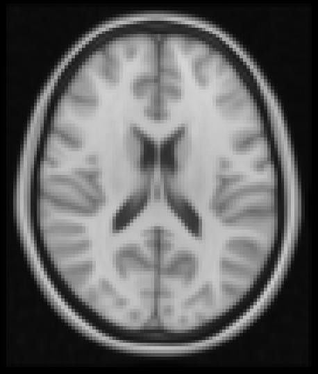

.. |right_arrow| unicode:: U+21D2

.. _overlays:

Overlays
========

FSLeyes refers to the files that you load as *overlays*. FSLeyes |version| is
capable of loading the following types of data:

 - NIFTI image files (``.nii``, ``.nii.gz``).

 - `FEAT <http://fsl.fmrib.ox.ac.uk/fsl/fslwiki/FEAT>`_ analysis directories
   (``.feat``).

 - `MELODIC <http://fsl.fmrib.ox.ac.uk/fsl/fslwiki/MELODIC>`_ analysis
   directories (``.melodic``).

 - `dtifit <http://fsl.fmrib.ox.ac.uk/fsl/fslwiki/FDT/UserGuide#DTIFIT>`_
   output directories. 
   
 - VTK files (``.vtk``) which are in a format similar to that produced by the
   `FIRST <http://fsl.fmrib.ox.ac.uk/fsl/fslwiki/FIRST>`_ sub-cortical
   segmentation tool.

.. _overlays_loading_an_overlay:

Loading an overlay
------------------

You can load an overlay by doing one of the following:

1. The *File* |right_arrow| *Add overlay from file* menu option allows you to
   choose a file to load (e.g. a ``.nii``, ``.nii.gz``, or ``.vtk`` file).

2. The *File* |right_arrow| *Add overlay from directory* menu option allows
   you to choose a directory to load (e.g. a ``.feat``, ``.ica``, or ``dtifit``
   directory).

3. The *File* |right_arrow| *Add standard* menu option allows you to choose a
   file from the ``$FSLDIR/data/standard/`` directory to load [*]_.

4. The + button on the overlay list allows you to choose a file to load.

.. [*] The *File* |right_arrow| *Add standard* menu option will be disabled
       if your FSL environment is not configured correctly.

Overlay types
-------------

NIFTI images can be displayed in a variety of different ways, depending on the
nature of the image, and on how you want to display it. The way in which an
overlay is displayed is called the *overlay type*, and it can be changed on
the :ref:`overlay toolbar <ortho_lightbox_controls_overlay_toolbar>`, or on
the :ref:`overlay display panel
<ortho_lightbox_controls_overlay_display_panel>`.

Volume
^^^^^^

This is the default (and most conventional) display type for NIFTI
images. Image intensity values are coloured according to a colour map.

Label
^^^^^

This type is useful for viewing NIFTI images which contain discrete integer
values, such as atlases and (sub-)cortical segmentation summary images.

.. container:: image-strip
   
   .. image:: images/overlays_label1.png
      :width: 30%

   .. image:: images/overlays_label2.png
      :width: 30% 

Mask
^^^^

RGB vector
^^^^^^^^^^

Line vector
^^^^^^^^^^^

Tensor
^^^^^^

Spherical harmonic
^^^^^^^^^^^^^^^^^^

The display space
-----------------

Coordinate systems
------------------

