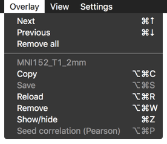
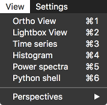
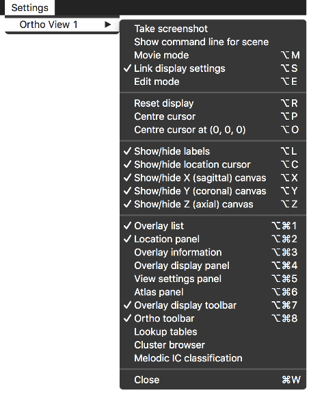
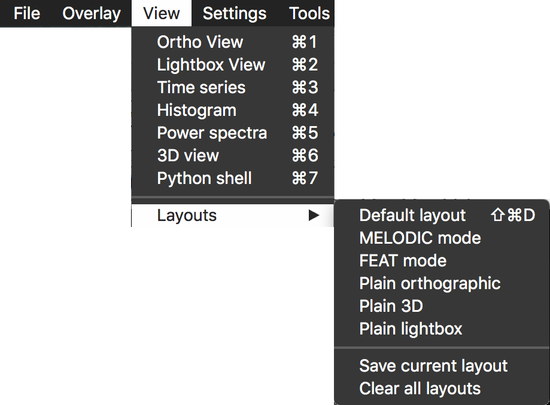
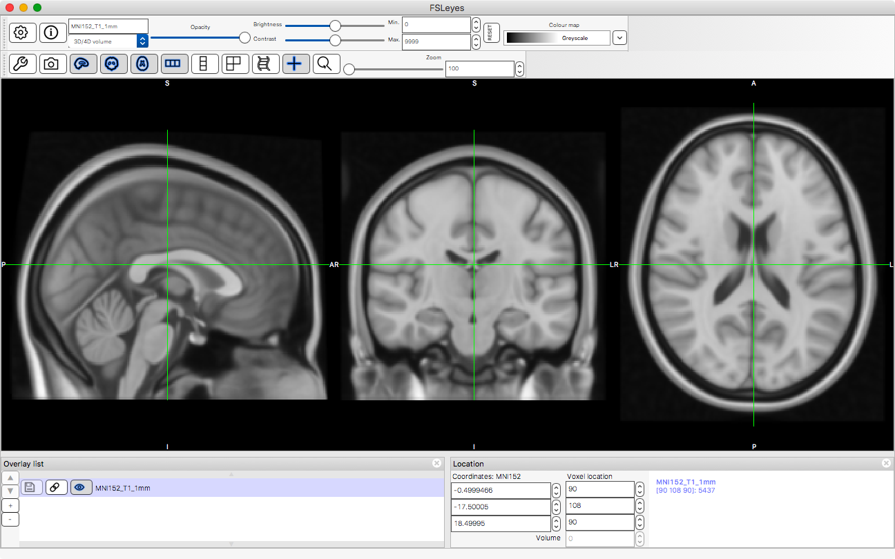
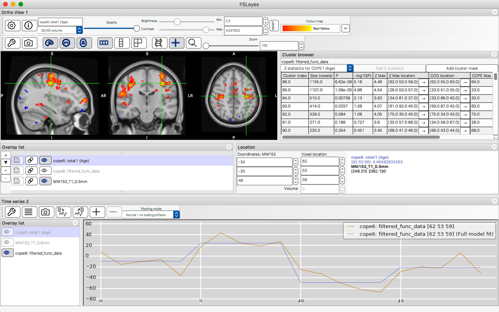

.. |right_arrow| unicode:: U+21D2
.. |command_key| unicode:: U+2318
.. |shift_key|   unicode:: U+21E7
.. |control_key| unicode:: U+2303
.. |alt_key|     unicode:: U+2325

.. _overview:

Overview
========

FSLeyes is a viewer for 3D and 4D neuroimaging data. It is intended as a
replacement for the much loved `FSLView
<http://fsl.fmrib.ox.ac.uk/fsl/fslview/>`_. FSLeyes offers similar
functionality to FSLView, and aims to improve and expand upon this
functionality in many ways.

.. _overview_overlays:

Overlays
--------

FSLeyes refers to the files that you load as *overlays*. Where FSLView
referred to files as *images*, FSLeyes uses the term *overlay* because FSLeyes
is capable of displaying more than just `NIFTI <http://nifti.nimh.nih.gov/>`_
images [*]_.  These files can be displayed in a variety of different ways -
see the page on :ref:`overlays <overlays>` for more information.

.. [*] FSLeyes |version| is able to load NIFTI, MGH, GIFTI, Freesurfer, and
       VTK files.  Future versions of FSLeyes will be able to load more file
       types.

.. sidebar:: Modifier keys

             If you skipped the :ref:`Quick start <quick_start>`, you missed
             out on a description of the symbols used in FSLeyes for keyboard
             shortcuts - here they are again:

             - |shift_key|:   Shift
             - |control_key|: Control
             - |command_key|: Command (on OSX; Control on other platforms)
             - |alt_key|:     Option (on OSX; Alt on other platforms)

Within a FSLeyes view, you can tell which overlay is selected by looking at
the name field on the :ref:`overlay display toolbar
<overlays_overlay_display_toolbar>`, or looking at the highlighted item in the
:ref:`overlay list <ortho_lightbox_views_overlay_list>`. Many operations in
FSLeyes will be applied to the currently selected overlay, such as adjusting
the overlay visibility, brightness and colour map.

The *Overlay* menu contains options for changing the selected overlay, and
performing some operations on the currently selected overlay:

The display space
-----------------

FSLeyes works under the assumption that all of the overlays you load are
defined in the same space. For example, if you load a T1 image and a T2*
image, FSLeyes will attempt to display them on top of one another, even if
they have different resolution or orientation. By default, FSLeyes will
display all overlays in terms of a single reference overlay, typically the
first one that you load. The reference overlay is displayed so that it is
orthogonal to the display coordinate system; all other overlays are
transformed into the space of this reference overlay.  You can change the
reference overlay via the **Display space** option in the :ref:`view settings
panel <ortho_lightbox_views_view_settings>`.

.. container:: image-strip

  .. image:: images/overview_display_space1.png
     :width: 25%

  .. image:: images/overview_display_space2.png
     :width: 25%

If you are having trouble with mis-aligned images, or are interested in how
FSLeyes works, refer to the page on :ref:`the display space <display_space>`.

.. _overview_views_and_controls:

Views and controls
------------------

The FSLeyes interface is arranged into *views* and *controls*.

Conceptually, a *view* (e.g. an :ref:`orthographic
<ortho_lightbox_views_ortho>` or :ref:`time series
<plot_views_time_series_view>` panel) displays the data in some way, and a
*control* (e.g. an :ref:`overlay display toolbar
<overlays_overlay_display_toolbar>` or :ref:`atlas panel <atlases>`) allows
you to manipulate that view.  Views are top-level panels, whereas controls are
embedded within a single view.

.. sidebar:: Which *Settings* menu corresponds to which view?

             Every FSLeyes view panel is given a name and a number so that
             it can be uniquely identified. The *Settings* sub-menu for each
             open view is given the same name and number. If you have more
             than one view panel open, you will be able to see the name and
             number for each panel on its title bar.

All available views are listed in the *View* menu:

When you open a new view, a sub-menu for that view is added to the *Settings*
menu. This sub-menu contains some actions that can be executed on the view,
and also contains a list of all the controls which can be added to the
view. For example, the settings menu for an :ref:`orthographic
<ortho_lightbox_views_ortho>` view looks like this:

Views and controls are described in more detail in the pages on
:ref:`orthographic/lightbox views <ortho_lightbox_views>`, :ref:`plotting
views <plot_views>`, and the :ref:`3D view <3d_view>`.

.. _ovewview_tools:

Tools
-----

Under the *Tools* menu, you can find a set of options which allow you to
perform various actions, typically affecting the currently selected overlay.
Some tools are always present, whereas others are associated with a specific
view, and will only be present if you have one of those views open.

More information on the FSLeyes tools can be found on the :ref:`tools <tools>`
page.

.. _overview_layouts:

Layouts
-------

FSLeyes allows you to lay out your view and control panels in any way you
like.

Whenever you have more than one view open, you can re-arrange them by clicking
and dragging their title bars, and dropping them onto the docking icons which
appear.  You can also re-arrange the control panels within a view in the same
way. These docking icons, shown below, will appear on the FSLeyes frame
whenever you click and drag the title bar of a view or control panel:

.. container:: image-strip

   .. image:: images/overview_dock_up.png

   .. image:: images/overview_dock_down.png

   .. image:: images/overview_dock_centre.png

   .. image:: images/overview_dock_left.png

   .. image:: images/overview_dock_right_active.png

FSLeyes refers to a specific view and control panel arrangement as a *layout*.
If you have a layout which you like, or use frequently, you can save it, and
restore it later on.  All of the options for managing layouts can be
found in the *View* |right_arrow| *layouts* sub-menu:

.. _overview_built_in_layouts:

Built-in layouts
----------------

FSLeyes comes with a few built-in layouts, described below.

.. _overview_default_layout:

Default layout
^^^^^^^^^^^^^^

This is the default FSLeyes layout, inspired by `FSLView
<http://fsl.fmrib.ox.ac.uk/fsl/fslview/>`_, and useful for general image
viewing and editing.

MELODIC mode
^^^^^^^^^^^^

This layout is designed to assist in manual classification of ICA
components. It provides functionality similar to that of the `Melview
<http://fsl.fmrib.ox.ac.uk/fsl/fslwiki/Melview>`_ tool, comprising a lightbox
view and plot panels which display the :ref:`time course
<plot_views_time_series_view>` and :ref:`power spectrum
<plot_views_power_spectrum_view>` of the currently selected component.  A
:ref:`classification panel
<ic_classification_classifying_components_with_the_classification_panel>`
allows you to load, save, and edit the classification labels for each
component. See the page on :ref:`IC classification <ic_classification>` for
more information.

.. image:: images/overview_melodic.png
   :align: center
   :width: 75%

FEAT mode
^^^^^^^^^

This layout is designed to assist in exploring the results of a `FEAT
<http://fsl.fmrib.ox.ac.uk/fsl/fslwiki/FEAT>`_ analysis. The :ref:`cluster
panel <feat_mode_viewing_clusters_the_cluster_panel>` displays a table of
clusters for each contrast (for analyses which used cluster thresholding), and
the :ref:`time series panel <plot_views_time_series_view>` allows you to view
full and partial model fits to the data. See the page on :ref:`viewing FEAT
analyses <feat_mode>` for more information.

Plain orthographic/lightbox/3D
^^^^^^^^^^^^^^^^^^^^^^^^^^^^^^

These layouts simply display a plain orthographic, lightbox, or 3D view,
respectively.

.. container:: image-strip

  .. image:: images/overview_ortho.png
     :width: 30%

  .. image:: images/overview_lightbox.png
     :width: 30%

  .. image:: images/overview_3d.png
     :width: 30%
