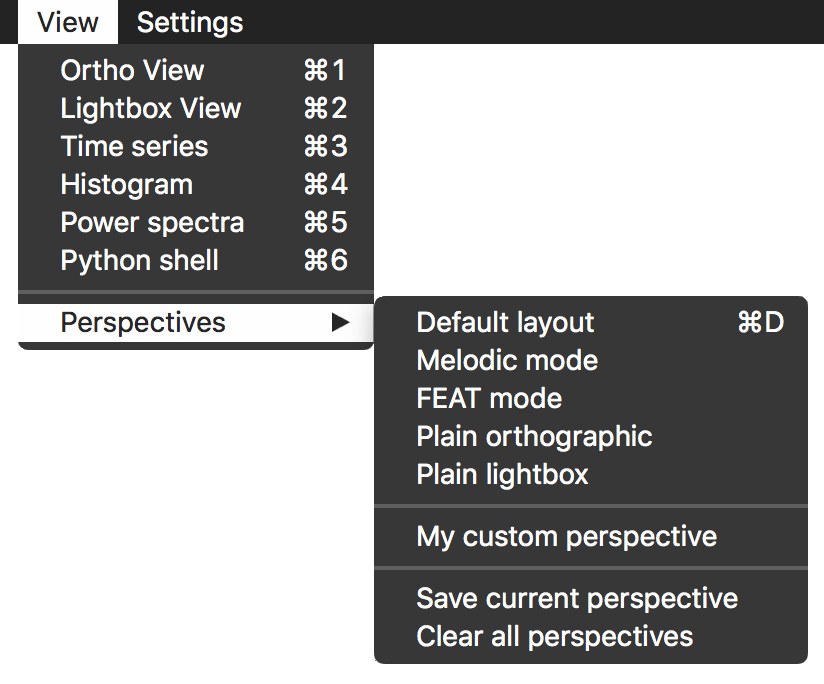
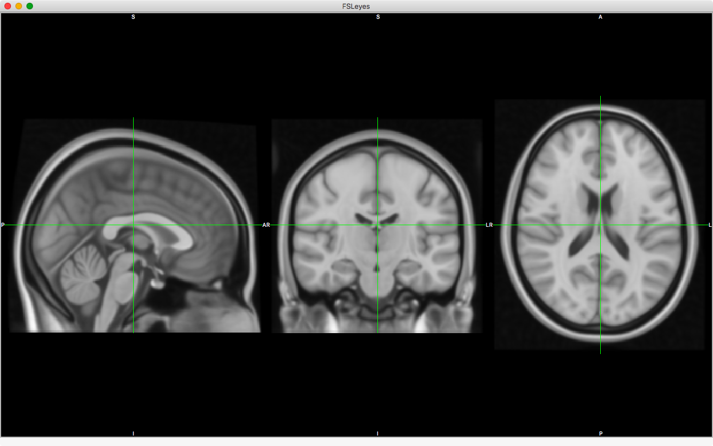

.. _perspectives:

.. |right_arrow| unicode:: U+21D2

Layout and perspectives
=======================

FSLeyes allows you to lay out your :ref:`view <views>` and
:ref:`control <controls>` panels in any way you like.

Whenever you have more than one view open, you can re-arrange them by clicking
and dragging their title bars, and dropping them onto the docking icons which
appear.  You can also re-arrange the control panels within a view in the same
way. These docking icons, shown below, will appear on the FSLeyes frame
whenever you click and drag the title bar of a view or control panel:

.. image:: images/perspectives_dock_up.png

.. image:: images/perspectives_dock_centre.png

.. image:: images/perspectives_dock_left.png

FSLeyes refers to a specific view and control panel arrangement as a
*perspective*.  If you have a layout which you like, or use frequently, you
can save it as a perspective, and restore it later on.  All of the options for
managing perspectives can be found in the *View* |right_arrow| *Perspectives*
sub-menu:

Built-in perspectives
---------------------

FSLeyes comes with a few built-in perspectives, outlined below.

Default layout
^^^^^^^^^^^^^^

This is the default FSLeyes perspective, which provides a layout inspired by
`FSLView <http://fsl.fmrib.ox.ac.uk/fsl/fslview/>`_, which is useful for
general image viewing and editing.

.. image:: images/perspectives_default.png
   :align: center
   :width: 75%

Melodic mode
^^^^^^^^^^^^

This perspective is designed to assist in manual classification of ICA
components. It provides functionality similar to that of the `Melview
<http://fsl.fmrib.ox.ac.uk/fsl/fslwiki/Melview>`_ tool, comprising a lightbox
view and plot panels which display the :ref:`time course <views-timeseries>`
and :ref:`power spectra<views-powerspectrum>` of the currently selected
component.  A :ref:`classification panel <controls-melodic-ic-classification>`
allows you to load, save, and edit the classification labels for each
component. See the page on :ref:`IC classification <ic_classification>` for
more information.

.. image:: images/perspectives_melodic.png
   :align: center
   :width: 75%

FEAT node
^^^^^^^^^

This perspective is designed to assist in exploring the results of a `FEAT
<http://fsl.fmrib.ox.ac.uk/fsl/fslwiki/FEAT>`_ analysis. The
:ref:`cluster panel <controls-cluster-panel>` displays a table of clusters
for each contrast (for analyses which used cluster thresholding), and the
:ref:`time series panel <views-timeseries>`  allows you to view full and
partial model fits to the data. See the page on
:ref:`viewing FEAT analyses <feat_mode>` for more information.

.. image:: images/perspectives_feat.png
   :align: center
   :width: 75%
 

Plain orthographic/Plain lightbox
^^^^^^^^^^^^^^^^^^^^^^^^^^^^^^^^^

These perspectives simply display a plain orthographic or lightbox view,
respectively.

.. image:: images/perspectives_lightbox.png
   :width: 45% 
