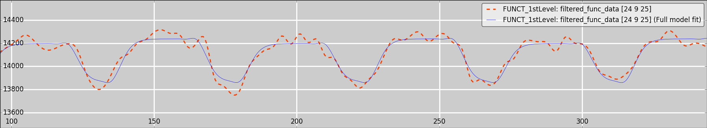
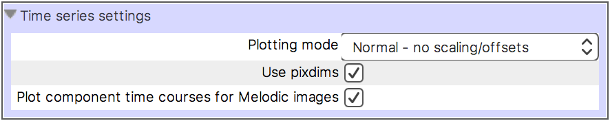
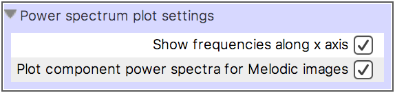
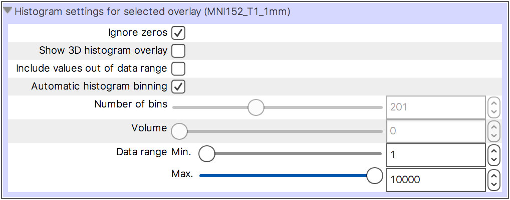
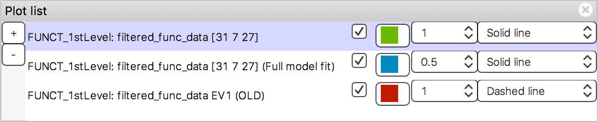
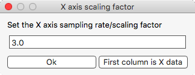
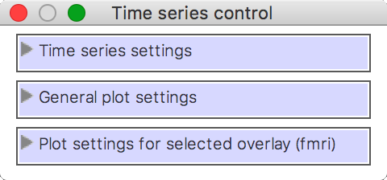
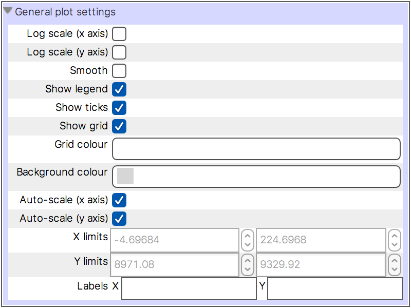
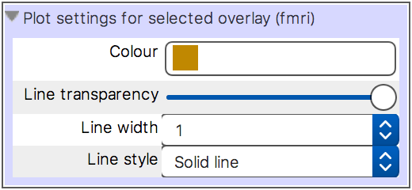

.. |eye_icon|                image:: images/eye_icon.png

.. |export_data_series_icon| image:: images/export_data_series_icon.png

.. _plot_views:

Plotting views
==============

FSLeyes |version| provides three plotting views:

- The :ref:`Time series <plot_views_time_series_view>` view plots voxel
  intensities from 4D NIFTI images.

- The :ref:`Power spectrum <plot_views_power_spectrum_view>` view is similar
  to the time series view, but it plots time series transformed into the
  frequency domain.

- The :ref:`Histogram <plot_views_histogram_view>` view plots a histogram of
  the intensities of all voxels in a 3D NIFTI image (or one 3D volume of a 4D
  image).

All of these views have a similar interface and functionality - they can plot
data series from :ref:`multiple overlays <plot_views_overlay_list>` and
:ref:`multiple voxels <plot_views_holding_data_series_and_the_plot_list>`, and
you can also :ref:`import and export data series
<plot_views_importing_exporting_data>`.

.. _plot_views_time_series_view:

Time series view
----------------

The time series view plots voxel intensities from 4D NIFTI images. It is also
capable of displaying various :ref:`FEAT analysis <feat_mode>` outputs, and
:ref:`MELODIC component time series <ic_classification>` - refer to those
pages for more details.

When you are viewing a 4D NIFTI image in an :ref:`orthographic or ligthbox
view <ortho_lightbox_views>`, the time series view will update as you change
the display location, to show the time series from the voxel (or voxels, if
you have more than one 4D image loaded) at the current location. Clicking, or
clicking and dragging on the time series plot will update the volume that is
displayed for the currently selected image.  You can use the :ref:`plot
toolbar <plot_views_plot_toolbar>` or :ref:`plot list
<plot_views_holding_data_series_and_the_plot_list>` to "hold" the time series
for one or more voxels, which will keep them on the plot after you change the
display location.

The plot control panel (described :ref:`below
<plot_views_customising_the_plot_the_plot_control_panel>`) contains some
settings specific to time series plots:

.. _plot_views_percent_signal_changed_calculation:

.. sidebar:: Percent-signal changed calculation

             FSLeyes calculates percent-signal changed for each voxel using
             the mean intensity, over time, for that voxel. For a given voxel
             the intensity :math:`i` at time :math:`t` is calculated as
             follows:

             .. math::

                i_t = 100 \times \frac{i_t}{\bar{i}} - 100

             where :math:`\bar{i}` is the mean voxel intensity across time.

- **Plotting mode** This setting allows you to scale or normalise the time
  series which are displayed. You can plot the "raw" data, demean it,
  normalise it to the range ``[-1, 1]``, or scale it to
  percent-signal-changed (suitable for FMRI BOLD data).

- **Use pixdims** This setting is disabled by default. When enabled, the
  ``pixdim`` field of the time dimension in the NIFTI header is assumed to
  contain the TR time, and is used to scale the time series data along the X
  axis. Effectively, this means that the X axis will show seconds. When
  disabled, the X axis corresponds to the volume index (starting from 0) in
  the 4D image.

- **Plot component time courses for Melodic images** This setting is enabled
  by default. If the currently selected overlay is the ``melodic_IC`` file
  from a `MELODIC <http://fsl.fmrib.ox.ac.uk/fsl/fslwiki/MELODIC>`_ analysis,
  the component time series for the current component (the current volume in
  the image) is shown, instead of the voxel intensity across all components.
  See the page on :ref:`IC classification <ic_classification>` for more
  details.

.. _plot_views_power_spectrum_view:

Power spectrum view
-------------------

The power spectrum view performs a similar role to that of the :ref:`time
series view <plot_views_time_series_view>`, but the time series are
transformed into the frequency domain before being plotted.

.. _plot_views_power_spectrum_calculation:

.. sidebar:: Power spectrum calculation

             Given the time series for a voxel, FSLeyes calculates the power
             spectrum using a Fast Fourier Transform, via the `numpy.fft.rfft
             <https://docs.scipy.org/doc/numpy/reference/generated/numpy.fft.rfft.html>`_
             function. FSLeyes then converts the result into a magnitude by
             summing the squares of the real and imaginary components.

The :ref:`plot control panel
<plot_views_customising_the_plot_the_plot_control_panel>` for a power spectrum
view contains the following settings:

- **Show frequencies along the X axis** This setting is enabled by
  default. When selected, the X axis values are transformed into frequencies,
  using the TR time specified in the NIFTI file header. Otherwise, the X axis
  values are simply plotted as indices.

- **Plot component power spectra for Melodic images** In the same manner as
  the :ref:`time series view <plot_views_time_series_view>`, if the currently
  selected overlay is a ``melodic_IC`` image, the power spectrum
  (pre-calculated by `MELODIC
  <http://fsl.fmrib.ox.ac.uk/fsl/fslwiki/MELODIC>`_) for the current component
  will be plotted.

One further setting is available for each data series displayed on a power
spectrum view (in the *Plot settings for selected overlay* section of the plot
control panel, described :ref:`below
<plot_views_customising_the_plot_the_plot_control_panel>`):

- **Normalise to unit variance** This setting is enabled by default. When
  selected, the time series data is normalised before being transformed into
  the frequency domain, by subtracting its mean, and dividing by its standard
  deviation.

.. _plot_views_histogram_view:

Histogram view
--------------

The histogram view plots a histogram of the intensities of all voxels in a 3D
NIFTI image, or of the current 3D volume in a 4D image. Both the :ref:`plot
toolbar <plot_views_plot_toolbar>` and :ref:`plot control panel
<plot_views_customising_the_plot_the_plot_control_panel>` allow you to choose
between displaying the histogram data series as probabilities, or as counts.

The following settings will be displayed on the plot control panel for a
histogram view, allowing you to customise the histogram for the currently
selected image:

.. _plot_views_histogram_control:

.. sidebar:: 3D histogram overlay

             .. image:: images/plot_views_histogram_overlay.png
                :width: 100%
                :align: center

             |

             When you enable the *Show 3D histogram overlay* setting, a
             :ref:`mask <overlays_mask>` is added to the display, allowing you
             to see the voxels that have been included in the histogram.
             Clicking and dragging on the histogram plot allows you to
             interactively adjust the range of voxel intensities that are
             displayed.

- **Ignore zeros** This setting is selected by default. When selected, voxels
  which have an intensity equal to 0 are excluded from the histogram
  calculation.

- **Show 3D histogram overlay** When this setting is selected, a :ref:`mask
  <overlays_mask>` overlay is created, which displays the voxels that have
  been included in the histogram calculation. See the sidebar for more
  details.

- **Include values out of data range** When this setting is selected, the
  histogram will be updated so that the first and last bins contain voxels
  that are outside of the *Data range*.

- **Automatic histogram binning** This setting is selected by default. When
  selected, the *Number of bins* is automatically set according to the data
  range.

- **Number of bins** When *Automatic histogram binning* is disabled, this
  setting allows you to adjust the number of bins used in the histogram
  calculation.

- **Volume** If the currently selected overlay is a 4D NIFTI image, this
  slider allows you to choose the 3D volume used in the histogram calculation.

- **Data range** This setting allows you to control the data range that is
  included in the histogram calculation.

.. _plot_views_controlling_what_gets_plotted:

Controlling what gets plotted
-----------------------------

Each of the plotting views allow you to plot data series for multiple
overlays, and for multiple voxels. You can also import arbitrary data series
from a text file, and export the data series that are plotted.

 - The :ref:`overlay list <plot_views_overlay_list>` allows you to toggle the
   data series for each overlay on and off.

 - The :ref:`plot toolbar <plot_views_plot_toolbar>` contains controls
   allowing you to import/export data series, and to "hold" data series for
   the current voxel.

 - The :ref:`plot list <plot_views_holding_data_series_and_the_plot_list>`
   allows you to customise the data series that have been "held" on the plot.

.. _plot_views_overlay_list:

The overlay list
^^^^^^^^^^^^^^^^

The overlay list which is available on plotting views is slightly different to
the :ref:`one available in orthographic/lightbox views
<ortho_lightbox_views_overlay_list>`. It simply displays a list of all loaded
overlays, and allows you to toggle on and off the data series associated with
each overlay, by clicking the |eye_icon| button next to each overlay's name.

.. _plot_views_plot_toolbar:

The plot toolbar
^^^^^^^^^^^^^^^^

Each plotting view has a toolbar which contains some controls allowing you to
do the following:

.. image:: images/plot_views_plot_toolbar.png
   :width: 60%
   :align: center

1. **Plot control panel** This button opens the :ref:`plot control panel
   <plot_views_customising_the_plot_the_plot_control_panel>`, which contains
   all available plot settings.

2. **Plot list** This button opens the :ref:`plot list
   <plot_views_holding_data_series_and_the_plot_list>`, which allows you to
   add and remove data series, and to customise the ones which are currently
   being plotted.

3. **Screenshot** This button allows you to save the current plot as a
   screenshot.

4. **Import data series** This button opens a file selection dialog, with
   which you can choose a file to :ref:`import data series
   <plot_views_importing_exporting_data>` from.

5. **Export data series** This button allows you to :ref:`export
   <plot_views_importing_exporting_data>` the data series which are currently
   plotted to a text file.

6. **Add data series** This button :ref:`"holds"
   <plot_views_holding_data_series_and_the_plot_list>` the plotted data series
   for the currently selected overlay, at the current voxel.

7. **Remove data series** This button removes the most recently :ref:`"held"
   <plot_views_holding_data_series_and_the_plot_list>` data series from the
   plot.

.. _plot_views_holding_data_series_and_the_plot_list:

Holding data series and the plot list
^^^^^^^^^^^^^^^^^^^^^^^^^^^^^^^^^^^^^

When you are viewing time series for voxels in a 4D NIFTI image, it can be
useful to view the time series at different voxels simultaneously.

You can accomplish this by "holding" the time series for the voxels in
question - when you push the + button on either the plot toolbar or the plot
list, the time series (or power spectrum) for the currently selected overlay,
at the current voxel, will be added to the plot list, and will be held on the
plot.  All data series that have been added to the plot list will remain on
the plot, even after you have selected a different overlay or moved to a
different voxel.

The plot list allows you to manage all held data series:

Through the plot list, you can add/remove data series, and customise the
appearance of all data series that have been added to the plot.

.. _plot_views_importing_exporting_data:

Importing/exporting data
^^^^^^^^^^^^^^^^^^^^^^^^

The *Import data series* button |import_data_series_icon| on the :ref:`plot
toolbar <plot_views_plot_toolbar>` allows you to import data series from a
text file to plot alongside the image data.

.. _plot_views_import_export_data_series_file_format:

.. sidebar:: Import/export data series file format

             FSLeyes expects the data series files that you import to consist
             of plain text numeric data organised into columns. One file may
             contain multiple data series, with the value from each series
             separated by white space. For example, FSLeyes will interpret
             this data as containing three three data series, each with six
             samples::

                 0.39  -1.53  -0.22
                 0.58  -8.19  -0.27
                 0.55   0.16  -0.18
                 0.58   4.19  -0.25
                 0.58  -0.11  -0.18
                 0.53   3.5   -0.22

For example, `FEAT <http://fsl.fmrib.ox.ac.uk/fsl/fslwiki/FEAT>`_ and `MELODIC
<http://fsl.fmrib.ox.ac.uk/fsl/fslwiki/MELODIC>`_ analyses typically contain
estimates of subject motion, generated by the `MCFLIRT
<http://fsl.fmrib.ox.ac.uk/fsl/fslwiki/MCFLIRT>`_ tool. It can sometimes be
useful to plot these estimates alongside the voxel time series, to visually
check for motion-related correlations and artefacts.

When you import data series from a file, FSLeyes will ask you how the data
series are to be scaled on the X axis:

If the first column in your data file contains the X axis data, click the
*First column is X data* button. Otherwise, FSLeyes will set the X axis data
according to the value that you enter [*]_.

.. [*] On time series views, make sure that the **Use pixdims** option is set
       appropriately for your X-axis scaling.

The *Export data series* button |export_data_series_icon| on the :ref:`plot
toolbar <plot_views_plot_toolbar>` allows you to save the data series that are
currently plotted to a text file in the format described in the :ref:`sidebar
<plot_views_import_export_data_series_file_format>`. To export data series of
different lengths and sample rates out to the same text file, FSLeyes applies
linear interpolation, and pads shorter data series with ``nan``.

.. _plot_views_customising_the_plot_the_plot_control_panel:

Customising the plot (the plot control panel)
---------------------------------------------

The plot control panel contains all of the settings available for customising
how each plotting view behaves, and how it looks. The available settings are
organised into three groups:

The view-specific settings (*Time series settings* in the above example) have
been covered above, in the sections on the :ref:`time series
<plot_views_time_series_view>`, :ref:`power spectrum
<plot_views_power_spectrum_view>`, and :ref:`histogram
<plot_views_histogram_view>` views. The *General plot settings* and *Plot
settings for selected overlay* groups are the same across all plotting views.

A fourth group of settings may be present, depending on the plotting view type
(e.g. the :ref:`histogram settings <plot_views_histogram_control>`), and on
the overlay type (e.g. :ref:`FEAT images
<feat_mode_viewing_model_fits_in_the_time_series_panel>`).

General plot settings
^^^^^^^^^^^^^^^^^^^^^

This group of settings allows you to control how the plot looks and how it
behaves:

.. _plot_views_data_series_smoothing:

.. sidebar:: Data series smoothing

             When the *Smooth* setting is selected, FSLeyes smooths each data
             series using the `scipy.interpolate
             <https://docs.scipy.org/doc/scipy/reference/interpolate.html>`_
             package. First, a B-spline representation of degree 3, of the
             data series is calculated using the `splrep
             <https://docs.scipy.org/doc/scipy/reference/generated/scipy.interpolate.splrep.html>`_
             function. Then, the data series is interpolated at five times its
             original resolution using the `splev
             <https://docs.scipy.org/doc/scipy/reference/generated/scipy.interpolate.splev.html>`_
             function.

- **Log scale (x axis)** When selected, the base 10 logarithm of the X axis
  data will be displayed.

- **Log scale (y axis)** When selected, the base 10 logarithm of the Y axis
  data will be displayed.

- **Smooth** When selected, each data series is upsampled and smoothed (see
  the :ref:`sidebar <plot_views_data_series_smoothing>`).

- **Show legend** Toggle the plot legend on and off.

- **Show ticks** Toggle the plot ticks on and off.

- **Show grid** Toggle the plot grid on and off.

- **Grid colour** This setting allows you to change the plot grid colour.

- **Background colour** This setting allows you to change the plot background
  colour.

- **Auto-scale (x axis)** This setting is selected by default. When selected,
  the X axis limits are automatically scaled to fit the data series that are
  plotted.

- **Auto-scale (y axis)** This setting is selected by default. When selected,
  the Y axis limits are automatically scaled to fit the data series that are
  plotted.

- **X limits** If *Auto-scale* is disabled for the X axis, this setting allows
  you to manually specify the X axis limits.

- **Y limits** If *Auto-scale* is disabled for the Y axis, this setting allows
  you to manually specify the Y axis limits.

- **Labels** Set the X and Y axis labels here.

Plot settings for selected overlay
^^^^^^^^^^^^^^^^^^^^^^^^^^^^^^^^^^

This group of settings allows you to control how the data series for the
current overlay is plotted.

You can customise the data series line colour, transparency, width, and
style - available styles are *Solid line*, *Dashed line*, *Dash-dot line*, and
*Dotted line*.
