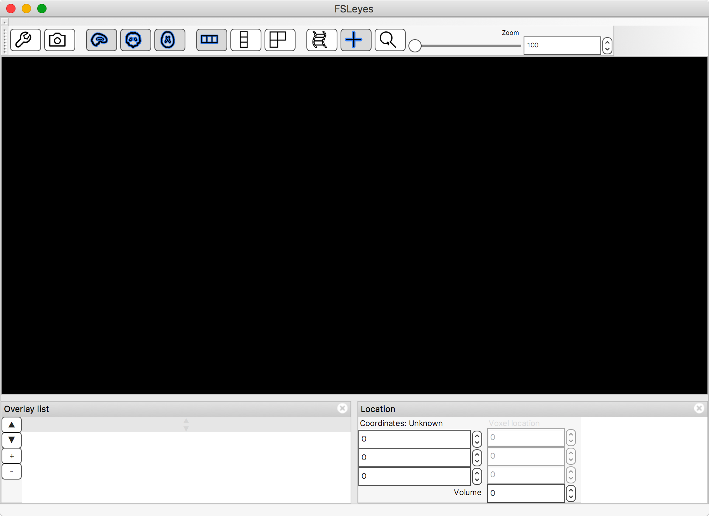
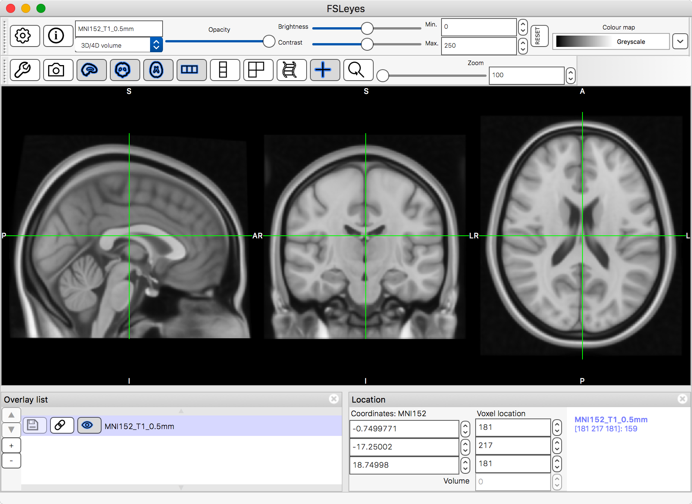
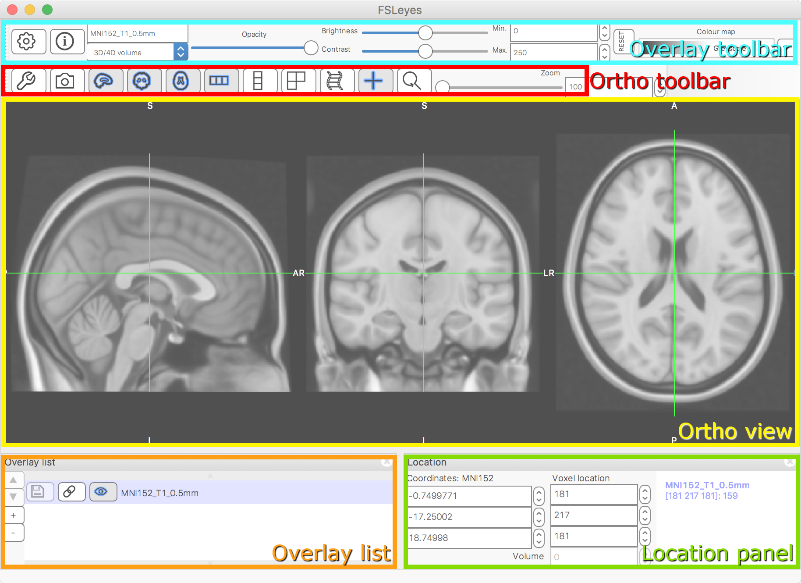

.. |command_key| unicode:: U+2318
.. |shift_key|   unicode:: U+21E7
.. |control_key| unicode:: U+2303
.. |alt_key|     unicode:: U+2325

.. |up_arrow|    unicode:: U+25B2
.. |down_arrow|  unicode:: U+25BC

.. |right_arrow| unicode:: U+21D2

.. |information_icon| image:: images/information_icon.png
.. |chainlink_icon|   image:: images/chainlink_icon.png
.. |camera_icon|      image:: images/camera_icon.png
.. |gear_icon|        image:: images/gear_icon.png
.. |spanner_icon|     image:: images/spanner_icon.png
.. |posneg_cmap_icon| image:: images/posneg_cmap_icon.png

.. _quick_start:

Quick start
===========

Help!
-----

If you get stuck:

 - Search through these help pages to see if your problem is discussed
   anywhere.

 - If you can't figure out how to do something, see if it is covered in the
   :ref:`How do i ... <quick_start_how_do_i>` section, below.

 - If something has gone wrong, check the :ref:`troubleshooting` page to
   see if you problem is covered there.

Most FSLeyes buttons and controls also have tooltips which contain useful
information, and which will pop up if your hover the mouse over a control
for a couple of seconds:

.. image:: images/quick_start_tooltip.png
   :align: center

The interface
-------------

When you first start FSLeyes, you will be presented with something that
looks like this:

This is slightly boring, so let's load an image. Select the *File*
|right_arrow| *Add from file* menu option, and choose a ``.nii.gz`` image to
load.

Now things are a bit more interesting:

Let's take a closer look at the components of the FSLeyes interface...

The view
^^^^^^^^

.. sidebar:: What is an *overlay*?
             :subtitle: And why aren't they just called *images* instead?

             An :ref:`overlay <overview_overlays>` is an image, or other data
             file, that you have loaded into FSLeyes.  While FSLeyes is first
             and foremost a NIFTI image viewer, the term *overlay* is used,
             instead of *image*, because FSLeyes supports other non-volumetric
             data types, and will hopefully support more in the future.

The view is where your overlays are displayed. By default, an
:ref:`orthographic view <ortho_lightbox_views_ortho>` is shown; you can also
select a :ref:`lightbox view <ortho_lightbox_views_lightbox>`, a :ref:`3D view
<3d_view>`, or some :ref:`plot views <plot_views>`, from the *View* menu.

Let's stick with the orthographic view for now. It displays your overlay on
three *canvases*, along the three primary axes. For a NIFTI image which is
oriented acording to the MNI152 template, these canvases will correspond to
the sagittal, coronal, and axial planes.

You can interact with an ortho view in a number of ways. Use the mouse to
click, or click and drag, to change the current location. Hold down the
|command_key| key (OSX) or |control_key| key (Linux), and use your mouse wheel
to zoom in and out of a canvas.  You can also middle-click and drag, or hold
down the |alt_key| key and drag with the left mouse button, to pan around.

See the section on :ref:`ortho view interaction
<ortho_lightbox_views_ortho_interaction>` for more hints on working with an
ortho view.

.. sidebar:: Modifier keys

             Throughout this page, and the rest of the FSLeyes documentation,
             we will use the following symbols to represent keyboard modifier
             keys:

             - |shift_key|:   Shift
             - |control_key|: Control
             - |command_key|: Command (on OSX; Control on other platforms)
             - |alt_key|:     Option (on OSX; Alt on other platforms)

The overlay list
^^^^^^^^^^^^^^^^

The :ref:`overlay list <ortho_lightbox_views_overlay_list>` displays a list of
all overlays that you have loaded. Amongst other things, this list allows you
to add and remove overlays, toggle overlay visibility, and change the overlay
display order.

The location panel
^^^^^^^^^^^^^^^^^^

The :ref:`location panel <ortho_lightbox_views_location_panel>` shows the
current display location, in terms of the currently selected overlay. It also
shows the overlay data value at the current location, for every loaded
overlay.

The toolbars
^^^^^^^^^^^^

The :ref:`overlay toolbar <overlays_overlay_display_toolbar>` allows you to
adjust display properties of the currently selected overlay. Pushing the
|gear_icon| button will open a dialog containing all of the overlay display
settings. Pushing the |information_icon| button opens a dialog containing
information about the overlay.

The :ref:`ortho toolbar <ortho_lightbox_views_ortho_toolbar>` allows you to
adjust the layout of the ortho view. For example, you can toggle each of the
canvases on and off, and switch between vertical, horizontal, or grid
layouts. Pushing the |spanner_icon| button will open a dialog containing all
of the ortho view settings.

.. _quick_start_how_do_i:

How do I ...
------------

Load an overlay?
^^^^^^^^^^^^^^^^

See :ref:`overlays_loading_an_overlay`.

Open another ortho/lightbox view?
^^^^^^^^^^^^^^^^^^^^^^^^^^^^^^^^^

The *View* menu allows you to open another view. You can open as many views as
you like.

Open/close control panels/toolbars?
^^^^^^^^^^^^^^^^^^^^^^^^^^^^^^^^^^^

The *Settings* menu contains a sub-menu for every open view, which allows you
to toggle the control panels and toolbars for that view, and perform a few
other tasks. For example, if you want to add an :ref:`atlas panel <atlases>`,
you would select the *Settings* |right_arrow| *Ortho view 1* |right_arrow|
*Atlas panel* menu option. See :ref:`overview_views_and_controls` for more
information.

Change the background colour?
^^^^^^^^^^^^^^^^^^^^^^^^^^^^^

You can change the background and cursor colours via the :ref:`view settings
panel <ortho_lightbox_views_view_settings>` (the |spanner_icon| button on the
ortho toolbar).

Show/hide the cursor/anatomical labels?
^^^^^^^^^^^^^^^^^^^^^^^^^^^^^^^^^^^^^^^

You can toggle the cursor and labels simultaneously via the + button on the
ortho toolbar, or toggle them independently via checkboxes in the :ref:`view
settings panel <ortho_lightbox_views_view_settings>` (the |spanner_icon|
button).

View images in neurological/radiological orientation?
^^^^^^^^^^^^^^^^^^^^^^^^^^^^^^^^^^^^^^^^^^^^^^^^^^^^^

You can switch between a radiological or neurological display, in the
:ref:`view settings panel <ortho_lightbox_views_view_settings>` (the
|spanner_icon| button).

Take a screenshot?
^^^^^^^^^^^^^^^^^^

Click the |camera_icon| button on the ortho toolbar, or select the *Settings*
|right_arrow| *Ortho view 1* |right_arrow| *Take screenshot* menu item.

Link/unlink the display properties across multiple views?
^^^^^^^^^^^^^^^^^^^^^^^^^^^^^^^^^^^^^^^^^^^^^^^^^^^^^^^^^

If you have more than one view open (e.g. an ortho view and a lightbox view),
and you want the overlay display settings to be the same across all views,
make sure that the *Settings* |right_arrow| *<view name>* |right_arrow| *Link
display settings* menu option for all views is selected.

This setting is also available via the :ref:`view settings panel
<ortho_lightbox_views_view_settings>` (via the toolbar |spanner_icon| button,
or the *Settings* |right_arrow| *<view name>* |right_arrow| *View settings
panel* menu option), as the *Link overlay display settings* check box.

Link/unlink the volumes on two or more 4D images?
^^^^^^^^^^^^^^^^^^^^^^^^^^^^^^^^^^^^^^^^^^^^^^^^^

If you want to view the same volumes from two or more 4D NIFTI images, make
sure the |chainlink_icon| button, in the :ref:`overlay list
<ortho_lightbox_views_overlay_list>`, is enabled for each image.

Set up a positive/negative colour map for Z statistics?
^^^^^^^^^^^^^^^^^^^^^^^^^^^^^^^^^^^^^^^^^^^^^^^^^^^^^^^

You can set up a negative colour map by clicking on the negative colour map
button (|posneg_cmap_icon|) on the :ref:`overlay display toolbar
<overlays_overlay_display_toolbar>`. The top colour map on the toolbar will be
used for positive values, and the bottom colour map for negative values.

You can also set up a negative colour map through the :ref:`overlay display
panel <overlays_overlay_display_panel>` (the |gear_icon| button on the
:ref:`overlay display toolbar <overlays_overlay_display_toolbar>`). See the
section on :ref:`volume display settings <overlays_volume>` for more details.

Edit a NIFTI image?
^^^^^^^^^^^^^^^^^^^

You can edit NIFTI image data from within an orthographic view. Switch to edit
mode via the *Settings* |right_arrow| *Ortho view* |right_arrow| *Edit mode*
menu option. This will open a new toolbar which contains editing
functionality. See the page on :ref:`editing images <editing_images>` for more
details.

Classify ICA components?
^^^^^^^^^^^^^^^^^^^^^^^^

Load your ``.ica`` directory (or the ``.ica/melodic_IC`` image file), then
open the melodic layout (the *View* |right_arrow| *Layouts*
|right_arrow| *MELODIC mode* menu option). See :ref:`ic_classification` for
more information.

Save the current view/control panel layout?
^^^^^^^^^^^^^^^^^^^^^^^^^^^^^^^^^^^^^^^^^^^

You can save a layout at any time: Choose the *View* |right_arrow|
*Layouts* |right_arrow| *Save current layout* menu item, and give
your layout a name. You can then restore it at any time by selecting it in the
*View* |right_arrow| *Layouts* menu.
