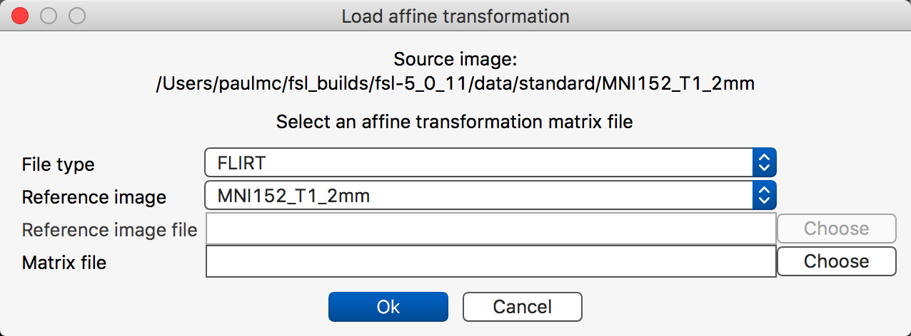
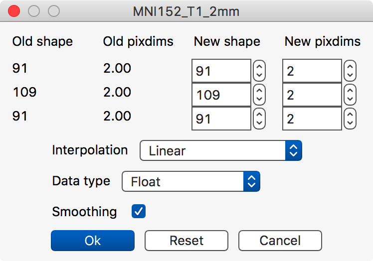
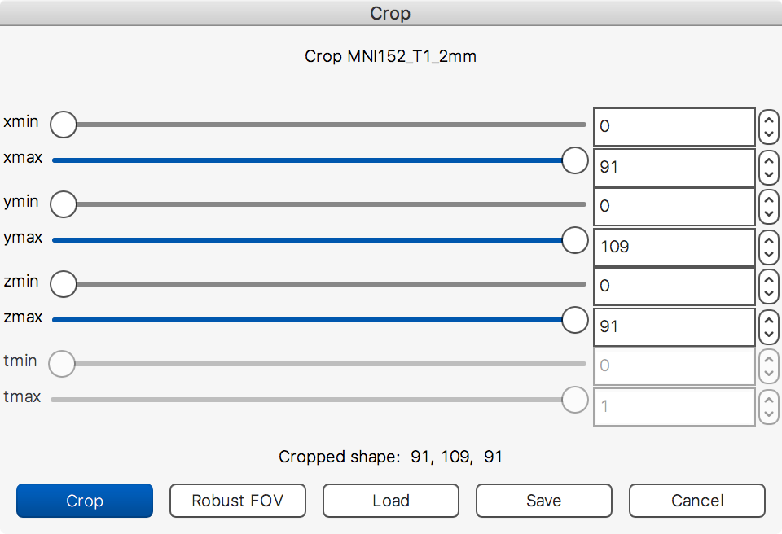
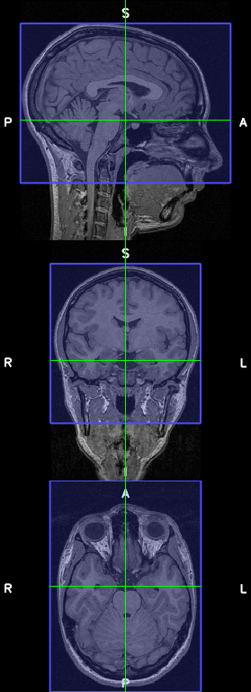
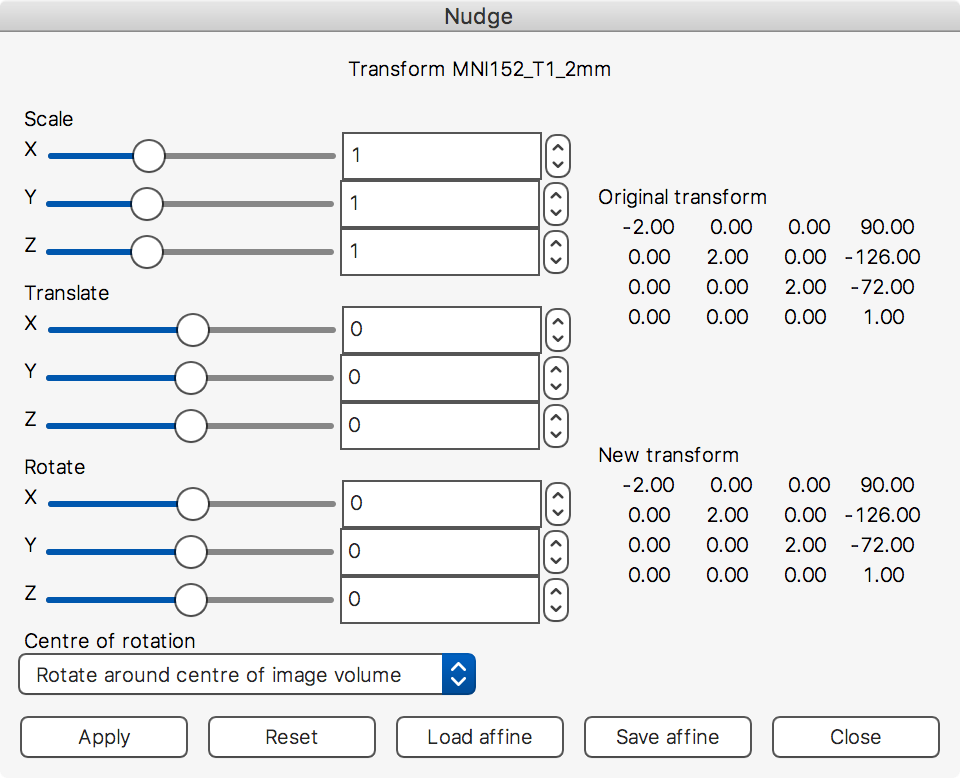
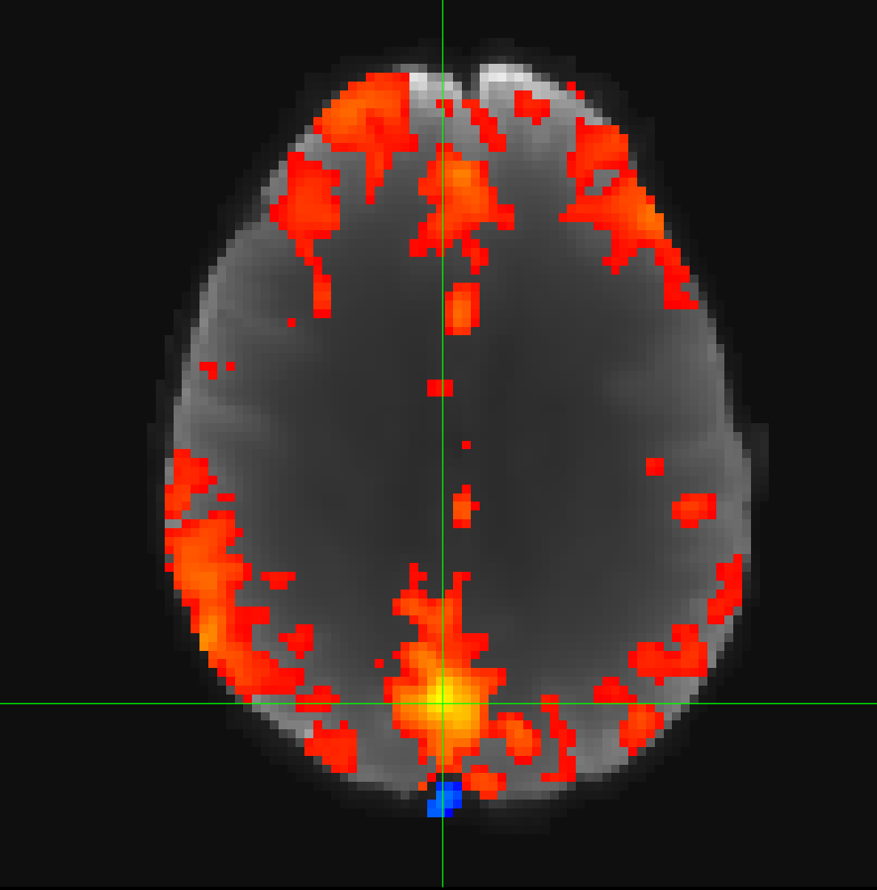
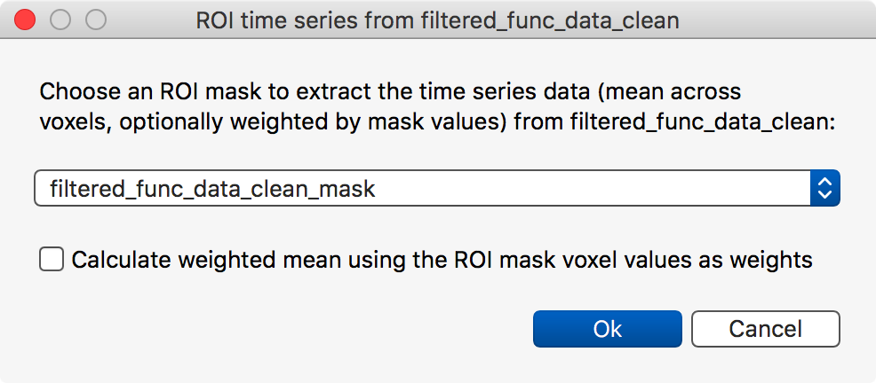
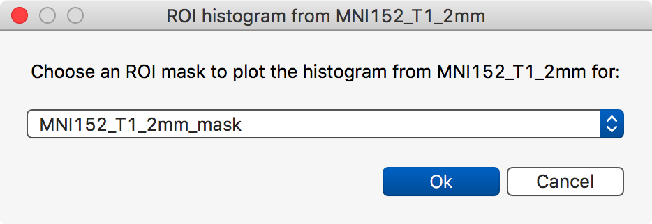

.. _tools:

Tools
=====

The FSLeyes *Tools* menu contains a range of tools to perform various types of
processing and analysis on your data. The *Tools* menu is organised into
one or more sections:

 - A section which contains tools that are always present, and independent of
   any open :ref:`view <overview_views_and_controls>`.
 - One section for each open view - some views have no tools associated with
   them, so will not appear in the tools menu.

.. _tools_general:

General tools
-------------

FSLeyes provides a selection of tools which allow you to manipulate the
currently selected overlay.

.. _tools_flirt_transformations:

FLIRT/affine transformations
^^^^^^^^^^^^^^^^^^^^^^^^^^^^

The **Load affine transformation** tool allows you to load an affine
transformation from a text file and apply it to the currently selected image.

The **File type** setting allows you to select the type of affine matrix you
wish to load:

 - A *FLIRT* matrix is an affine transformation produced by the `FLIRT
   <https://fsl.fmrib.ox.ac.uk/fsl/fslwiki/FLIRT>`_ linear registration
   tool. A FLIRT matrix encodes a transformation from a source image to a
   reference image, where both the source and reference image spaces are in a
   scaled-voxel coordinate system, possibly with an inversion about the first
   (left-right) voxel axis. More information on FLIRT matrices can be found
   `here
   <http://fsl.fmrib.ox.ac.uk/fsl/fslwiki/FLIRT/FAQ#What_is_the_format_of_the_matrix_used_by_FLIRT.2C_and_how_does_it_relate_to_the_transformation_parameters.3F>`_.

 - A *voxel-to-world* matrix is an affine matrix which encodes a
   transformation for a single image, from voxel coordinates into world
   coordinates.

If you are loading a FLIRT matrix, you must specify a reference image. You can
use the **Reference image** drop-down box to select one of the images currently
loaded in FSLeyes. Or, if you choose *Select file manually*, you can select
an image from the file system.

The **Export affine transformation** tool allows you to save the affine for
the currently selected image.  This is useful if you have used the **Nudge**
tool (`covered below <tools_adjust_image_transform>`_) to manually adjust the
affine for an image.

.. _tools_resample_image:

Resample image
^^^^^^^^^^^^^^

The **Resample image** tool allows you to resample the currently selected
image to a different resolution. You can specify a desired shape via the *New
shape* inputs, or a desired voxel resolution via the *New pixdims* inputs.

The **Interpolation** option allows you to choose different interpolation
options to use during the resampling. If you are resampling a binary mask, you
will likely want to select *Nearest neighbour* interpolation.

You can also specify the output *Data type*, and apply *Smoothing* to the
resampled image.

.. _tools_ortho:

Ortho view tools
----------------

The `ortho view <ortho_lightbox_views_ortho>`_ has a number of interactive
tools for editing and adjusting NIFTI images. The **Edit mode** option is
covered in the page on `editing NIFTI images <editing_images>`_.

.. _tools_crop_image:

Crop image
^^^^^^^^^^

The **Crop image** tool allows you to manually crop an image - it is
essentialy an interactive version of the ``fslroi`` `command-line tool
<https://fsl.fmrib.ox.ac.uk/fsl/fslwiki/Fslutils>`_.

When you select the *Crop image* tool, a blue overlay will appear on the ortho
view. You can click and drag on the ortho canvases to adjust the region that
will be cropped. You can also use the sliders in the crop image dialog box to
adjust the cropping region.

If FSL is installed, clicking the **Robust FOV** button will run the
``robustfov`` command-line tool - this tool estimates a good cropping region
for images with a large field-of-view.

When you are happy with the region, click on the **Crop** button to create a
cropped copy of the image. You can then select that image, and save it out to
a file.

The **Save** and **Load** buttons allow you to save and load cropping
parameters to/from simple text files. The format used in these text files is
equivalent to the parameters that would be passed to the ``fslroi``
command-line tool.

.. _tools_adjust_image_transform:

Adjust image transform (a.k.a. *Nudge*)
^^^^^^^^^^^^^^^^^^^^^^^^^^^^^^^^^^^^^^^

The **Nudge** tool allows you to adjust the affine transformation of a NIFTI
image. This can be useful if you need to manually register one image to
another, if you need to fine-tune a previously calculated linear registration,
or if you simply wish to view some image data from a different angle.

The three sets of sliders allow you to apply scalings, translations, and
rotations to each of the three image axes. The **Centre of rotation**
drop-down box can be used to set the centre of rotation to either the image
centre, or to the current display location.

The **Load affine** and **Save affine** buttons allow you to load a
transformation from a file, or save the current transformation to a file (see
the section on :ref:`FLIRT/affine transformations
<tools_flirt_transformations>`, above).

Once you are happy with your adjustments, click the **Apply** button to apply
it to the image. You may then need to save the image to file, to make your
adjustments permanent.

.. _tools_seed_correlation:

Seed correlation
^^^^^^^^^^^^^^^^

The **Seed correlation** tool is active when a 4D image is selected. When you
select this tool, it will calculate Pearson's correlation coefficient between
the time series of the voxel at the current location, and the time series of
all other voxels. When the calculation is complete, a correlation map will be
added as a new overlay.

You can then select a different location and re-run seed correlation. The
correlation map will then be updated with the correlation values for the new
location.

.. _tools_timeseries:

Time series view tools
----------------------

The :ref:`time series view <plot_views_time_series_view>` currently has a
single tool, the **Add time series from ROI** tool. This tool is active when
the currently selected overlay is a 4D image, and one or more other images,
which are in the same space as the selected image [*]_, are also loaded.

When you select a mask and click the **Ok** button, FSLeyes will calculate the
mean time series from the selected image, of all voxels which are in the mask.
If the mask is non-binary, you can also choose to calculate a weighted mean by
selecting the **Calculated weighted mean** checkbox.

The mean time course will then be added to the time series view.

.. [*] Has the same voxel dimensions and affine transformation.

.. _tools_histogram:

Histogram view tools
--------------------

The :ref:`histogram view <plot_views_histogram_view>` has a similar tool which
allows you to calculate the histogram of a region within an image, where the
region is specified by a binary mask.
