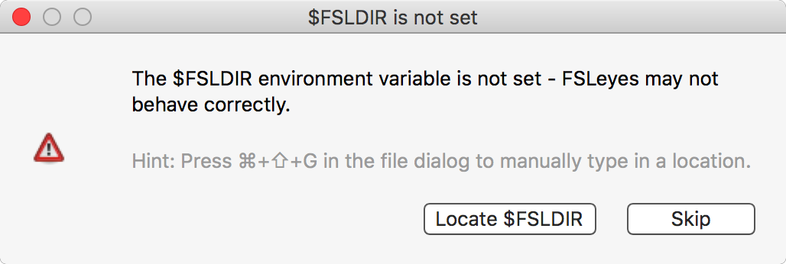
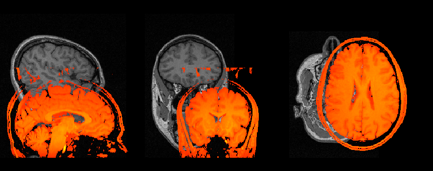
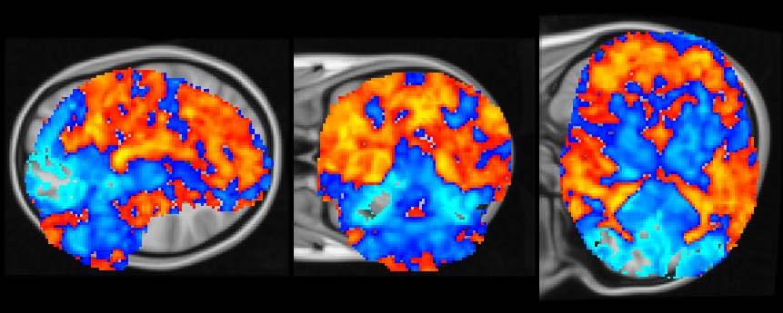
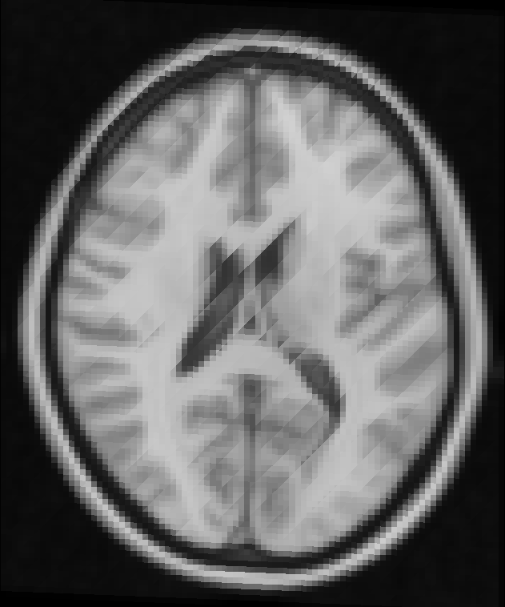
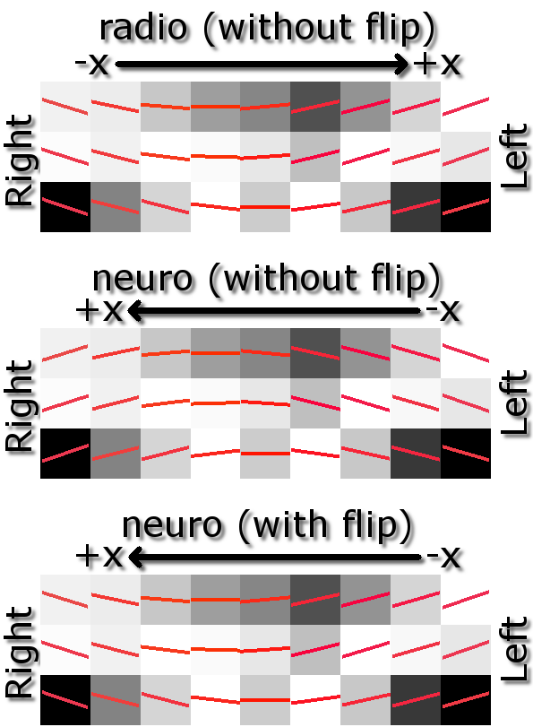
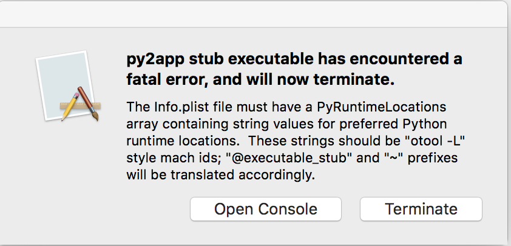

.. |right_arrow| unicode:: U+21D2

.. |spanner_icon| image:: images/spanner_icon.png

.. _troubleshooting:

Troubleshooting
===============

This page describes some problems which you may encounter when using FSLeyes.
If you are having a problem which is not listed here, try searching the `FSL
mailing list <https://www.jiscmail.ac.uk/cgi-bin/webadmin?A0=FSL>`_ archives
to see if somebody else has had the same problem. Failing that, send an email
to the mailing list - we will try our best to help!

``$FSLDIR`` is not set
----------------------

When you first start FSLeyes, you may be presented with the following warning:

This means that FSLeyes has been unable to locate the directory in which FSL
is installed, and may mean that your FSL environment is not correctly
configured. If you see this warning, you can tell FSLeyes where FSL is located
by clicking on the **Locate $FSLDIR** button, and selecting the FSL
installation directory (typically ``/usr/local/fsl/``).  Alternately, you can
click **Skip** to ignore the warning- you can still use FSLeyes, however some
features (e.g. atlases) will not be available.

FSLeyes has saved the wrong ``$FSLDIR``
---------------------------------------

FSLeyes keeps track of the location that it thinks FSL is installed in.  If
you move or re-install FSL, or have multiple versions of FSL installed, and
need to update FSLeyes, you can force FSLeyes to forget its settings via the
*FSLeyes* |right_arrow| *Clear FSLeyes settings* menu option.

Images are not overlaid on each other correctly
-----------------------------------------------

Sometimes when you load some images into FSLeyes, they will be displayed
incorrectly - either badly oriented, or mis-aligned:

This can mean one of two things:

1. The images are not aligned, and they are not supposed to be (the top
   example above). For example, they are from different subjects, modalities,
   or studies.

2. The images should be aligned, but there is an error in the orientation
   information stored in the NIFTI header, for one (or several) of the images
   (the bottom example above).

The first scenario is not a problem - you can safely load and view data from
different subjects and studies into FSLeyes, but be aware that there will be
no anatomical correspondence, across the different images, in the world or
voxel coordinates.

The second scenario is more serious, as it means that the orientation
information for one or more images has somehow been corrupted.  The
:ref:`overlay information panel <overlays_overlay_information_panel>` is
useful here, as it allows you to check the orientation information of each
images, including the ``sform`` and ``qform`` codes and transformation
matrices, and the voxel and world coordinate orientations.

Once you identify the image(s) which is/are causing the problem, you need to
re-generate the image (if it was generated as part of a processing pipeline),
or correct the orientation information in the NIFTI file header. In the
future, you will be able to do this from within FSLeyes, but as of version
|version|, you must do this with an external program such as ``fslcpgeom`` or
``fsledithd``.

My image is tilted/oblique! How do I make it oriented/rectangular?
------------------------------------------------------------------

Open the :ref:`view settings panel <ortho_lightbox_views_view_settings>` (the
|spanner_icon| button) and set the *Display space* to the image which you want
oriented.

There are weird striping artifacts in my image!
-----------------------------------------------

Those are slice boundaries - your image is being displayed obliquely to the
display, and FSLeyes is using nearest-neighbour interpolation to draw the
image to the screen. Change the interpolation (in the :ref:`overlay display
panel <overlays_overlay_display_panel>`) to *linear* or *spline*.

Movie mode gives me a black/flickering screen
---------------------------------------------

Try changing the **Synchronise movie updates** setting, in the view settings
panel (the |spanner_icon| button).

.. _troubleshooting_vector_orientation:

Line vectors/tensors/fibre orientation distributions are left/right flipped
---------------------------------------------------------------------------

Occasionally you might load a :ref:`vector <overlays_vector>` image (or
:ref:`tensor <overlays_tensor>` or :ref:`SH <overlays_diffusion_sh>` image)
into FSLeyes, only to find that the orientation of the vectors is incorrectly
inverted along the left-right axis. This can occur because different software
tools may output vector image data in different ways, depending on the image
orientation.

For images which are stored radiologically (with the X axis in the voxel
coordinate system increasing from right to left, the top image), FSL tools
such as `dtifit <http://fsl.fmrib.ox.ac.uk/fsl/fslwiki/FDT/UserGuide#DTIFIT>`_
will generate vectors which are oriented according to the voxel coordinate
system.

However, for neurologically stored images (X axis increasing from left to
right), FSL tools generate vectors which are *radiologically* oriented (the
middle image), and thus are inverted with respect to the X axis in the voxel
coordinate system.  Therefore, in order to correctly display vectors from such
an image, we must flip each vector about the X axis (the bottom image).

:ref:`Vector <overlays_vector>` overlays have a **L/R orientation flip**
setting, which allows you to flip vectors (or tensor ellipsoids, or FODs)
along the left/right axis. FSLeyes will automatically adjust this setting
based on the orientation of the image data, and will correctly display all
vector images that have been generated by FSL tools.

However, if you are working with vector (or :ref:`tensor <overlays_tensor>`,
or :ref:`SH <overlays_diffusion_sh>`) data generated by a different tool, you
may need to flip the orientation, via the **L/R orientation flip** setting in
the :ref:`overlay display panel <overlays_overlay_display_panel>`, in order to
display the data correctly.

.. _troubleshooting_keyboard_navigation_doesnt_work_in_the_ic_classification_panel:

OSX - Keyboard navigation doesn't work in the IC classification panel
---------------------------------------------------------------------

Under OSX, you may have focus-related issues while navigating around the
:ref:`IC classification panel
<ic_classification_classifying_components_with_the_classification_panel>` with
the keyboard.

If this is happening to you, you may need to enable *Full keyboard access* for
the MELODIC classification panel to work with keyboard navigation/focus.  This
setting can be changed through *System Preferences* |right_arrow| *Keyboard*
|right_arrow| *Shortcuts*, and changing *Full Keyboard Access* to *All
controls*.

OSX - FSLeyes breaks after updating
-----------------------------------

Under OSX, you may encounter the following error after overwriting an old
version of FSLeyes with a new version:

This is happening because OSX is caching the old version of the FSLeyes
application specification file (found in ``FSLeyes.app/Contents/Info.plist``),
and ignoring the new version. You can fix this problem by temporarily moving
this file to a different location, and then moving it back again, for example::

  cd /Path/to/FSLeyes.app
  mv Contents/Info.plist ./Info.plist.backup
  # This command will fail
  ./Contents/MacOS/fsleyes
  mv ./Info.plist.backup Contents/Info.plist
  # FSLeyes should now work
  ./Contents/MacOS/fsleyes

If, after the above, the problem is still occurring, it may be that you are
using a symbolic link to call FSLeyes (e.g. a link called
``$FSLDIR/bin/fsleyes`` which points to
``/Applications/FSLeyes.app/Contents/MacOS/fsleyes``. If this is the case,
try replacing the symlink with a wrapper script that contains the following::

  #!/bin/bash
  /path/to/FSLeyes.app/Contents/MacOS/fsleyes $@

Linux - FSLeyes does not start
------------------------------

``glutInit``
^^^^^^^^^^^^

Under linux, you might be presented with the following error when you try to
start FSLeyes::

  WARNING          __init__.py  596: create          - GLContext callback function raised NullFunctionError: Attempt to call an undefined function glutInit, check for bool(glutInit) before calling
  Traceback (most recent call last):
    File "fsleyes/gl/__init__.py", line 590, in create
    File "fsleyes/main.py", line 371, in realCallback
    File "fsleyes/gl/__init__.py", line 377, in bootstrap
    File "site-packages/OpenGL/GLUT/special.py", line 333, in glutInit
    File "site-packages/OpenGL/platform/baseplatform.py", line 407, in __call__
  NullFunctionError: Attempt to call an undefined function glutInit, check for bool(glutInit) before calling

This error is occurring because FSLeyes depends on some features provided by
[GLUT](https://www.opengl.org/resources/libraries/glut/), which is not
necessarily present on linux systems. You can avoid this error simply by
installing [FreeGLUT](http://freeglut.sourceforge.net/), which should be
available through your package manager (e.g. ``yum install freeglut`` under
CentOS, or ``apt-get install freeglut3`` under Ubuntu).

``libxcb``
^^^^^^^^^^

Another possible error which you may encounter when running on older Linux
platforms::

  Traceback (most recent call last):
    File "fsleyes/__main__.py", line 4, in <module>
    File "fsleyes/main.py", line 33, in <module>
    File "site-packages/wx-3.0-gtk2/wx/__init__.py", line 45, in <module>
    File "site-packages/wx-3.0-gtk2/wx/_core.py", line 4, in <module>
  ImportError: libX11.so.6: undefined symbol: xcb_wait_for_reply64
  Failed to execute script __main__

This error is occurring because FSLeyes requires a more up-to-date version of
the ``libxcb`` library. You can solve this problem simply by upgrading
``libxcb``. Under CentOS, simply run ``yum update libxcb`` (with administrator
privileges).

``GLib version too old (micro mismatch)``
^^^^^^^^^^^^^^^^^^^^^^^^^^^^^^^^^^^^^^^^^

If you see an error that looks like this::

  (fsleyes:15552): Gtk-WARNING **: GModule (/usr/lib64/gtk-2.0/2.10.0/immodules/im-ibus.so) initialization check failed: GLib version too old (micro mismatch)

Then you are probably using a version of FSLeyes which has been built for a
different operating system (e.g. using a version of FSLeyes that has been
built for CentOS6 on a CentOS7 machine). Head to the |fsleyes_homepage|_ home
page and follow the instructions to download the correct version for your
platform.

Running FSLeyes remotely
------------------------

FSLeyes is capable of running on remote servers, over SSH/X11 connections, or
from within VNC or other remote desktop tools. However, you may need to
configure your environment before FSLeyes will work correctly.

OpenGL 1.4 or newer is required (detected version: 1.2)
^^^^^^^^^^^^^^^^^^^^^^^^^^^^^^^^^^^^^^^^^^^^^^^^^^^^^^^

FSLeyes requires OpenGL 1.4 or newer. In some remote desktop environments, the
OpenGL version may be restricted. If you receive this error when trying to
start FSLeyes, try the following::

  unset LIBGL_ALWAYS_INDIRECT
  fsleyes

Options are missing!
^^^^^^^^^^^^^^^^^^^^

Sometimes, in a remote desktop environment, FSLeyes is not able to provide all
of the features that it can when running locally. When you run FSLeyes over
X11, the following options will not be available:

 - Spline interpolation for :ref:`volume <overlays_volume>` and :ref:`RGB
   vector <overlays_vector>` overlays
 - :ref:`Tensor <overlays_tensor>` display
 - :ref:`Diffusion  SH <overlays_diffusion_sh>` display

XQuartz - FSLeyes doesn't start, and just shows an error
^^^^^^^^^^^^^^^^^^^^^^^^^^^^^^^^^^^^^^^^^^^^^^^^^^^^^^^^

Under XQuartz 2.7.9 and newer, FSLeyes may not start, and you may see the
following error::

  Gdk-ERROR **: The program 'fsleyes' received an X Window System error.
  This probably reflects a bug in the program.
  The error was 'BadValue (integer parameter out of range for operation)'.
    (Details: serial 695 error_code 2 request_code 149 minor_code 24)
    (Note to programmers: normally, X errors are reported asynchronously;
     that is, you will receive the error a while after causing it.
     To debug your program, run it with the --sync command line
     option to change this behavior. You can then get a meaningful
     backtrace from your debugger if you break on the gdk_x_error() function.)
  aborting...

This is caused by a configuration issue with XQuartz - you will be unable to
run any OpenGL application, not just FSLeyes. Fortunately, there is a
solution: if you are using XQuartz 2.7.10 or newer, run this command (locally,
not within the SSH session)::

  defaults write org.macosforge.xquartz.X11 enable_iglx -bool true

If you are using XQuartz 2.7.9, and you cannot upgrade to 2.7.10 or newer, you
will need to edit ``/usr/X11R6/bin/startx`` (you will probably need
administrator privileges). There is a section in this script, around line 100,
which configures a variable called ``defaultserverargs``. Immediately after
this section, add the following line::

  defaultserverargs="$defaultserverargs +iglx"

After making this change, restart XQuartz - FSLeyes should now start.

XQuartz - keyboard shortcuts don't work
^^^^^^^^^^^^^^^^^^^^^^^^^^^^^^^^^^^^^^^

If you are using XQuartz, you may need to select the *Option keys send Alt_L
and Alt_R* option in the XQuartz Preferences dialog before keyboard shortcuts
will work in FSLeyes.
