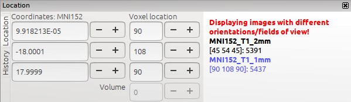
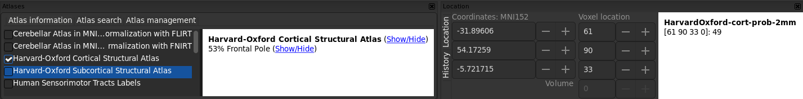

.. |right_arrow| unicode:: U+21D2

.. |spanner_icon| image:: images/spanner_icon.png

.. _troubleshooting:

Troubleshooting
===============

This page describes some problems which you may encounter when using FSLeyes.
If you are having a problem which is not listed here, try searching the `FSL
mailing list <https://www.jiscmail.ac.uk/cgi-bin/webadmin?A0=FSL>`_ archives
to see if somebody else has had the same problem. Failing that, send an email
to the mailing list - we will try our best to help!

``$FSLDIR`` is not set
----------------------

When you first start FSLeyes, you may be presented with the following warning:

.. image:: images/troubleshooting_fsldir_not_set.png
   :width: 70%
   :align: center

This means that FSLeyes has been unable to locate the directory in which FSL
is installed, and may mean that your FSL environment is not correctly
configured. If you see this warning, you can tell FSLeyes where FSL is located
by clicking on the **Locate $FSLDIR** button, and selecting the FSL
installation directory (typically ``/usr/local/fsl/``).  Alternately, you can
click **Skip** to ignore the warning- you can still use FSLeyes, however some
features (e.g. atlases) will not be available.

FSLeyes has saved the wrong ``$FSLDIR``
---------------------------------------

FSLeyes keeps track of the location that it thinks FSL is installed in.  If
you move or re-install FSL, or have multiple versions of FSL installed, and
need to update FSLeyes, you can force FSLeyes to forget its settings via the
*FSLeyes* |right_arrow| *Clear FSLeyes settings* menu option.

Images are not overlaid on each other correctly
-----------------------------------------------

Sometimes when you load some images into FSLeyes, they will be displayed
incorrectly - either badly oriented, or mis-aligned:

.. image:: images/troubleshooting_misaligned.png
   :width: 80%
   :align: center

.. image:: images/troubleshooting_bad_orientation.png
   :width: 80%
   :align: center

This can mean one of two things:

1. The images are not aligned, and they are not supposed to be (the top
   example above). For example, they are from different subjects, modalities,
   or studies.

2. The images should be aligned, but there is an error in the orientation
   information stored in the NIFTI header, for one (or several) of the images
   (the bottom example above).

The first scenario is not a problem - you can safely load and view data from
different subjects and studies into FSLeyes, but be aware that there will be
no anatomical correspondence, across the different images, in the world or
voxel coordinates.

The second scenario is more serious, as it means that the orientation
information for one or more images has somehow been corrupted.  The
:ref:`overlay information panel <overlays_overlay_information_panel>` is
useful here, as it allows you to check the orientation information of each
images, including the ``sform`` and ``qform`` codes and transformation
matrices, and the voxel and world coordinate orientations.

Once you identify the image(s) which is/are causing the problem, you need to
re-generate the image (if it was generated as part of a processing pipeline),
or correct the orientation information in the NIFTI file header. In the
future, you will be able to do this from within FSLeyes, but as of version
|version|, you must do this with an external program such as ``fslcpgeom`` or
``fsledithd``.

FSLeyes is slow!
----------------

Performance of FSLeyes can be poor when it is used on remote systems
(e.g. over X11/SSH, or VNC).  You may be able to improve the situation by
trying some low-performance settings. You can find this setting in the view
settings panel (the |spanner_icon| button), or you can start FSLeyes in
low-performance mode from the command-line with the ``-p`` option, e.g.::

  # Fastest -> 1
  fsleyes -p 1 image.nii.gz

  # Faster -> 2
  fsleyes -p 2 image.nii.gz

  # Best looking -> 3
  fsleyes -p 3 image.nii.gz

On some systems, the *Faster* setting may give better performance than the
*Fastest* setting, so try them both, and use the one which works best for your
set-up.

Note that this setting will only have an effect on the orthographic
and lightbox views. However, the 3D view has some additional settings which
can be tweaked to improve performance, specifically the **Quality** and
**Number of samples** settings. Refer to the page on the :ref:`3D view
<3d_view_volume>` for details.

My image is tilted/oblique! How do I make it oriented/rectangular?
------------------------------------------------------------------

Open the :ref:`view settings panel <ortho_lightbox_views_view_settings>` (the
|spanner_icon| button) and set the *Display space* to the image which you want
oriented.

There are weird striping artifacts in my image!
-----------------------------------------------

.. image:: images/troubleshooting_striping.png
   :width: 10%
   :align: right

Those are slice boundaries - your image is being displayed obliquely to the
display, and FSLeyes is using nearest-neighbour interpolation to draw the
image to the screen. Change the interpolation (in the :ref:`overlay display
panel <overlays_overlay_display_panel>`) to *linear* or *spline*.

My images are aligned in FSLeyes, but other FSL tools complain about orientation!
---------------------------------------------------------------------------------

FSLeyes projects all of the overlays that you load into a common display
coordinate system, regardless of their dimensions, orientation, or field of
view. So two images which have a different resolution or orientation may
appear to be aligned when you view them in FSLeyes.

However, many FSL tools (and many neuroimage analysis tools) require input
images to be **voxel-aligned**, so that the same voxel from each input image
corresponds to the same anatomical location.

When you load images with different orientations into FSLeyes, a warning
will appear in the location panel:

If you see this warning, and you intend to use the images you are viewing with
any FSL processing or analysis tools, you may need to resample your images into
the same space - you can do this within FSLeyes via the :ref:`Resample image
<tools_resample_image>` tool, using the *Resample to reference* option, or on
the command-line using ``flirt`` with the ``-applyxfm`` and ``-usesqform``
options.

You can read more about the different coordinate systems used by FSLeyes
:ref:`here <display_space>`.

Movie mode gives me a black/flickering screen
---------------------------------------------

Try changing the **Synchronise movie updates** setting, in the view settings
panel (the |spanner_icon| button).

.. _troubleshooting_vector_orientation:

Line vectors/tensors/fibre orientation distributions are left/right flipped
---------------------------------------------------------------------------

Occasionally you might load a :ref:`vector <overlays_vector>` image (or
:ref:`tensor <overlays_tensor>` or :ref:`SH <overlays_diffusion_sh>` image)
into FSLeyes, only to find that the orientation of the vectors is incorrectly
inverted along the left-right axis. This can occur because different software
tools may output vector image data in different ways, depending on the image
orientation.

.. image:: images/troubleshooting_line_vector_orientation.png
   :width: 40%
   :align: right

For images which are stored radiologically (with the X axis in the voxel
coordinate system increasing from right to left, the top image), FSL tools
such as `dtifit <http://fsl.fmrib.ox.ac.uk/fsl/fslwiki/FDT/UserGuide#DTIFIT>`_
will generate vectors which are oriented according to the voxel coordinate
system.

However, for neurologically stored images (X axis increasing from left to
right), FSL tools generate vectors which are *radiologically* oriented (the
middle image), and thus are inverted with respect to the X axis in the voxel
coordinate system.  Therefore, in order to correctly display vectors from such
an image, we must flip each vector about the X axis (the bottom image).

:ref:`Vector <overlays_vector>` overlays have a **L/R orientation flip**
setting, which allows you to flip vectors (or tensor ellipsoids, or FODs)
along the left/right axis. FSLeyes will automatically adjust this setting
based on the orientation of the image data, and will correctly display all
vector images that have been generated by FSL tools.

However, if you are working with vector (or :ref:`tensor <overlays_tensor>`,
or :ref:`SH <overlays_diffusion_sh>`) data generated by a different tool, you
may need to flip the orientation, via the **L/R orientation flip** setting in
the :ref:`overlay display panel <overlays_overlay_display_panel>`, in order to
display the data correctly.

The values reported in the atlas panel are different from those in the atlas image!
-----------------------------------------------------------------------------------

Sometimes when you are using the atlas panel to inspect different brain
regions, the reported values may differ from the values you see in the atlas
image. This is because there are often different versions of each FSL atlas,
sampled at different resolutions (e.g. 1mm\ :sup:`3` and 2mm\ :sup:`3`).

For example, in the screenshot above the atlas panel reports that the voxel
under the cursor has a 53% probability of being in the Frontal Pole (as
defined by the Harvard-Oxford Cortical Structural Atlas). However, in the
location panel, the value at the current voxel is reported as being 49.

This discrepancy is due to the fact that the FSLeyes atlas panel will always
report regions and region probabilities values from the atlas version with the
highest resolution; if you are viewing a different version of the atlas, the
values that you see in the image (reported in the location panel) may not be
identical to those reported in the atlas panel.

.. _troubleshooting_keyboard_navigation_doesnt_work_in_the_ic_classification_panel:

macOS - Keyboard navigation doesn't work in the IC classification panel
-----------------------------------------------------------------------

Under macOS, you may have focus-related issues while navigating around the
:ref:`IC classification panel
<ic_classification_classifying_components_with_the_classification_panel>` with
the keyboard.

If this is happening to you, you may need to enable *Full keyboard access* for
the MELODIC classification panel to work with keyboard navigation/focus.  This
setting can be changed through *System Preferences* |right_arrow| *Keyboard*
|right_arrow| *Shortcuts*, and changing *Full Keyboard Access* to *All
controls*.

macOS - I can't start FSLeyes from IPython/Jupyter Notebook
-----------------------------------------------------------

If you are using macOS, and you are using FSLeyes from a `conda
<https://conda.io/en/latest/>`_ environment, you may encounter this error
when trying to use FSLeyes::

    This program needs access to the screen. Please run with a Framework
    build of python, and only when you are logged in on the main display
    of your Mac.

This is due to a problem with the way that conda interacts with macOS. If you
are using ``python``/``ipython``, you can work around the problem by using
``pythonw`` instead of ``python``. If you are using ``ipython``, you can run
it like so::

    pythonw $(which ipython)

If you are using a Jupyter Notebook, things are a little bit more complicated.
You will need to define a custom Jupyter kernel specification file, which uses
``pythonw``. The easiest way to do this is to create a copy of the default
kernel specification, e.g::

  cp -r [conda environment location]/share/jupyter/kernels/python3 \
        [conda environment location]/share/jupyter/kernels/python3w

Then open ``[conda environment location]/share/jupyter/kernels/python3w/kernel.json``
in a text editor, and change the first element in the ``argv`` list to
``pythonw`` instead of ``python``. For example, if the contents of
``kernel.json`` look like this::

    {
     "argv": [
      "/Users/paulmc/miniconda3/envs/fsleyes/bin/python",
      "-m",
      "ipykernel_launcher",
      "-f",
      "{connection_file}"
     ],
     "display_name": "Python 3",
     "language": "python"
    }

Change it to this::

    {
     "argv": [
      "/Users/paulmc/miniconda3/envs/fsleyes/bin/pythonw",
      "-m",
      "ipykernel_launcher",
      "-f",
      "{connection_file}"
     ],
     "display_name": "Python 3 (GUI)",
     "language": "python"
    }

The next time you start a new Jupyter notebook, select the *Python 3 (GUI)*
kernel.

.. _running_fsleyes_remotely:

Running FSLeyes remotely
------------------------

FSLeyes is capable of running on remote servers, over SSH/X11 connections, or
from within VNC or other remote desktop tools. However, you may need to
configure your environment before FSLeyes will work correctly.

.. note:: `This web page
          <https://www.scm.com/doc/Installation/Remote_GUI.html>`_ is a very
          good resource to consult if you are having trouble getting FSLeyes
          working over a SSH connection.

SSH/X11, VNC, NoMachine, etc - FSLeyes won't start
^^^^^^^^^^^^^^^^^^^^^^^^^^^^^^^^^^^^^^^^^^^^^^^^^^

If you are having trouble running FSLeyes on a remote server, there are
several things you may need to check.

**SSH/X11 - wxPython version**

If you are using ``ssh -X`` or ``ssh -Y`` to connect to a remote server, be
aware that recent versions of `wxPython <https://www.wxpython.org/>`_ (the GUI
toolkit upon which FSLeyes is based) no longer support the GLX protocol
(OpenGL over SSH/X11). In this case, you will need to use an alternative
method of connecting to your server (e.g. VNC), or to install an older version
of wxPython (``4.0.*``) before FSLeyes will work. Alternatively, you can force
software-based rendering by setting the ``LIBGL_ALWAYS_SOFTWARE=1``
environment variable.

**SSH/X11 - indirect rendering via GLX**

If you are using ``ssh -X`` or ``ssh -Y`` to connect to a remote server, you
must make sure that the X server on your **local** machine allows indirect
rendering via GLX. The way to go about doing this depends on your operating
system - see below if you are using a mac with XQuartz. If your local machine
is using Linux, you may find a solution on one of these web pages:

 * https://www.scm.com/doc/Installation/Remote_GUI.html#enabling-indirect-rendering-on-xorg-1-17-and-newer
 * https://www.programmersought.com/article/71135109048/
 * https://kb.tecplot.com/2019/12/18/linux-remote-display-issues/
 * http://whiteboard.ping.se/Linux/GLX

After you have enabled indirect rendering, if you have ``glxinfo`` or
``glxgears`` installed, check to see that they work. Try running them both
with the ``LIBGL_ALWAYS_INDIRECT`` variable set, and un-set, e.g.::

    unset LIBGL_ALWAYS_INDIRECT
    glxinfo
    glxgears

    # or, if the above doesn't work

    export LIBGL_ALWAYS_INDIRECT=1
    glxinfo
    glxgears

If ``glxinfo`` or ``glxgears`` doesn't work, then FSLeyes is unlikely to work.

If you have older versions of `mesa <https://mesa3d.org/>`_ installed on
either the local or remote machines, update them to the latest available using
your OS package manager. Also make sure that your X server (which runs on your
local machine, e.g. XQuartz on macOS) is updated to the latest
avaialble.

After upgrading your X Server, you may need to re-enable indirect rendering
via GLX, as outilned above (or below, if you are using macOS and XQuartz).

If, after doing all of the above, FSLeyes still won't start, or if you are
running FSLeyes within a VNC session, you may need to force software-based
rendering::

  export LIBGL_ALWAYS_SOFTWARE=1
  fsleyes

Options are missing/disabled/not working!
^^^^^^^^^^^^^^^^^^^^^^^^^^^^^^^^^^^^^^^^^

Sometimes, in a remote desktop environment, FSLeyes is not able to provide all
of the features that it can when running locally. When you run FSLeyes over
X11, the following options will not be available:

 - Spline interpolation for :ref:`volume <overlays_volume>` and :ref:`RGB
   vector <overlays_vector>` overlays
 - :ref:`Tensor <overlays_tensor>` display
 - :ref:`Diffusion SH <overlays_diffusion_sh>` display
 - 3D lighting effects on for :ref:`volume <overlays_volume>` overlays.

XQuartz - FSLeyes doesn't start, and just shows an error
^^^^^^^^^^^^^^^^^^^^^^^^^^^^^^^^^^^^^^^^^^^^^^^^^^^^^^^^

Under XQuartz 2.7.9 and newer, FSLeyes may not start, and you may see the
following error::

  Gdk-ERROR **: The program 'fsleyes' received an X Window System error.
  This probably reflects a bug in the program.
  The error was 'BadValue (integer parameter out of range for operation)'.
    (Details: serial 695 error_code 2 request_code 149 minor_code 24)
    (Note to programmers: normally, X errors are reported asynchronously;
     that is, you will receive the error a while after causing it.
     To debug your program, run it with the --sync command line
     option to change this behavior. You can then get a meaningful
     backtrace from your debugger if you break on the gdk_x_error() function.)
  aborting...

This is likely due to a configuration issue with XQuartz - you will be unable
to run any OpenGL application, not just FSLeyes. Fortunately, there is a
solution: if you are using XQuartz 2.7.10 or newer, run this command (locally,
not within the SSH session)::

  defaults write org.macosforge.xquartz.X11 enable_iglx -bool true

if you are using XQuartz 2.8.0 or newer, run this command::

  defaults write org.xquartz.X11 enable_iglx -bool true

If you are using XQuartz 2.7.9, and you cannot upgrade to a newer version, you
will need to edit ``/usr/X11R6/bin/startx`` (you will probably need
administrator privileges). There is a section in this script, around line 100,
which configures a variable called ``defaultserverargs``. Immediately after
this section, add the following line::

  defaultserverargs="$defaultserverargs +iglx"

After making this change, restart XQuartz - FSLeyes should now start. If
FSLeyes is still not working, the problem may be with the remote server -
refer to the information on :ref:`Running FSLeyes remotely
<running_fsleyes_remotely>`, above.

XQuartz - keyboard shortcuts don't work
^^^^^^^^^^^^^^^^^^^^^^^^^^^^^^^^^^^^^^^

If you are using XQuartz, you may need to select the *Option keys send Alt_L
and Alt_R* option in the XQuartz Preferences dialog before keyboard shortcuts
will work in FSLeyes.
